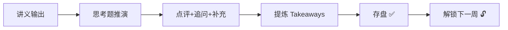

## 学习进度

| 阶段 | 周次 | 模块 | 状态 |
|------|------|------|------|
| 物理基础设施 | Week 1 | 电力、电网与能源底层 | ✅ 已完成 |
| 物理基础设施 | Week 2 | 数据中心 | ✅ 已完成 |
| 物理基础设施 | Week 3 | 高速互联与网络拓扑 | ✅ 已完成 |
| 芯片与硬件 | Week 4 | GPU 架构深度拆解 | ✅ 已完成 |
| 芯片与硬件 | Week 5 | AI 芯片竞争格局 | ✅ 已完成 |
| 芯片与硬件 | Week 6 | 存储与内存墙 | 🔒 未解锁 |
| 模型与算法 | Week 7-9 | Transformer / 训练 / 推理 | 🔒 未解锁 |
| 应用与 Agent | Week 10-12 | 云计算 / Agent / 终局 | 🔒 未解锁 |

## 交互机制

> **规则**：每周必须完成思考题回复并存盘后，才能解锁下一周内容。拒绝一次性平庸输出，追求渐进式深度认知。
