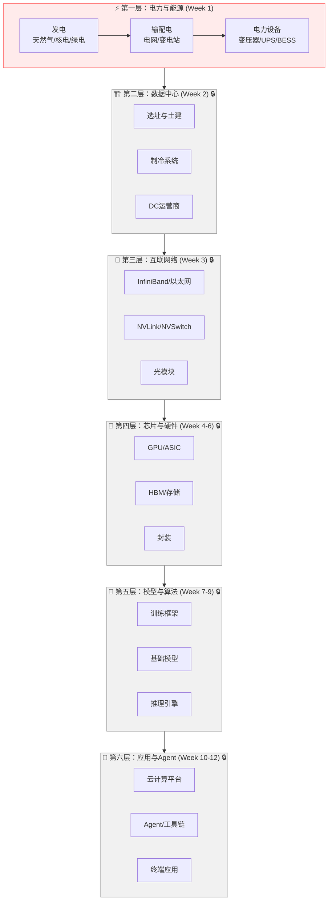

# 产业投资地图

::: tip 使用说明
本页面逐周叠加产业链全景图，每完成一周内容后更新对应层级的细节。
:::

## AI 全产业链价值流转图

## 各层关键玩家

### 第一层：电力与能源（Week 1 已解锁）

| 环节 | 代表公司 | 定价权 | 产能弹性 | 超额利润判断 |
|------|---------|--------|---------|-------------|
| 电力设备 | 伊顿 / 施耐德 / 特变电工 | 强 | 低（产能扩张慢） | ⭐⭐⭐ 持续超额利润 |
| DC 运营商 | Equinix / Digital Realty / 万国数据 | 强 | 低（建设2-3年） | ⭐⭐⭐ 长租约锁定 |
| 天然气发电 | Vistra Energy | 中 | 中 | ⭐⭐ 受益于电价上涨 |
| 核电 | Constellation / 中核 | 中 | 极低 | ⭐ 长期看好但兑现远 |
| 铜矿 | Freeport / 紫金矿业 | 中 | 极低（7-10年） | ⭐⭐ 资源品长期看涨 |

### 第二层至第六层

（随课程推进逐步解锁更新）

---

## 跨层洞察

（互动过程中提炼的跨层级分析将记录在此）
