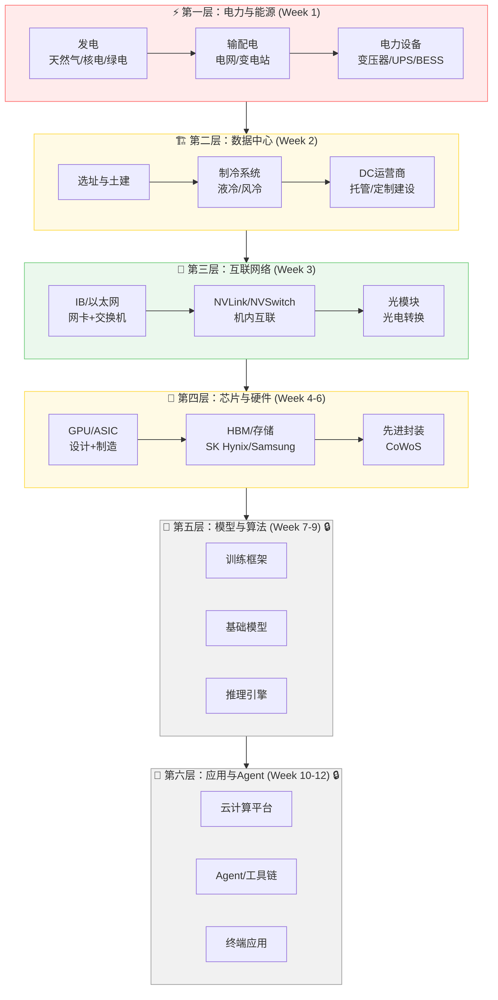

# 产业投资地图

::: tip 使用说明
本页面逐周叠加产业链全景图，每完成一周内容后更新对应层级的细节。
:::

## AI 全产业链价值流转图

## 各层关键玩家

### 第一层：电力与能源（Week 1 ✅）

| 环节 | 代表公司 | 定价权 | 产能弹性 | 超额利润判断 |
|------|---------|--------|---------|-------------|
| 电力设备 | 伊顿 / 施耐德 / 特变电工 | 强 | 低（产能扩张慢） | ⭐⭐⭐ 持续超额利润 |
| DC 运营商 | Equinix / Digital Realty / 万国数据 | 强 | 低（建设2-3年） | ⭐⭐⭐ 长租约锁定 |
| 天然气发电 | Vistra Energy | 中 | 中 | ⭐⭐ 受益于电价上涨 |
| 核电 | Constellation / 中核 | 中 | 极低 | ⭐ 长期看好但兑现远 |
| 铜矿 | Freeport / 紫金矿业 | 中 | 极低（7-10年） | ⭐⭐ 资源品长期看涨 |

### 第二层：数据中心（Week 2 ✅）

| 环节 | 代表公司 | 定价权 | 产能弹性 | 超额利润判断 |
|------|---------|--------|---------|-------------|
| 液冷系统（冷板） | 维谛技术 / CoolIT / 曙光数创 | 中强 | 低（定制化） | ⭐⭐⭐ AI 液冷刚需，供给追不上需求 |
| DC 运营商（AI 定制） | CoreWeave / Lambda / 万国数据 | 强 | 低（建设6-9月） | ⭐⭐⭐ AI 需求锁定长期合同 |
| 模块化预制 | Schneider / Vertiv / 华为 | 中 | 中 | ⭐⭐ 受益于建设加速需求 |
| 传统 DC 托管 | Equinix / Digital Realty | 中 | 中 | ⭐⭐ AI 改造需求有限，主要服务推理 |

### 第三层：互联网络（Week 3 ✅）

| 环节 | 代表公司 | 定价权 | 产能弹性 | 超额利润判断 |
|------|---------|--------|---------|-------------|
| InfiniBand 网卡+交换机 | NVIDIA（Mellanox） | 极强（垄断） | 低 | ⭐⭐⭐ 持续超额利润 |
| 以太网交换机芯片 | Broadcom | 强 | 中 | ⭐⭐ 受益于以太网份额扩大 |
| 光模块 | 中际旭创 / 新易盛 / Coherent | 中（多厂商） | 中 | ⭐⭐ 周期性溢价+趋势增长 |
| 光纤光缆 | 长飞光纤 / 康宁 | 弱 | 高 | ⭐ 大宗商品属性 |
| 网络软件 NCCL | NVIDIA（开源但绑定） | 极强（生态锁定） | — | 非直接收入，生态锁定关键 |
| NVLink/NVSwitch | NVIDIA | 极强（独占） | 低 | ⭐⭐⭐ 无替代方案，随 GPU 捆绑销售 |

### 第四层：芯片与硬件（Week 4-6 ✅）

| 环节 | 代表公司 | 定价权 | 产能弹性 | 超额利润判断 |
|------|---------|--------|---------|-------------|
| GPU 设计 | NVIDIA | 极强（CUDA 生态 + 80% 份额） | 低（台积电产能受限） | ⭐⭐⭐⭐ 飞轮加速中 |
| GPU 制造（代工） | 台积电 | 极强（先进制程双寡头） | 极低（建厂 3-5 年） | ⭐⭐⭐⭐ 持续超额利润 |
| HBM（AI 内存） | SK Hynix、Samsung | 极强（双寡头 + AI 刚需） | 极低（扩产 1.5-2 年） | ⭐⭐⭐⭐ AI 时代最稀缺元器件 |
| CoWoS 先进封装 | 台积电 | 极强（独家技术） | 极低（扩产 1-2 年） | ⭐⭐⭐⭐ GPU 出货最紧瓶颈 |
| GPU 竞品设计 | AMD | 弱（缺乏生态锁定） | 中 | ⭐⭐ 推理市场份额有望增长 |
| 自研芯片 | Google TPU | N/A（不对外卖） | 低 | 不参与公开市场定价 |
| 国产 AI 芯片 | 华为昇腾 | 中（政策+市场保护） | 低（制程约束） | ⭐⭐⭐ 中国市场结构性需求 |
| CXL 控制器 | Astera Labs、澜起科技 | 弱（市场早期） | 中 | ⭐⭐ 长期看好，短期收入极小 |
| 并行文件系统 | WekaFS、DDN | 中 | 中 | ⭐⭐ 软件差异化，但替代品多 |

### 第五层至第六层

（随课程推进逐步解锁更新）

---

## 跨层洞察

### 洞察 1：NVIDIA 的纵向整合覆盖了第三层和第四层

NVIDIA 同时控制 GPU（第四层）、NVLink/NVSwitch（第三层机内）、InfiniBand（第三层跨机）、CUDA/NCCL（软件生态），形成三层锁定（Triple Lock-in）。这种纵向整合在 AI 产业链中独一无二——没有其他公司同时覆盖计算、互联和网络三个环节。

### 洞察 2：组织能力是跨层技术选型的隐藏变量

超大规模云厂商（Meta/Google/微软）有能力在网络层自研替代（以太网替代 IB），但中小企业必须接受 NVIDIA 全家桶捆绑。这意味着产业链的利润分配不仅取决于技术壁垒，还取决于客户侧的组织能力分布。

### 洞察 3：每一层都存在"代际窗口期"

- 第一层：天然气电厂 vs SMR 的代际转换（2028+）
- 第二层：风冷 → 液冷的代际转换（正在进行）
- 第三层：400G → 800G → 1.6T 光模块的代际转换（18-24 个月窗口）
- 第四层：HBM3 → HBM3e → HBM4 代际转换（SK Hynix 先发优势窗口）
- 在每个窗口期内，早期具备新技术能力的厂商享受短期超额利润

### 洞察 4：HBM 是 AI 产业链中被低估的利润捕获点

GPU 的关注度集中在 NVIDIA，但 GPU 物料成本的 40-60% 流向了 SK Hynix 的 HBM。加上台积电的 CoWoS 封装，NVIDIA 自身在硬件层的成本份额可能只有 20-30%——它的超额利润主要来自 CUDA 生态的软件锁定溢价，而非硬件本身。
