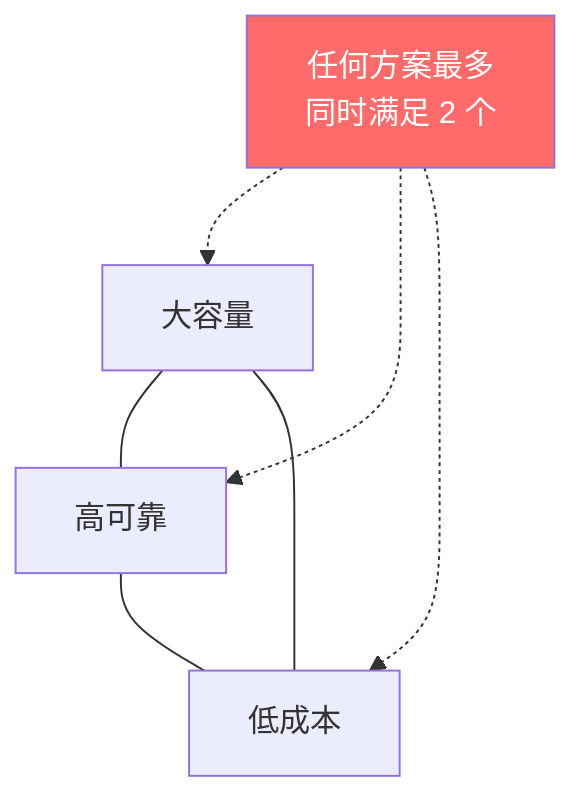
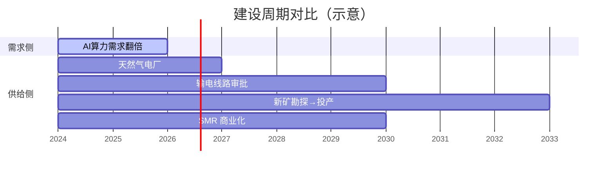
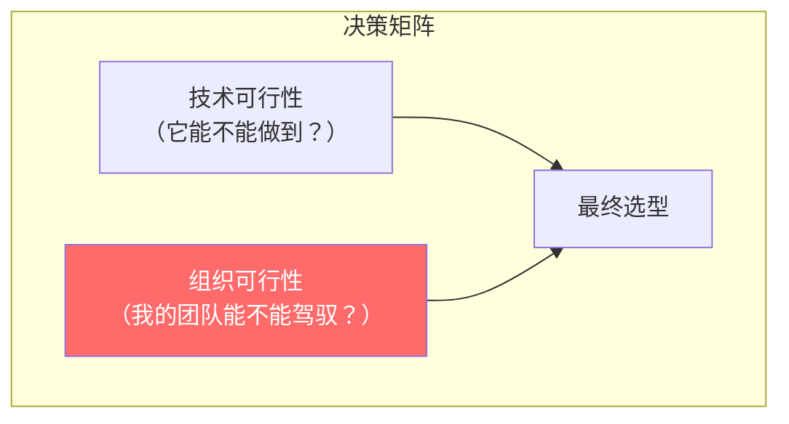
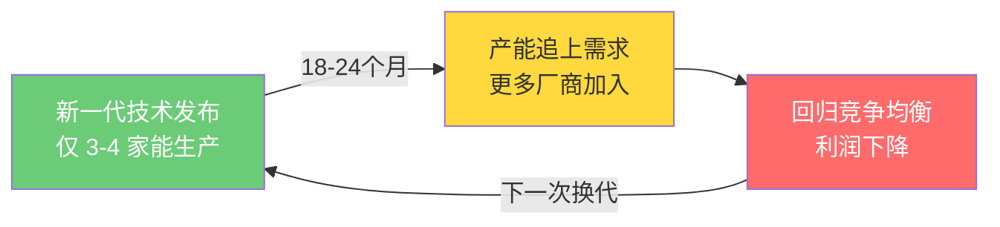

# 思维模型库

::: tip 使用说明
这里收录的是跨周次提炼出的**可复用分析框架**。每个模型标注来源周次，但其适用范围不限于来源周。
:::

## 模型 1：硬约束三角（Week 1）

分析任何基础设施方案时，检查三个维度是否同时满足：

**应用场景**：评估电力方案、数据中心选址、芯片供应商选择——凡是涉及"基础设施选型"的决策，先画出三角，标出每个方案能满足哪两个角。

## 模型 2：产能弹性 × 定价权矩阵（Week 1）

判断产业链某环节能否捕获超额利润：

|  | 产能弹性高 | 产能弹性低 |
|--|-----------|-----------|
| **定价权强** | 短期暴利，但竞争者快速涌入 | **持续超额利润**（理想位置） |
| **定价权弱** | 完全竞争，无超额利润 | 被上下游挤压，最惨 |

**应用场景**：分析任何产业链环节的投资价值。先问：它的产能扩张需要多久？它面对上下游有没有定价权？

## 模型 3：建设周期错配分析（Week 1）

当需求增长速度 >> 供给建设周期时，产生结构性短缺。

**应用场景**：任何"需求暴增但供给有物理约束"的场景。错配越大，中间环节的定价权越强。

---

## 模型 4：软件生态锁定 > 硬件锁定（Week 3）

评估竞争护城河的持久度时，区分两种锁定类型：

| | 硬件锁定 | 软件生态锁定 |
|--|---------|------------|
| **打破方式** | 买新设备（一次性动作） | 重写代码 + 重建社区（持续投入） |
| **成本类型** | 金钱 | 工程师-年 |
| **随时间变化** | 设备折旧 → 锁定减弱 | 生态积累 → 锁定加强 |
| **典型案例** | NVLink → AMD Infinity Fabric 可替代 | CUDA → ROCm 迁移成本极高 |

**应用场景**：分析任何平台/生态的护城河时，先区分"花钱能解决"和"花钱也解决不了"的锁定层。后者才是真正的长期壁垒。

## 模型 5：组织能力决定技术选型（Week 3）

同一个技术方案，对不同规模组织的可行性截然不同：

**应用场景**：评估技术方案时不只问"这个技术好不好"，还要问"这个技术需要多少人、什么水平的人来运维和调优"。Meta 选以太网替代 InfiniBand 成功（1,000+ 网络工程师），不代表 500 人创业公司也能做到。**"开箱即用"（Turnkey）方案在组织能力受限时价值极高。**

## 模型 6：技术代际窗口期（Week 3）

技术换代期存在 18-24 个月的溢价窗口：

**应用场景**：分析"看起来没有垄断但利润很高"的环节时，检查是否处于技术换代窗口期。典型案例：800G 光模块（2024-2025 仅少数厂商能做 → 短期超额利润 → 2026+ 产能追上 → 回归量大利薄）。投资时机比选公司更重要。

---

## 模型 7：缝隙战略——面对飞轮型垄断的进攻路径（Week 4）

面对已经转起来的飞轮（正反馈循环），正面硬刚几乎不可能成功。有效策略是**找到飞轮覆盖不到的缝隙**，在缝隙中建立根据地，再逐步扩大。

**应用场景**：AMD 挑战 NVIDIA 的最优策略不是追平 CUDA 生态（正面硬刚），而是专攻推理市场（CUDA 依赖弱、性价比敏感）。同理适用于任何挑战者 vs 生态型垄断的竞争分析——找对手不强的细分领域切入。

## 模型 8：先免费后付费的优化序列（Week 4）

面对效率/性能问题时，按投资回报率排序优化动作：

| 优先级 | 类型 | 成本 | 典型手段 |
|--------|------|------|---------|
| **1** | 软件优化（免费） | 零/低 | 算法改进、通信重叠、算子融合 |
| **2** | 配置优化（低成本） | 低 | 调参、调度策略、批次大小 |
| **3** | 硬件升级（高成本） | 高 | 换 GPU、升级 HBM、加网络带宽 |

**应用场景**：不只适用于 GPU 优化。任何效率问题的优化序列都应该先穷尽免费选项再花钱。类比策略运营：先把免费流量玩法做到极致，再投预算买付费流量。

## 模型 9：推理成本与 TAM 的正反馈（Week 4）

推理成本降低 → 更多场景的 Unit Economics 跑通 → 市场扩大 → 总调用量暴增 → 需求不降反增。

**应用场景**：评估技术进步的商业影响时，不只看存量市场的成本节省（零和），更要看它打开的**增量市场**（正和）。价格弹性越高的市场，成本降低带来的增量越大。

---

## 待补充

后续周次的新模型将持续添加。
