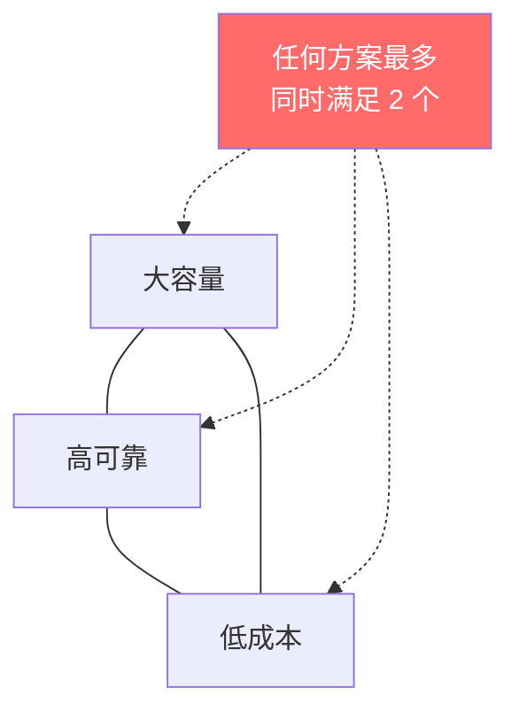
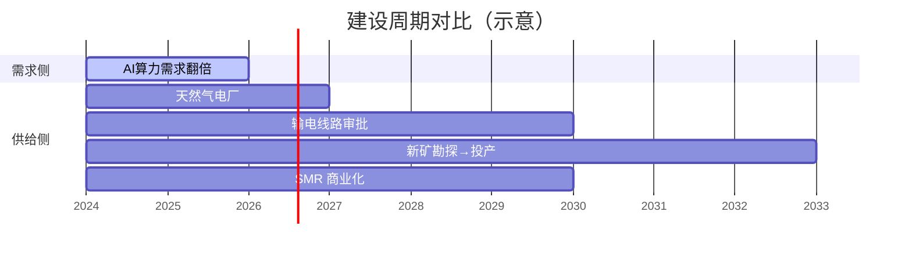

# 思维模型库

::: tip 使用说明
这里收录的是跨周次提炼出的**可复用分析框架**。每个模型标注来源周次，但其适用范围不限于来源周。
:::

## 模型 1：硬约束三角（Week 1）

分析任何基础设施方案时，检查三个维度是否同时满足：

**应用场景**：评估电力方案、数据中心选址、芯片供应商选择——凡是涉及"基础设施选型"的决策，先画出三角，标出每个方案能满足哪两个角。

## 模型 2：产能弹性 × 定价权矩阵（Week 1）

判断产业链某环节能否捕获超额利润：

|  | 产能弹性高 | 产能弹性低 |
|--|-----------|-----------|
| **定价权强** | 短期暴利，但竞争者快速涌入 | **持续超额利润**（理想位置） |
| **定价权弱** | 完全竞争，无超额利润 | 被上下游挤压，最惨 |

**应用场景**：分析任何产业链环节的投资价值。先问：它的产能扩张需要多久？它面对上下游有没有定价权？

## 模型 3：建设周期错配分析（Week 1）

当需求增长速度 >> 供给建设周期时，产生结构性短缺。

**应用场景**：任何"需求暴增但供给有物理约束"的场景。错配越大，中间环节的定价权越强。

---

## 待补充

后续周次的新模型将持续添加。
