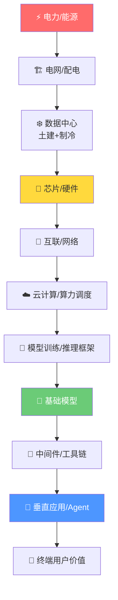

# 12 周研究大纲

## 底层逻辑：为什么要从电力开始？

一个大模型训练集群的本质是一台**将电力转化为权重参数的热力学机器**。当前一个 GPT-4 级别模型单次训练消耗约 50-100 GWh 电量，相当于一个 10 万人城市一个月的用电。推理阶段的总能耗已经超过训练。这意味着 AI 产业的第一性瓶颈不是算法，而是**能量供给与散热**。

整条产业链的价值传导路径：

> 每一层对上一层的依赖关系是**刚性约束**，而非软性偏好。

---

## 四大阶段 · 12 周路线图

### 第一阶段：物理基础设施层（Week 1-3）

| 周次 | 模块 | 核心命题 |
|------|------|---------|
| **W1** | [电力、电网与能源底层](/week-01/lecture) | AI 的物理边界在哪？1GW 数据中心的电力架构？核电/气电/绿电的经济性拐点？ |
| **W2** | [数据中心：土建、制冷与选址经济学](/week-02/lecture) | 液冷 vs 风冷的 TCO 分水岭？Tier IV 级别 DC 的资本结构？ |
| **W3** | [高速互联与网络拓扑](/week-03/lecture) | InfiniBand vs 以太网？NVLink 如何重新定义"一台计算机"的边界？ |

### 第二阶段：芯片与硬件层（Week 4-6）

| 周次 | 模块 | 核心命题 |
|------|------|---------|
| **W4** | [GPU 架构深度拆解](/week-04/lecture) | NVIDIA 护城河是硬件还是 CUDA？Blackwell 的关键设计决策？ |
| **W5** | [AI 芯片竞争格局](/week-05/lecture) | TPU / AMD MI / 华为昇腾的真实竞争力？ASIC vs GPU 终局？ |
| **W6** | 存储与内存墙 | HBM 为何成为 AI 芯片"命门"？CXL 能否打破内存墙？ |

### 第三阶段：模型与算法层（Week 7-9）

| 周次 | 模块 | 核心命题 |
|------|------|---------|
| **W7** | Transformer 与 Scaling Law | 注意力机制的计算瓶颈？Scaling Law 的统计力学解释？ |
| **W8** | 训练工程 | 3D 并行的工程取舍？合成数据天花板？RLHF/DPO 本质区别？ |
| **W9** | 推理优化与推理经济学 | 量化/蒸馏的帕累托前沿？推理成本为何决定 AI 商业化天花板？ |

### 第四阶段：应用与 Agent 层（Week 10-12）

| 周次 | 模块 | 核心命题 |
|------|------|---------|
| **W10** | 云计算与算力调度 | AWS/Azure/GCP 的 AI 基础设施差异？Serverless GPU 的经济模型？ |
| **W11** | AI Agent 架构与工具链 | RAG/MCP 的技术本质？多 Agent 系统的工程挑战？ |
| **W12** | 终局推演 | Copilot vs 自主 Agent？AI SaaS 定价变革？哪一层捕获最多价值？ |

---

## 大纲设计原则

1. **自底向上的因果链**：每一周是下一周的物理前提
2. **每周三交付件**：技术解构 + 商业闭环 + 推演思考题
3. **存盘即解锁**：回复思考题 + 提出追问 = 完成存盘，解锁下一周
