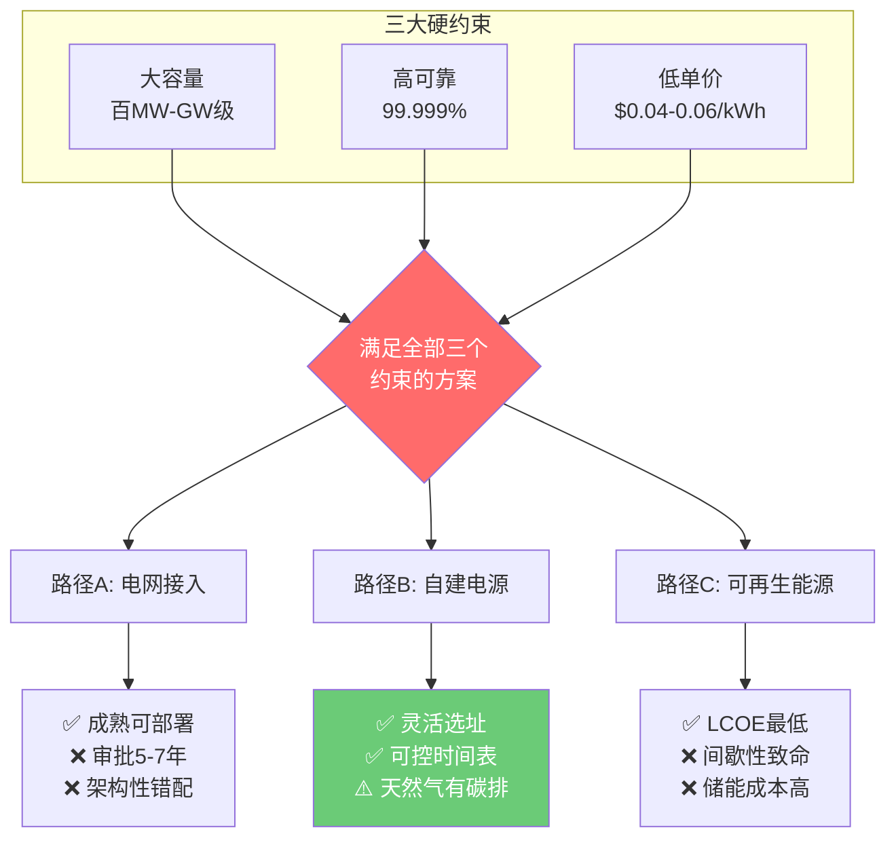
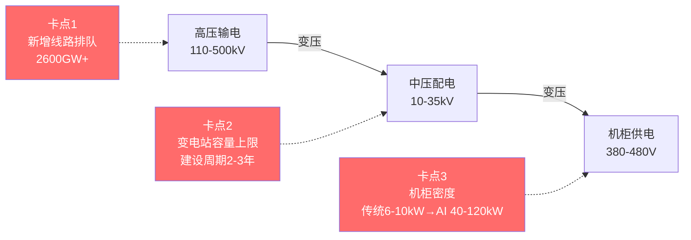
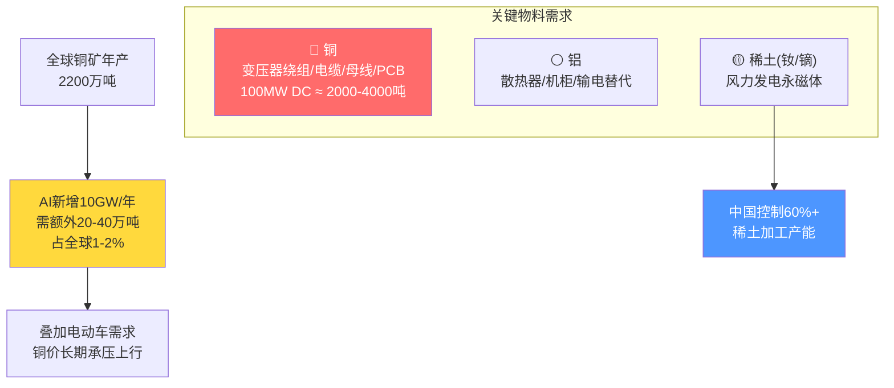

---
prev:
  text: '12 周大纲'
  link: '/outline'
next:
  text: '💬 互动记录'
  link: '/week-01/interaction'
---

# Week 1：电力、电网与能源底层——AI 的物理边界

::: tip 本周核心命题
1GW 数据中心的电力架构长什么样？核电/气电/绿电各自的经济性拐点在哪？AI 的扩张边界由什么决定？
:::

## 一、核心技术解构：1GW 数据中心的电力架构

### 1.1 基本物理事实

一块 NVIDIA H100 GPU 的 TDP（热设计功耗）为 **700W**。一台 DGX H100 服务器装 8 块 GPU，加上 CPU、内存、NVSwitch、网卡、风扇，整机功耗约 **10.2kW**。

一个标准 AI 训练集群需要数千到数万块 GPU。Meta 的 Llama 3 405B 用了 16,384 块 H100，仅 GPU 功耗就是 **11.5MW**，加上配套基础设施（制冷、网络、存储），实际数据中心功耗约为 GPU 功耗的 **1.4-1.6 倍**（这个系数叫 PUE，Power Usage Effectiveness），总功耗约 **16-18MW**。

今天头部玩家规划的是 **GW 级**数据中心：

| 玩家 | 规划规模 | 等效对比 |
|------|---------|---------|
| Microsoft（Stargate 项目） | 1-5 GW | 一座中型核电站的全部输出 |
| xAI（Memphis） | 150MW → 1GW 扩展 | 一个中型城市的峰值用电 |
| Amazon（数据中心集群） | 多个 300-500MW 站点 | 已经在买核电站 |

::: warning 关键认知
1GW = 1,000,000 kW。一个中国普通家庭平均用电约 0.5kW。1GW 数据中心的耗电量等于 **200 万个家庭**的用电总和。
:::

### 1.2 电力供给的三条路径及其经济性

AI 数据中心对电力的需求有三个硬约束：**大容量**（百MW到GW级）、**高可靠**（99.999% 可用率）、**低单价**（电费是运营成本的 40-60%）。三个约束同时满足，答案空间极窄。

#### 路径 A：电网接入（Grid Power）

- **优势**：成熟、可快速部署
- **致命问题**：电网不是为单点 GW 级负载设计的。美国电网的新增输电线路审批周期 **5-7 年**。中国的特高压直流（±800kV/±1100kV）传输能力强，但终端变电站容量有上限
- **经济性**：美国工业电价约 $0.04-0.07/kWh，中国约 ¥0.3-0.6/kWh。1GW 数据中心年电费约 **$3.5-6 亿**（PUE 1.3，年利用 8000h）
- **本质矛盾**：电网是为分布式负载设计的公共基础设施，AI 数据中心是极端集中的私有负载——**架构性错配**

#### 路径 B：自建/就近电源（On-site Generation）

**天然气发电**
- 建设周期 2-3 年，LCOE 约 $0.04-0.06/kWh，可灵活选址
- 微软、Amazon 都在走这条路
- 问题：碳排放（每度电约 400g CO2）+ 天然气管道容量限制

**核电（SMR 小型模块化反应堆）**
- LCOE 目标 $0.05-0.08/kWh，零碳，7x24 稳定输出
- NuScale、Oklo 等与科技巨头签约
- 问题：**截至 2026 年中没有一座 SMR 商业化运行**，最乐观时间表 2028-2030

::: info 关键判断
中短期（2024-2027），天然气是唯一能同时满足大容量+快速部署+低成本的方案。核电是 2030+ 的终局解，但不是当下的解。
:::

#### 路径 C：可再生能源（Solar/Wind + Storage）

- **优势**：LCOE 已降到 $0.02-0.04/kWh（光伏）和 $0.03-0.05/kWh（陆上风电），所有电源中最便宜
- **致命问题**：间歇性。AI 训练需 7x24 供电，光伏容量因子仅 20-25%，风电约 25-35%
- **储能经济学**：1GW 数据中心覆盖夜间 12 小时无光照，需 12GWh 储能。按锂电池 $150-200/kWh，仅储能投资 **$18-24 亿**

> 纯绿电方案的 LCOE 虽低，但加上储能后的"全时段等效成本"仍高于天然气。绿电在 AI 场景下是一个 **PR 叙事远强于经济性叙事** 的方案。

### 1.3 电力传输的物理瓶颈

即使发电端不是问题，电力从电源到机柜的传输链路上有三个卡点：

1. **输电网络容量**：美国 PJM 互联电网新增接入排队超 2,600GW，每年批准不到 5%
2. **变电站与配电**：每级变压都有容量上限和建设周期
3. **机柜级配电密度**：传统机柜 6-10kW，AI 机柜需 **40-120kW**。配电母线、铜缆截面积增加 4-12 倍——这是铜的物理截面积问题

::: danger 一句话总结
AI 的电力瓶颈不在"发多少电"，而在"把电送到 GPU 旁边"的最后几公里。
:::

---

## 二、商业闭环剖析：谁在电力层赚钱？

### 2.1 价值链拆解

**利润最厚的两个环节：数据中心运营商（REITs）和电力设备商。**

| 环节 | 代表公司 | 赚钱逻辑 |
|------|---------|---------|
| 数据中心运营商 | Equinix / Digital Realty / 万国数据 | "带电的商业地产"，10-15年长租约，AI热潮下租金定价权转向业主 |
| 电力设备商 | 伊顿 / 施耐德 / 西门子能源 / 特变电工 | 变压器全球供不应求，交货周期 12→36-48 个月，拥有定价权 |
| 发电侧 | Vistra Energy / Constellation Energy | AI 需求拉动电价上涨；核电 PPA 推高估值（但收入兑现要等 SMR 投产） |

### 2.2 中美对比：制度性差异决定博弈结构

| 维度 | 美国 | 中国 |
|------|------|------|
| 电力市场 | 部分自由化，批发电价波动大 | 计划电+市场电双轨，大工业电价相对稳定 |
| 数据中心选址 | 受电网审批限制，向中西部迁移 | "东数西算"政策引导，但算力需求集中东部 |
| 核电路径 | SMR 初创 + 科技巨头联盟 | 国有核电集团主导，华龙一号量产中 |
| 核心矛盾 | 电网审批慢 + NIMBYism | 西部绿电充沛但传输损耗+时延 vs 东部电力紧张 |

### 2.3 投资视角的关键指标

判断一家 AI 公司算力扩张是否可持续，**先看电力保障**：

| 指标 | 含义 | 参考值 |
|------|------|--------|
| 已签 PPA 容量 | 锁定多少 MW 长期低价电 | 越大越好 |
| 电力接入时间表 | 新建 DC 电力接入是否获批 | 排队时间 < 2年为佳 |
| PUE 水平 | 基础设施能效比 | Google 1.1（极致）/ 行业 1.3 / >1.5 有问题 |
| 单位算力电费占比 | 电费占每 FLOPS 成本比例 | 越高说明越接近物理极限 |

---

## 三、上游资源：铜、铝与稀土——被忽视的物料约束

::: warning 关键认知
数据中心是重工业，不是纯软件。
:::

- **铜**：一个 100MW 数据中心铜用量约 2,000-4,000 吨。AI 数据中心年新增 10GW 需额外 20-40 万吨，占全球产量 1-2%
- **铝**：散热器、机柜框架、输电线路替代材料
- **稀土**：风力发电机永磁体。绿电路线成主流则稀土需求上升，中国控制 60%+ 加工产能

> AI 的扩张最终受制于采矿业的产能扩张周期（新矿从勘探到投产：**7-10 年**）。这是一个以"十年"为单位的硬约束。

---

## Week 1 思考题

::: tip 推演规则
请认真思考以下三个问题，形成你自己的判断框架后回复。没有标准答案，但有高质量和低质量的推理之分。完成回复后进入 [互动记录](/week-01/interaction) 存档。
:::

### 思考题 1：电力瓶颈的时间窗口

> 假设到 2028 年，全球 AI 数据中心总功耗需求达到 50GW（当前约 5-8GW）。哪种电力供给方案最有可能成为 2025-2028 窗口期的"主力解"？请从**建设周期、经济性、政策可行性**三个维度排序。

### 思考题 2：中国的"东数西算"悖论

> 中国西部有充沛绿电和低廉土地，但 AI 训练对网络时延极其敏感（跨节点通信时延每增加 1ms，万卡集群效率下降约 0.5-1%）。如果你是一家中国 AI 公司的 Infra VP，你会把万卡训练集群放在东部还是西部？你的决策框架是什么？

### 思考题 3：电力层的价值捕获

> 在"电力设备商 → 发电商 → 电网 → 数据中心运营商"链路中，哪个环节在 AI 浪潮中最终能捕获最大超额利润？提示：思考"定价权"和"产能弹性"这两个概念。
