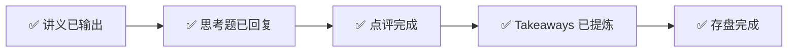

---
prev:
  text: '📖 讲义'
  link: '/week-02/lecture'
next:
  text: '✅ 认知存盘'
  link: '/week-02/takeaways'
---

# Week 2 · 互动记录

::: info 状态
✅ 思考题互动完成
:::

## 交互流程

## 思考题回顾

### 题目 1：改造 vs 新建
> 10 个现有传统风冷 DC（单机柜 8kW），面临 AI 算力需求。改造还是新建？

**你的回答**：选 B——新建。三个理由：
1. **模块化预制（Modular Prefab）节省时间**：新建采用模块化预制方案，6-9 个月可交付，速度可控
2. **全生命周期 TCO（Total Cost of Ownership）更优**：改造看似省资本开支，但长期运营成本（冷却效率差、密度上不去）导致 TCO 反而更高
3. **技术硬约束不可绕过**：风冷物理极限在 25-30kW/柜，AI 训练机柜需要 40-120kW/柜，风冷改液冷涉及地板承重、管路、配电全面重做，等于推倒重来

**点评与补充**：✅ 判断正确——但最优解是**混合策略（Hybrid Strategy）**

核心逻辑没问题：新建是主力方向。但需要补充一个关键判断维度——**训练 vs 推理的部署分离**（这个框架在 Week 1 已经建立过）：

| 场景 | 机柜密度需求 | 散热方案 | 现有 DC 是否可用 |
|------|-------------|---------|-----------------|
| AI 训练（Training） | 40-120kW/柜 | 液冷（必须） | ❌ 不可行 |
| AI 推理（Inference） | 15-25kW/柜 | 风冷勉强可行 | ✅ 改造后可用 |

**最优策略**：
- **现有 10 个 DC → 改造为推理集群**：推理机柜 15-25kW/柜在风冷极限范围内，升级配电即可，不浪费已有资产
- **新建 DC → 专为训练设计**：液冷、高密度、模块化预制，从头按 AI 需求设计

**决策优先级方法论**："先排除硬约束，再优化软变量"
1. 先识别不可绕过的物理/技术约束（如风冷极限）
2. 排除硬约束后，在可行域内优化成本、时间、运营等软变量

---

### 题目 2：液冷方案选型
> 500MW AI 训练集群（B200 GPU，100kW/柜），冷板液冷 vs 浸没式液冷？

**你的回答**：选冷板液冷（Cold Plate）。两个理由：
1. **供应链成熟度**：冷板液冷的供应链更成熟，组件标准化程度高，大规模采购有保障
2. **运维实操性**：冷板方案允许单卡热插拔维护，浸没式需要把整个服务器从冷却液中取出，运维复杂度和停机时间显著增加

**点评与补充**：✅ 判断正确，补充三个加分项

1. **B200 原生支持冷板**：NVIDIA B200/GB200 在硬件设计上原生集成了冷板液冷接口，选冷板是跟着 GPU 厂商的设计走，兼容性最好
2. **PFAS 监管风险**：浸没式液冷使用的氟化冷却液属于全氟烷基物质（PFAS, Per- and Polyfluoroalkyl Substances），欧盟和美国多州已提出限制/禁令。500MW 集群生命周期 10-15 年，监管风险不可忽视
3. **供应链交付能力**：500MW 规模对应约 5,000 个机柜，冷板方案的 CDU（Coolant Distribution Unit）和管路可以标准化批量生产；浸没式的定制化槽体和专用冷却液在这个规模下交付能力存疑

---

### 题目 3：东南亚数据中心热潮
> 马来西亚柔佛成为亚洲 AI DC 热点，驱动力和风险是什么？你会把训练集群放那里吗？

**你的回答**：
- **驱动力**：电价便宜、建设成本低、地理位置靠近新加坡（网络节点）
- **风险**：地缘政治不确定性、数据主权（Data Sovereignty）问题
- **决策**：不会放马来西亚，对比后更倾向内蒙古（电价低、国内数据安全可控）

**点评与补充**：⚠️ 驱动力分析遗漏了最关键的因素

你列举的驱动力（电价、成本、地理）都成立，但**漏掉了最核心的驱动力——美国 GPU 出口管制（Export Control）**。

**被忽略的关键事实**：
- 美国对中国实施芯片出口管制，中国企业**无法合法购买 H100/B200 等高端训练 GPU**
- 中国企业能买到的最高端型号是 H20，性能仅为 B200 的 **1/3 到 1/5**（3-5x 性能差距）
- 中国企业去东南亚建 DC 的首要目的不是省电费，而是**在合规框架下获取高端 GPU 的使用权**
- 马来西亚、新加坡、日本等地不受出口管制限制，可以合法部署 H100/B200

**正确答案："双轨策略（Dual-Track Strategy）"**

| 部署位置 | 用途 | GPU 型号 | 原因 |
|---------|------|---------|------|
| 海外（东南亚/日本） | 训练（Training） | H100/B200 | 绕过出口管制，获取最强算力 |
| 国内（内蒙古等） | 推理（Inference） | H20/国产芯片 | 数据安全、低时延、合规 |

**内蒙古 vs 马来西亚的对比修正**：
- 内蒙古的优势（电价低、数据安全）在推理场景成立
- 但训练场景下，**GPU 性能差距（3-5x）远远压过电价优势**，必须用海外方案

---

## 追问与延伸讨论

### Q: InfiniBand vs Ethernet（以太网）——GPU 集群用哪种网络？

这个问题承接 Week 1 的通信时延讨论，预热 Week 3 高速互联主题。

| | InfiniBand (IB) | Ethernet（以太网） |
|--|----------------|-------------------|
| **时延** | 0.5-1.5 微秒 | 5-20 微秒 |
| **生态** | NVIDIA 垄断（收购 Mellanox） | 开放生态，多厂商竞争 |
| **成本** | 高（绑定 NVIDIA 全家桶） | 相对低，但需要 RoCE/RDMA 改造 |
| **适用场景** | 万卡训练集群（性能优先） | 推理集群、中小规模训练（成本优先） |

关键洞察：InfiniBand 是 NVIDIA 垄断生态的又一环——GPU（CUDA）+ 网络（IB）+ 互联（NVLink）形成闭环锁定。Week 3 会深入拆解。

### Q: GPU 挖矿 vs GPU 训练——为什么区块链没有催生类似的算力军备竞赛？

概念辨析：
- **区块链挖矿**：计算任务简单（哈希碰撞），可以用 ASIC（Application-Specific Integrated Circuit）专用芯片替代 GPU，且不需要 GPU 间通信
- **AI 训练**：计算任务复杂（矩阵乘法 + 梯度同步），必须用通用 GPU，且需要 GPU 间高速通信（AllReduce）
- 结论：区块链算力需求被 ASIC 分流，不会推高 GPU 价格；AI 训练是 GPU 不可替代的场景，才形成了真正的算力军备竞赛
