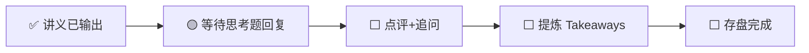

---
prev:
  text: '📖 讲义'
  link: '/week-02/lecture'
next:
  text: '✅ 认知存盘'
  link: '/week-02/takeaways'
---

# Week 2 · 互动记录

::: info 状态
🟡 等待思考题推演回复
:::

## 交互流程

## 思考题回顾

### 题目 1：改造 vs 新建
> 10 个现有传统风冷 DC（单机柜 8kW），面临 AI 算力需求。改造还是新建？

**你的回答**：（待填写）

**点评与补充**：（待填写）

---

### 题目 2：液冷方案选型
> 500MW AI 训练集群（B200 GPU，100kW/柜），冷板液冷 vs 浸没式液冷？

**你的回答**：（待填写）

**点评与补充**：（待填写）

---

### 题目 3：东南亚数据中心热潮
> 马来西亚柔佛成为亚洲 AI DC 热点，驱动力和风险是什么？你会把训练集群放那里吗？

**你的回答**：（待填写）

**点评与补充**：（待填写）

---

## 追问与延伸讨论

（互动过程中产生的追问将记录在此）
