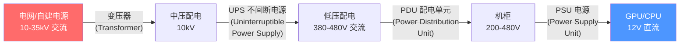
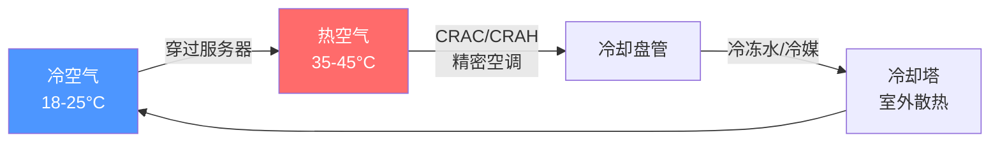
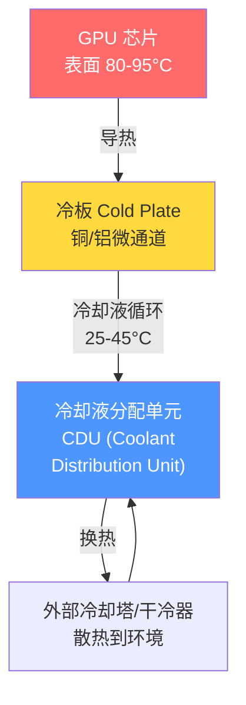
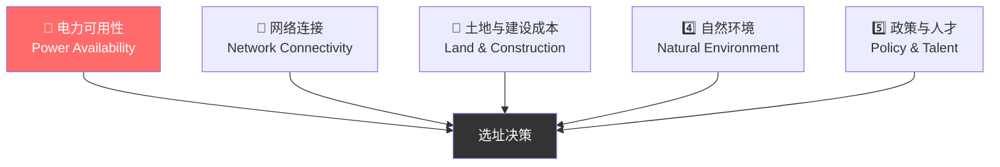
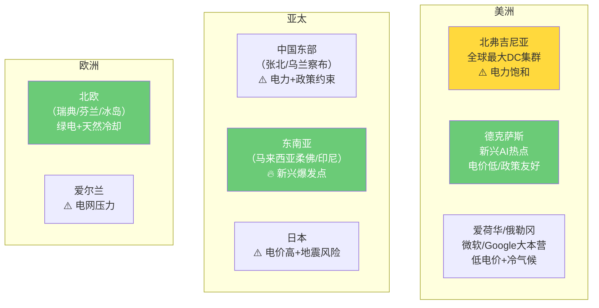
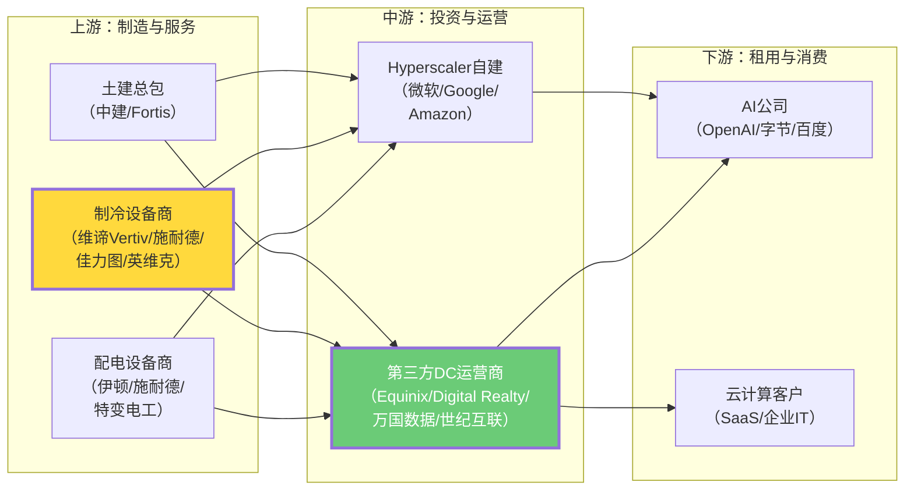

---
prev:
  text: 'Week 1 · 认知存盘'
  link: '/week-01/takeaways'
next:
  text: '💬 互动记录'
  link: '/week-02/interaction'
---

# Week 2：数据中心——土建、制冷与选址经济学

::: tip 本周核心命题
数据中心是把电力转化为可用算力的"容器"。电到了门口之后，怎么变成 GPU 可以用的计算能力？为什么散热（Cooling）是数据中心的第二大成本？液冷（Liquid Cooling）vs 风冷（Air Cooling）的经济拐点在哪？选址除了电力还看什么？
:::

## 为什么要单独用一周讲数据中心？

Week 1 我们讲了电力是 AI 的物理边界。但电力只是"原料"——你不能把高压电线直接插到 GPU 上。中间需要一个**物理容器**，把不稳定的电网电力变成 GPU 可以稳定消耗的直流电，同时把 GPU 产生的巨量废热带走。这个容器就是**数据中心（Data Center, DC）**。

**关键认知**：数据中心不是"放服务器的房子"，而是一套精密的**能量转换与热管理系统**。在一个典型的 AI 数据中心里：

- **电力系统**（Power Distribution）占建设成本的 30-40%
- **制冷系统**（Cooling System）占建设成本的 20-30%
- **IT 设备**（服务器/GPU）只占建设成本的 20-30%
- 剩余是土建、网络、安防等

换句话说，你花在"让 GPU 正常工作的周边系统"上的钱，比 GPU 本身还多。这就是为什么数据中心是一个独立的、价值极高的产业环节。

---

## 一、核心技术解构：数据中心的内部架构

### 1.1 从电网到芯片：电力如何一步步"变形"

在 Week 1 我们讲了电力传输的宏观瓶颈。现在我们进入数据中心内部，看电力在"最后 100 米"怎么流动。

每一步转换都有**能量损耗**（以热量形式散失）：

| 环节 | 典型效率 | 损耗去哪了 |
|------|---------|-----------|
| 变压器 | 98-99% | 铁损+铜损，变成热量 |
| UPS（不间断电源） | 94-97% | 电池充放电+逆变器损耗 |
| PDU（配电单元） | 99% | 微小线路损耗 |
| PSU（服务器电源） | 94-96% | AC-DC 转换损耗 |
| **累计到 GPU** | **~87-91%** | 每送 100W 到数据中心门口，只有约 87-91W 到达 GPU |

::: warning 为什么这很重要？
这意味着在一个 1GW 数据中心里，仅电力转换环节就会产生 **90-130MW 的废热**——还没算 GPU 本身产生的热量。这些热量如果不及时带走，芯片温度几分钟内就会超过安全阈值（通常 80-95°C），导致降频（Thermal Throttling，温度过高时自动降低运行速度）甚至烧毁。

所以**制冷不是"附加功能"，而是数据中心的生存必需系统**。
:::

### 1.2 数据中心的分级体系：Tier I-IV

**为什么要分级？** 因为不同业务对"不能停机"的容忍度不同。银行交易系统一秒都不能断，而一个内部测试环境停几个小时也无所谓。数据中心行业用 **Uptime Institute** 的 Tier 分级来衡量可靠性：

| 等级 | 年可用率 | 年最大停机时间 | 核心特征 | 典型用途 |
|------|---------|-------------|---------|---------|
| **Tier I** | 99.671% | 28.8 小时 | 单路供电，无冗余 | 小企业/测试环境 |
| **Tier II** | 99.741% | 22.7 小时 | 部分冗余组件 | 中小企业 |
| **Tier III** | 99.982% | 1.6 小时 | 双路供电，可并行维护（Concurrently Maintainable） | 大型企业/云服务 |
| **Tier IV** | 99.995% | 26 分钟 | 全冗余，容错设计（Fault Tolerant） | 金融/关键基础设施 |

**AI 训练数据中心的特殊矛盾**：AI 训练对可用率的要求看似不如金融（训练中断可以从 Checkpoint 恢复），但一次万卡训练可能持续数周到数月，频繁中断的代价是巨大的——每次中断后重启、重新加载数据、重新预热的时间可能浪费数小时算力。按 H100 的云租赁价格（约 $2-3/GPU/小时），16,384 卡中断 4 小时的直接成本损失约 **$13-20 万**。

所以 AI 数据中心通常按 **Tier III** 或 **Tier III+** 建设，在可靠性和成本之间取平衡。

### 1.3 AI 机柜 vs 传统机柜：密度革命

这是 AI 数据中心与传统数据中心最根本的差异：

| 维度 | 传统数据中心（云计算/存储） | AI 数据中心（训练/推理） |
|------|-------------------------|----------------------|
| **单机柜功率密度** | 6-10 kW | **40-120 kW** |
| **每机柜 GPU 数量** | 0-2 块（CPU 为主） | 8-16 块（GPU 为主） |
| **散热方式** | 风冷（Air Cooling）足够 | 风冷不够，必须液冷（Liquid Cooling） |
| **网络要求** | 10-25 Gbps 以太网 | 400-800 Gbps InfiniBand |
| **地板承重** | 1-2 吨/平方米 | 需要 **3-5 吨/平方米** |
| **供电方式** | 交流 PDU | 趋势转向直流配电（减少转换损耗） |

**为什么密度暴涨？** 本质原因是 GPU 的功耗密度远高于 CPU：

- 一块 Intel 至强 CPU：250-350W，面积约 800mm²
- 一块 NVIDIA H100 GPU：700W，面积约 814mm²（单 die）
- 下一代 NVIDIA B200：1,000W+

同样面积的芯片，GPU 的发热量是 CPU 的 2-4 倍。8 块 GPU 塞进一台服务器，热密度直接飙升到传统服务器的 **10-20 倍**。

::: danger 这意味着什么？
绝大多数现有数据中心**无法直接改造为 AI 数据中心**。地板承重不够、配电容量不够、制冷能力不够——这三个物理约束中任何一个都足以判"死刑"。这就是为什么 AI 浪潮下需要大量**新建**数据中心，而不是简单地往现有机房里塞 GPU。

这也解释了为什么数据中心运营商（Equinix、Digital Realty、万国数据）在 AI 时代获得了巨大的定价权——能承载 AI 负载的机柜供给严重不足。
:::

---

## 二、制冷：数据中心的第二大成本

### 2.1 为什么制冷是 AI 数据中心的核心挑战？

**一个直觉性的类比**：一块 H100 GPU 的功耗是 700W，工作面积约 800mm²（大约一张邮票大小）。700W 的热量集中在一张邮票上——这个热流密度（Heat Flux）约 **87.5 W/cm²**，已经接近**电炉灶**的热流密度（约 100 W/cm²）。

你可以想象一下：一台 DGX H100 服务器 = 8 个电炉灶在一个机柜大小的空间里同时全功率运行。一排机柜 = 几十个电炉灶。一个机房 = 几百个电炉灶。

如果不制冷，机房温度在几分钟内就会飙升到 50°C 以上，GPU 开始降频（Thermal Throttling），算力直接打折。超过极限温度（~105°C），芯片直接损坏。

### 2.2 风冷（Air Cooling）：传统方案为什么撞墙了

**风冷的工作原理很简单**：用空调把冷空气吹向服务器，带走热量，然后把热空气排到室外冷却后再循环。

> **CRAC**（Computer Room Air Conditioner，机房精密空调）/ **CRAH**（Computer Room Air Handler，机房空气处理单元）：数据中心专用的空调系统，比家用空调精确得多，可以控制温度和湿度。

**风冷的物理极限**：空气的比热容（Specific Heat Capacity）很低——1 kg 空气升温 1°C 只能带走约 1,005 焦耳的热量。而水的比热容是空气的 **4 倍**，加上水的密度是空气的约 830 倍，水的单位体积携热能力是空气的 **3,300 倍**。

当单机柜功率超过 **25-30 kW** 时，你需要吹过的空气量大到风扇噪音像飞机引擎，而且风道设计变得极其困难。超过 40 kW，风冷在工程上基本不可行了。

**行业现实**：在 2022 年之前，全球 95%+ 的数据中心用风冷，因为传统机柜功率在 6-10 kW，风冷完全够用。但 AI 机柜的 40-120 kW 功率密度一夜之间让风冷方案失效。这不是渐进的技术演进，而是**断崖式的需求跳变**。

### 2.3 液冷（Liquid Cooling）：AI 数据中心的必选项

**为什么液冷是 AI 时代的必选项？** 因为物理定律不允许风冷处理 GPU 级别的热密度。这不是"液冷更好"的问题，而是"风冷不可能"的问题。

液冷有两条主要技术路线：

#### 路线 A：冷板式液冷（Cold Plate / Direct-to-Chip Liquid Cooling）

**工作原理**：在 GPU/CPU 芯片表面贴一块金属冷板（Cold Plate），冷却液在冷板内部的微通道（Microchannel）中流动，直接从芯片表面带走热量。

**优势**：
- 可以处理 **80+ kW/机柜**的热密度
- 改造相对容易：在现有服务器上加装冷板，不需要完全重新设计
- NVIDIA 的 DGX/HGX 系列已经原生支持冷板式液冷
- 冷却液通常用去离子水或丙二醇水溶液，成本低

**劣势**：
- 只冷却 GPU/CPU 本身，其他组件（内存、网卡、VRM 供电模块）仍然需要风冷辅助
- 管路接头有泄漏风险（虽然概率低，但一旦泄漏可能损坏设备）
- 需要在机房内部署大量管道，增加了运维复杂度

**行业现状（2025-2026）**：冷板式液冷已经成为 AI 数据中心的**主流方案**。NVIDIA 从 H100 开始提供液冷版本，Blackwell B200/GB200 强烈推荐液冷部署。微软、Meta、Google 的新建 AI 集群几乎全部采用冷板液冷。

#### 路线 B：浸没式液冷（Immersion Cooling）

**工作原理**：把整台服务器完全浸泡在一种不导电的特殊液体（介电流体，Dielectric Fluid）中。整台机器的所有组件都直接被液体包裹散热。

**优势**：
- 散热效率最高，可以处理 **100+ kW/机柜**
- 所有组件同时冷却，不需要风扇（零噪音）
- PUE 可以做到 **1.02-1.05**（接近理论极限）
- 没有管路接头，无泄漏风险

**劣势**：
- **介电流体极其昂贵**：3M Novec/Fluorinert 系列每升 $50-200，一个浸没槽需要几百到上千升
- 运维困难：要换一块 GPU 需要把整个服务器从液体中捞出来
- 服务器需要重新设计（材料兼容性、连接器密封等）
- 液体蒸发/降解后需要补充，长期运营成本高

**行业现状**：浸没式液冷仍处于**小规模试点阶段**。少数公司（如 GRC、LiquidCool Solutions）在推广，但主流云厂商尚未大规模采用。短期内冷板式液冷是主流，浸没式是 2028+ 的潜力方案。

### 2.4 制冷方案的经济性对比

| 方案 | 适用功率密度 | PUE | 建设成本（每kW IT负载） | 运维复杂度 | 成熟度 |
|------|------------|-----|---------------------|-----------|--------|
| 传统风冷 | 6-25 kW/柜 | 1.3-1.5 | $8,000-12,000 | 低 | 极成熟 |
| 冷板液冷 | 25-100 kW/柜 | 1.1-1.2 | $12,000-18,000 | 中 | 成熟，正在规模化 |
| 浸没液冷 | 50-150+ kW/柜 | 1.02-1.1 | $15,000-25,000 | 高 | 早期，小规模试点 |

::: info TCO（Total Cost of Ownership，总拥有成本）视角
虽然液冷的建设成本高于风冷，但从 **5-10 年 TCO** 看，液冷反而更划算：
- **电费节省**：PUE 从 1.4 降到 1.15，意味着制冷用电减少了 65%。在 1GW 数据中心规模下，每年节省电费约 **$5,000-8,000 万**
- **密度提升**：同样面积放更多 GPU，减少了土地和建筑成本
- **芯片寿命**：温度更低更稳定，GPU 故障率下降，减少更换成本

所以液冷的 TCO 拐点大约在**机柜功率超过 20-25 kW** 时出现。AI 机柜 40-120 kW 的功率已经远超这个拐点，液冷不是"要不要用"的问题，而是"必须用"。
:::

---

## 三、选址经济学：数据中心建在哪里？

### 3.1 选址决策的五个核心变量

数据中心选址不是拍脑袋决定的，而是一个多变量优化问题。五个核心变量按重要性排序：

#### 变量 1：电力可用性（最重要）

Week 1 已经讲过，这是第一性约束。具体到选址：

- **电力容量**：当地电网能提供多少 MW？是否需要自建电源？
- **电力成本**：工业电价多少？能否签长期 PPA 锁定低价？
- **接入时间表**：变电站有没有余量？新建变电站要多久？

> **真实案例**：微软 2024 年重启了美国宾夕法尼亚州三里岛核电站（Three Mile Island，就是 1979 年发生核事故的那个），签了 20 年 PPA。为什么要花这么大代价？因为那个核电站旁边恰好有大量闲置的高压输电线路——电力容量和传输通道同时具备，这种条件极其稀缺。

#### 变量 2：网络连接

- **训练场景**：对外部网络要求不高（数据可以提前搬运到本地），但对**内部网络**（GPU 之间的 InfiniBand/以太网）要求极高。Week 1 讲过，训练集群必须在同一地点。
- **推理场景**：需要低延迟连接到终端用户。推理数据中心通常建在靠近人口密集区的位置（所谓 Edge DC，边缘数据中心）。
- **互联网交换点（IXP, Internet Exchange Point）**：大型数据中心通常选址在靠近 IXP 的位置，因为这里网络资源丰富。

#### 变量 3：土地与建设成本

| 地区 | 土地成本 | 建设成本（每 MW IT 负载） | 电价 |
|------|---------|----------------------|------|
| 美国弗吉尼亚（北弗吉尼亚） | 极高 | $10-15M/MW | 中等 |
| 美国德克萨斯 | 中 | $8-12M/MW | 低 |
| 美国中西部（爱荷华、俄勒冈） | 低 | $7-10M/MW | 低 |
| 中国北京/上海周边 | 极高 | ¥5,000-8,000万/MW | 高 |
| 中国贵州/内蒙 | 低 | ¥3,000-5,000万/MW | 低 |
| 东南亚（马来西亚、印尼） | 低 | $6-9M/MW | 低 |
| 北欧（瑞典、芬兰） | 中 | $8-12M/MW | 低（丰富水电） |

> **全球趋势（2025-2026）**：由于北弗吉尼亚（全球最大的数据中心集群，"Data Center Alley"）的电力和土地接近饱和，新建 AI 数据中心正在向**德克萨斯、中西部、东南亚和北欧**迁移。马来西亚柔佛州（Johor）因为靠近新加坡、电价低、政策友好，正在成为亚洲新的 AI 数据中心热点。

#### 变量 4：自然环境

- **气温**：气温越低，自然冷却（Free Cooling，利用外部冷空气直接冷却）的小时数越多，制冷成本越低。这是北欧和加拿大的核心优势——每年有 6-8 个月可以利用 Free Cooling。
- **湿度**：过高导致凝露，过低导致静电。理想范围：相对湿度 40-60%。
- **自然灾害风险**：地震、洪水、飓风直接影响数据中心的安全设计等级和保险成本。日本地震带上的数据中心需要额外的抗震设计，成本增加 10-20%。
- **水资源**：冷却塔需要大量水。一个 100MW 的风冷数据中心每天耗水量约 **100-300 万升**（相当于一个小型游泳池每小时被用完）。在缺水地区（如美国亚利桑那），水资源会成为限制因素。

#### 变量 5：政策与人才

- **税收优惠**：多个国家/地区对数据中心建设提供税收减免。爱尔兰曾因低企业税率吸引了大量美国科技公司的数据中心。
- **数据主权（Data Sovereignty）**：某些国家要求数据必须存储在本国境内（如中国、欧盟 GDPR）。这直接限制了数据中心的选址范围。
- **运维人才**：数据中心需要电气工程师、暖通工程师（HVAC, Heating Ventilation and Air Conditioning）、网络工程师。偏远地区可能面临人才短缺。

### 3.2 全球数据中心地理格局（2025-2026 最新）

**2025-2026 关键趋势**：

1. **"算力出海"成为中国 AI 公司的战略选择**。由于国内高端 GPU（H100/B200）受出口管制限制，部分中国 AI 公司选择在东南亚（马来西亚、印尼）建设训练集群，使用不受限制的 GPU。这催生了东南亚数据中心的建设热潮。

2. **超大规模（Hyperscale）数据中心持续集中化**。微软、Google、Amazon 三家的在建数据中心容量合计超过 **50GW**，占全球新增容量的 60%+。这种集中度意味着少数几家公司的选址决策就能改变一个地区的电网规划。

3. **数据中心建设周期被压缩**。传统数据中心建设周期 18-24 个月。为了抢占 AI 算力窗口，头部玩家正在尝试**模块化预制（Modular Prefab）**方案——在工厂里预制好标准化的数据中心模块（集装箱大小），运到现场拼装，建设周期压缩到 **6-9 个月**。这与 Week 1 讲的天然气自建电源（2-3 年）的时间线匹配。

---

## 四、商业闭环剖析：数据中心产业链的钱怎么流？

### 4.1 价值链拆解

### 4.2 两种商业模式的本质对比

| | Hyperscaler 自建 | 第三方运营商（Colocation） |
|--|-----------------|------------------------|
| **代表** | 微软、Google、Amazon、字节跳动 | Equinix、Digital Realty、万国数据 |
| **商业逻辑** | 数据中心是成本中心，服务于自身 AI/云业务 | 数据中心是利润中心，收取托管费（Colocation Fee） |
| **定价** | 内部转移定价，不直接产生收入 | 按 kW/月 或 机柜/月 收费，签 5-15 年长期合约 |
| **资本结构** | 从 CapEx（资本开支）走账，压缩折旧 | 很多是 REIT 结构，享受税收优惠，靠租金回报投资者 |
| **风险** | AI 投资回报不确定，CapEx 可能打水漂 | 租约锁定，现金流可预测，但扩建速度受制于融资和拿地 |

**2025-2026 的行业新变化**：

出现了一种新模式——**Build-to-Suit（定制建设）**。AI 公司（如 CoreWeave、Lambda Labs）与数据中心运营商签订长期合约，运营商按 AI 公司的需求定制建设（包括液冷、高密度配电），建好后 AI 公司长期租用。这种模式让 AI 公司不需要自己操心土建和制冷，同时运营商有长期租约保障，双方风险共担。

### 4.3 数据中心运营商的关键财务指标

如果你要评估一个数据中心公司：

| 指标 | 含义 | 健康值 |
|------|------|--------|
| **上架率（Utilization Rate）** | 已出租机柜 / 总可用机柜 | > 80% 为佳 |
| **月度经常性收入 MRR** | Monthly Recurring Revenue，每月合约收入 | 稳定增长 |
| **租约加权平均剩余期限 WALE** | Weighted Average Lease Expiry | > 5 年为佳 |
| **CapEx/MW** | 每 MW IT 负载的建设投资 | 参考上面选址表 |
| **PUE** | 能效比 | < 1.3 为佳，AI DC 目标 < 1.2 |
| **客户集中度** | Top 5 客户收入占比 | < 50% 较安全 |

---

## 五、上游设备：制冷产业链的隐形赢家

**为什么制冷设备商值得关注？** 因为 AI 带来的从风冷到液冷的转换，本质上是一次**技术栈替换（Technology Stack Replacement）**——不是"升级"，而是"换代"。这意味着：

1. 现有风冷设备商如果不转型，会被淘汰
2. 率先布局液冷的公司将获得先发优势（First-Mover Advantage）
3. 液冷产业链上还有一个关键组件——**冷却液**（Coolant），目前供应集中在少数几家化工巨头

| 液冷产业链环节 | 代表公司 | 壁垒 |
|-------------|---------|------|
| 冷板/散热器 | 台达（Delta）、Auras（双鸿）、Cooler Master | 精密制造+材料 |
| CDU（冷却液分配单元） | 维谛（Vertiv）、施耐德、英维克 | 系统集成+温控算法 |
| 冷却液（介电流体） | 3M（已退出 PFAS）、Solvay、Shell | 化学专利+环保合规 |
| 管路与连接器 | Swagelok、Parker Hannifin | 零泄漏密封技术 |
| 浸没槽 | GRC、LiquidCool、中科曙光 | 系统设计+材料兼容 |

::: warning 风险提示：PFAS 监管
传统浸没式液冷使用的 3M Fluorinert 系列液体含有**全氟烷基物质（PFAS, Per- and Polyfluoroalkyl Substances）**，被称为"永远的化学品"（Forever Chemicals），因为它们在环境中几乎不降解。欧盟正在推进 PFAS 全面禁令（预计 2027-2028 生效），这可能颠覆整个浸没式液冷的技术路线。替代方案（碳氢化合物基液体）的散热性能目前还不如 PFAS 液体。

这是一个**技术路线风险**——如果你投注浸没式液冷，需要密切关注 PFAS 监管的时间表。
:::

---

## Week 2 思考题

### 思考题 1：改造 vs 新建

> 你是一家中国云计算公司的 CTO（Chief Technology Officer，首席技术官），手里有 10 个现有的传统风冷数据中心（单机柜 8kW），同时面临客户对 AI 算力的急迫需求。你会选择：A）改造现有数据中心适配 AI 负载，还是 B）新建 AI 专用数据中心？请从**时间成本、资金效率、技术可行性**三个维度分析你的选择。

### 思考题 2：液冷方案选型

> 基于本周讲义中冷板液冷和浸没式液冷的对比，如果你负责为一个 500MW 的 AI 训练集群（全部使用 NVIDIA B200 GPU，单机柜 100kW）选择制冷方案，你会选哪种？你的决策框架是什么？提示：不要只看技术参数，想想**运维团队的现实能力、供应链成熟度、以及长期风险**。

### 思考题 3：东南亚数据中心热潮

> 讲义中提到马来西亚柔佛州正在成为亚洲新的 AI 数据中心热点。请思考：这个趋势的**驱动力**是什么？它的**风险**是什么？如果你是一家中国 AI 公司的战略负责人，你会把训练集群放在马来西亚吗？为什么？
