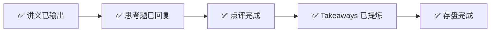

---
prev:
  text: '📖 讲义'
  link: '/week-03/lecture'
next:
  text: '✅ 认知存盘'
  link: '/week-03/takeaways'
---

# Week 3 · 互动记录

::: info 状态
✅ 思考题互动完成
:::

## 交互流程

## 思考题回顾

### 题目 1：NVIDIA 的三层锁定能持续多久？
> CUDA + NVLink + InfiniBand 三层中，哪层最容易被突破？哪层最难替代？

**你的回答**：
1. CUDA 不能独立替代，需要以太网联盟整体替换方案
2. NVLink 的 IB 可替代但效率打折，服务器内必须用 NVLink，服务器间可用 IB
3. InfiniBand 2027 后有以太网替代方案，但替换成本高

**点评与补充**：⚠️ 方向基本正确，但有两个概念混淆需要纠正

**混淆 1：CUDA 和 UEC 的关系**。UEC（Ultra Ethernet Consortium，超以太网联盟）替代的是 **InfiniBand**，不是 CUDA。CUDA 的替代方案是 AMD 的 **ROCm** 和 Intel 的 **oneAPI**——这是软件生态之争，跟网络协议无关。

**混淆 2：NVLink 和 IB 的层级**。NVLink 是第二层（机内互联），InfiniBand 是第三层（跨机互联）。NVLink 的替代方案是 AMD 的 **Infinity Fabric**，不是 IB。

**正确排序（最容易 → 最难替代）**：

| 排名 | 层级 | 替代难度 | 核心原因 |
|------|------|---------|---------|
| 1（最容易） | InfiniBand | ⭐⭐ | UEC 联盟有明确技术路线，Meta 已在万卡规模验证以太网可行 |
| 2（中等） | NVLink | ⭐⭐⭐ | AMD Infinity Fabric 存在但规模远逊；替代需换整台服务器硬件 |
| 3（最难） | **CUDA** | ⭐⭐⭐⭐⭐ | **400 万+ 开发者、15 年+ 的库积累、PyTorch/TensorFlow 深度优化。切换成本以"工程师-年"计量** |

**关键认知**：硬件层的锁定可以"买新设备"打破（贵但直接），软件生态的锁定是累积效应——每多一天、每多一个库，切换成本就高一分。

---

### 题目 2：如果你是 Meta 的网络架构师
> Meta 选以太网的核心理由？500 人 AI 创业公司会做同样选择吗？

**你的回答**：
1. **Meta 选以太网**：避免被 NVIDIA 卡脖子，有利于成本管控和生态发展
2. **创业公司选 IB**：核心需求是快速发展，IB 提供高效一体化解决方案

**点评与补充**：✅ 两个方向都正确，但 Meta 的理由需要深化

你提到了"避免卡脖子"——这是正确的战略层判断。但题目提示了"想想**团队能力和组织规模**"，你遗漏了最关键的变量：

**Meta 选以太网的四层理由**：

| 层级 | 理由 | 是否提到 |
|------|------|---------|
| **成本层** | 100K+ GPU 规模下，IB 授权费达数亿美元，以太网省 30-50% | ✅ 间接提到 |
| **战略层** | 单一供应商依赖在 Meta 规模下是系统性风险 | ✅ 核心论点 |
| **能力层** | Meta 有 **1,000+ 网络工程师**，能自研调参 Ethernet RDMA | ❌ 遗漏 |
| **芯片层** | Meta 设计**自研网络 ASIC**，能从硬件层优化以太网 | ❌ 遗漏 |

**关键对比——组织能力（Organizational Capability）决定技术可行性**：

| 维度 | Meta | 500 人创业公司 |
|------|------|---------------|
| 网络工程师 | 1,000+ 人 | 5-10 人 |
| 以太网 RDMA 调优 | 有专门团队持续优化 | 无力承担，一个 bug 可能停训数天 |
| IB 的额外成本 | 数亿美元（规模效应放大） | 数百万美元（可接受） |
| 最优选择 | 以太网（省钱+自主可控） | IB（开箱即用，时间 > 金钱） |

**核心框架**：**IB 是"开箱即用"方案（Turnkey Solution），以太网是"自己组装调试"方案。工程能力不够就不要造轮子。**

---

### 题目 3：光模块——AI 产业链的"隐形冠军"？
> 运用"定价权×产能弹性"矩阵分析光模块厂商的价值捕获能力。

**你的回答**：
- 定价权：厂商 > 3 家，非垄断，定价权弱
- 产能弹性：需求巨大导致弹性低
- 结论："量大利薄"

**点评与补充**：⚠️ 结论方向对，但矩阵应用逻辑有一个关键错误

**混淆：产能弹性 ≠ 供需关系**。你说"需求巨大所以弹性低"——产能弹性指的是**供给侧扩产速度**，不是需求大小。光模块的产线扩建周期约 12-18 个月，产能弹性是**中等**（不像晶圆厂需 3-5 年，也不像光纤光缆几个月就能扩产）。

**正确的矩阵定位**：

| 维度 | 分析 |
|------|------|
| **定价权** | 中等偏弱——厂商 5 家以上（中际旭创、新易盛、Coherent、II-VI、Lumentum），且客户是超大规模云厂商（议价能力极强） |
| **产能弹性** | 中等——扩产周期 12-18 个月 |
| **矩阵位置** | 中定价权 × 中弹性 = 量大利薄但增长确定 ✅ |

**你遗漏的关键维度——技术代际窗口期（Generation Transition Window）**：

| 时期 | 主流规格 | 能做的厂商 | 利润状态 |
|------|---------|-----------|---------|
| 2024-2025 | 400G → 800G 过渡 | 仅 3-4 家 | **短期超额利润**（供给受限） |
| 2026-2027 | 800G 成熟 | 更多厂商具备能力 | 回归量大利薄 |
| 2028+ | 1.6T + CPO（Co-Packaged Optics，光电共封装） | 游戏规则可能改变 | 独立光模块厂商面临被边缘化风险 |

**修正后的结论**：光模块不是"持续超额利润"，也不是简单的"量大利薄"，而是**"周期性溢价 + 趋势性增长"**——每次技术换代的 18-24 个月窗口期内有溢价，产能追上后回归竞争均衡。投资时机（Timing）比选哪家公司更重要。

---

## 追问与延伸讨论

### CUDA 的生态锁定为什么比硬件锁定更持久？

类比理解：
- **硬件锁定**像"换车"——贵但一次性动作，买新车就完了
- **软件生态锁定**像"换语言"——不是花钱能解决的。想象让全中国的程序员从 Python 改写 Java，所有教程、库、工具链全部重来。CUDA 的 400 万开发者 + 数十万个项目积累，就是这个量级的切换成本

### 组织能力为什么是技术选型的隐藏变量？

一个反直觉的例子：
- **相同技术（以太网 RDMA），不同结果**：Meta 用它训了 Llama 3（成功），某创业公司用它训了 3 个月网络频繁中断（失败）
- 原因不是技术不行，是**调试这个技术需要的工程团队规模**超出了小公司的承受能力
- 启发：分析技术方案时，除了"技术可行性"，还要问"**我的团队能驾驭吗？**"
