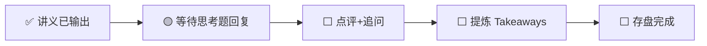

---
prev:
  text: '📖 讲义'
  link: '/week-03/lecture'
next:
  text: '✅ 认知存盘'
  link: '/week-03/takeaways'
---

# Week 3 · 互动记录

::: info 状态
🟡 等待思考题推演回复
:::

## 交互流程

## 思考题回顾

### 题目 1：NVIDIA 的三层锁定能持续多久？
> CUDA + NVLink + InfiniBand 三层中，哪层最容易被突破？哪层最难替代？

**你的回答**：（待填写）

**点评与补充**：（待填写）

---

### 题目 2：如果你是 Meta 的网络架构师
> Meta 用以太网替代 InfiniBand 的核心理由？500 人 AI 创业公司会做同样选择吗？

**你的回答**：（待填写）

**点评与补充**：（待填写）

---

### 题目 3：光模块——AI 产业链的"隐形冠军"？
> 运用"定价权×产能弹性"矩阵分析光模块厂商的价值捕获能力。

**你的回答**：（待填写）

**点评与补充**：（待填写）

---

## 追问与延伸讨论

（互动过程中产生的追问将记录在此）
