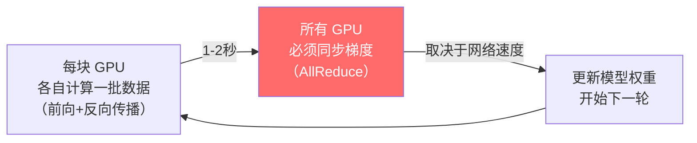
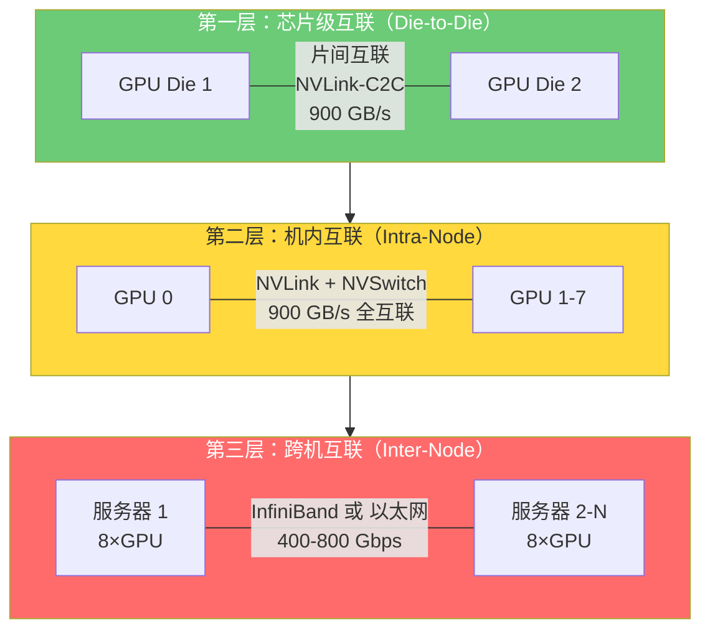
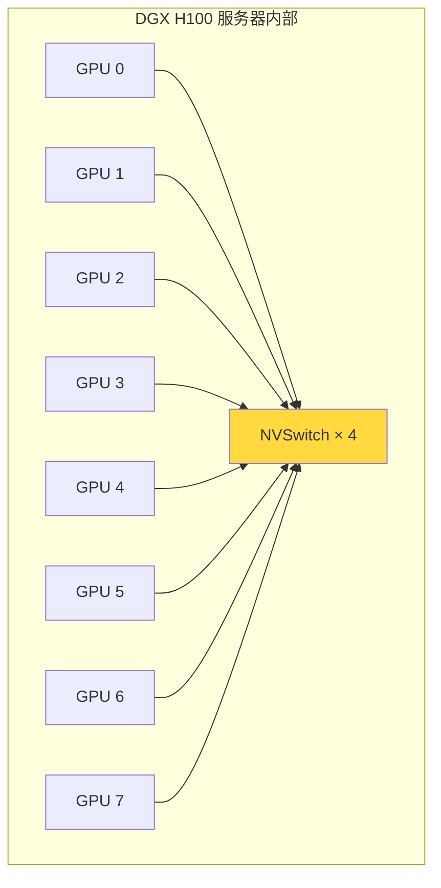
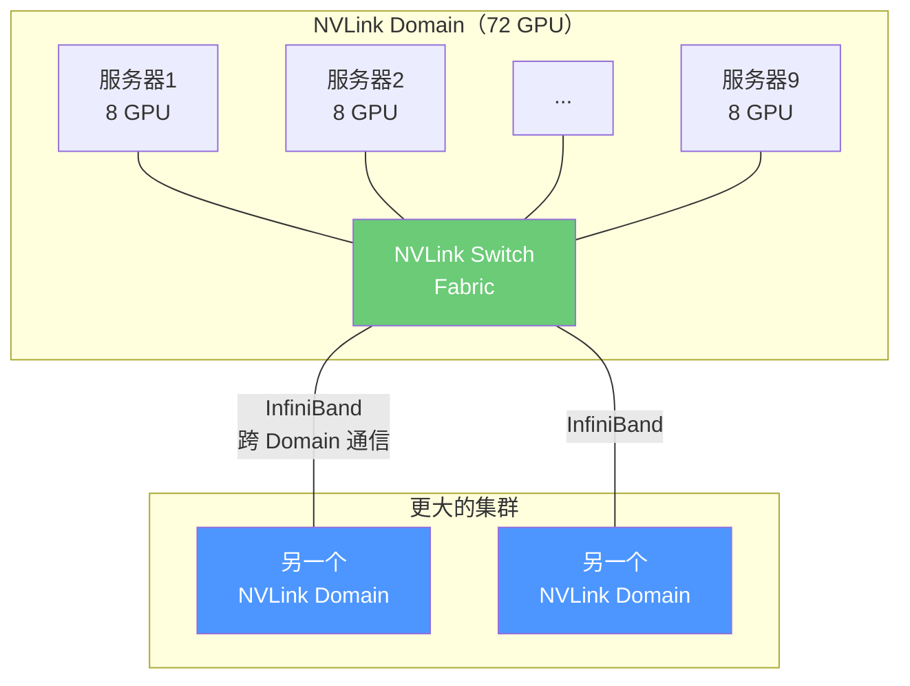
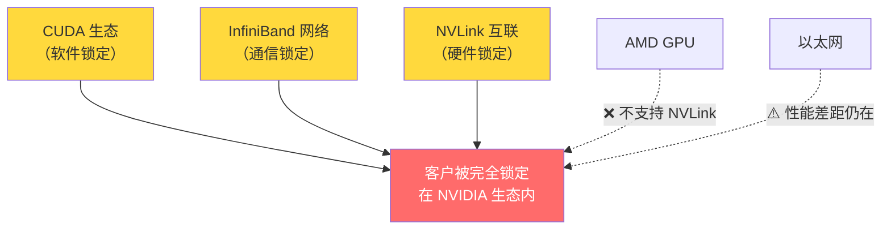
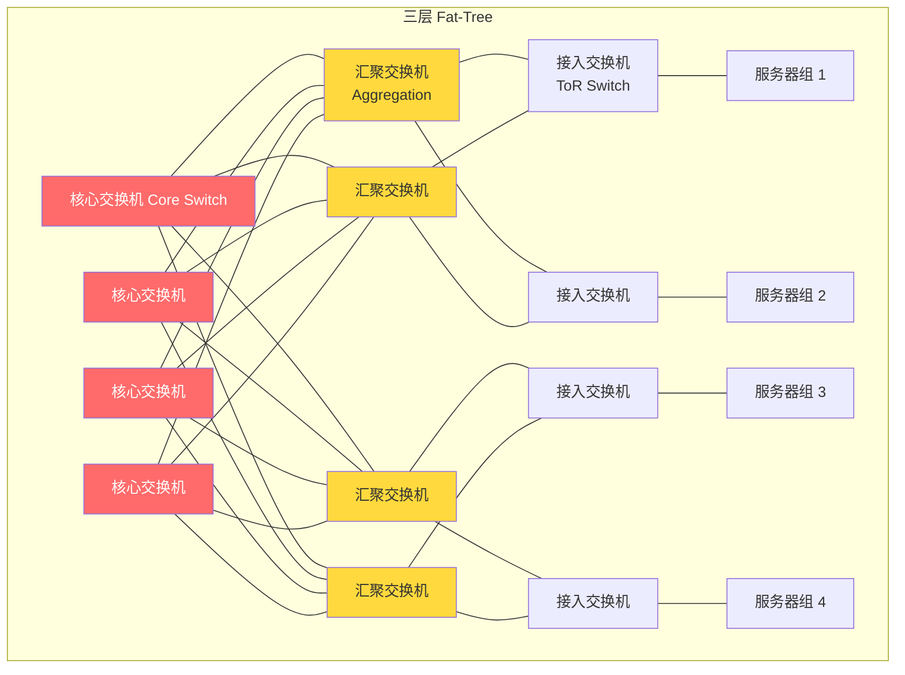
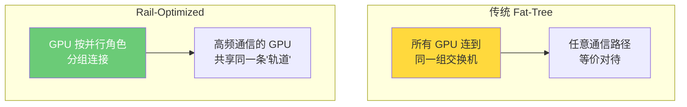
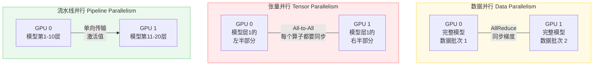
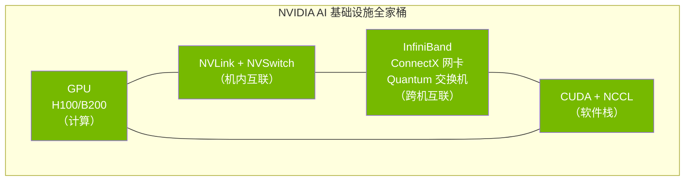

---
prev:
  text: 'Week 2 · 认知存盘'
  link: '/week-02/takeaways'
next:
  text: '💬 互动记录'
  link: '/week-03/interaction'
---

# Week 3：高速互联与网络拓扑——AI 集群的神经系统

::: tip 本周核心命题
GPU 再多，如果彼此"说话"慢，就等于一盘散沙。万卡训练集群的网络架构是怎么设计的？NVLink、InfiniBand、以太网分别在哪一层工作？为什么 NVIDIA 通过网络垄断锁定了整个 AI 算力生态？
:::

## 为什么网络是 AI 训练的"隐形瓶颈"？

Week 1 讲了电力，Week 2 讲了散热。到这一周，电力已经到位，GPU 也散好热在全力运转了——但训练速度还是上不去。为什么？

**因为 GPU 之间在"等"。**

大模型训练的核心操作是这样的：



第一步（各自计算）每块 GPU 独立进行，不需要通信。但第二步（同步梯度）**所有 GPU 必须互相交换数据，等最慢的那块 GPU 完成后才能一起进入下一轮**。

这就像一个 10,000 人的合唱团——每个人可以独立练习自己的声部，但合唱时所有人必须同步。如果有一个人的麦克风信号延迟 1 秒，整个合唱团都要等他。

**关键数据**：在一个 16,384 块 H100 的训练集群中：

- 每次 AllReduce 需要交换的数据量：数百 MB 到数 GB
- 如果用高速 InfiniBand（400Gbps）：同步耗时约 **几十毫秒**
- 如果用普通以太网（100Gbps，无 RDMA）：同步耗时可能 **数百毫秒到数秒**
- 一次训练有数百万到数千万个迭代步（Iteration / Step）

**每个 Step 慢 100 毫秒，乘以 1000 万步 = 多花 277 小时 ≈ 11.5 天。** 按 H100 租赁价格，11.5 天 × 16,384 卡 × $2.5/卡/小时 ≈ **$1,130 万**。

这就是为什么网络不是"配套设施"，而是**直接影响训练成本的核心变量**。

---

## 一、三层互联架构：从芯片到集群

一个万卡训练集群的互联分为三个层次，每层用不同的技术，解决不同距离的通信问题：



**核心规律**：越近的通信越快、越便宜；越远的通信越慢、越贵。整个网络设计的目标就是**尽可能让 GPU 之间的通信停留在离自己最近的层次**。

---

## 二、第一层和第二层：NVLink 与 NVSwitch——NVIDIA 的"私有高速公路"

### 2.1 为什么需要 NVLink？

在 Week 2 互动中你已经了解了 InfiniBand 和以太网。但有一个问题：**同一台服务器内部 8 块 GPU 之间的通信，用 InfiniBand 也不够快。**

一台 DGX H100 有 8 块 GPU，训练时这 8 块 GPU 之间需要极其频繁地交换数据（张量并行 Tensor Parallelism 要求同一层的计算分布在多块 GPU 上，每次矩阵乘法后都要同步结果）。

如果用 InfiniBand（400Gbps = 50GB/s），8 块 GPU 共享网络带宽，每块 GPU 平均只有 6.25 GB/s——这远远不够。

所以 NVIDIA 发明了 **NVLink**——一种 GPU 之间的**专用高速直连通道**，绕过 CPU 和主板上的 PCIe 总线，让 GPU 直接"面对面说话"。

### 2.2 NVLink 的演进

| 代际 | 首次搭载 | 单链路带宽 | 每 GPU 总带宽 | 关键变化 |
|------|---------|-----------|-------------|---------|
| NVLink 1.0 | P100（2016） | 20 GB/s | 80 GB/s | 首次实现 GPU 直连 |
| NVLink 2.0 | V100（2017） | 25 GB/s | 150 GB/s | 支持 CPU-GPU 互联 |
| NVLink 3.0 | A100（2020） | 50 GB/s | 600 GB/s | 引入 NVSwitch |
| NVLink 4.0 | H100（2022） | 50 GB/s | **900 GB/s** | 第三代 NVSwitch |
| **NVLink 5.0** | **B200（2024）** | **100 GB/s** | **1,800 GB/s** | **第四代 NVSwitch，支持 576 GPU 全互联** |

> **关键认知**：NVLink 5.0 的单 GPU 带宽 1,800 GB/s，是 InfiniBand NDR 400G（50 GB/s）的 **36 倍**。这就是为什么机内互联和跨机互联用完全不同的技术——性能差距太大，不是一个量级。

### 2.3 NVSwitch：让所有 GPU "看到彼此"

**问题**：如果 8 块 GPU 两两直连，需要 8×7/2 = 28 条 NVLink 线路。GPU 数量越多，直连的线路数呈平方增长，物理上不可行。

**解法**：加一个"交换机"——**NVSwitch**。它的作用就像高速公路的立交枢纽，所有 GPU 都连接到 NVSwitch，通过它中转，实现**任意两块 GPU 之间的全速通信**。



DGX H100 内部有 **4 块 NVSwitch**，每块 NVSwitch 有 64 个 NVLink 端口。8 块 GPU 通过这 4 块 NVSwitch 实现**全互联（All-to-All）**——任意两块 GPU 之间都有 900 GB/s 的带宽，不需要经过 CPU。

### 2.4 NVLink 5.0 + NVSwitch 4.0 的质变：从"机内"到"跨机"

**B200 时代最重要的突破**：NVLink 5.0 不再局限于单台服务器内部。通过第四代 NVSwitch，NVIDIA 实现了 **72 块 GPU（9 台服务器）通过 NVLink 全互联**，每块 GPU 对外带宽 1,800 GB/s。

这个叫做 **NVLink Domain**——在这个域内，所有 72 块 GPU 看起来就像在"同一台超级计算机"里，通信速度远超 InfiniBand。



**为什么这很重要？** 因为 72 块 GPU 已经足够运行很多模型的张量并行（Tensor Parallelism）部分——这是通信最频繁的并行方式。张量并行留在 NVLink Domain 内（1,800 GB/s），数据并行（Data Parallelism，通信量较小）走 InfiniBand 跨 Domain（50 GB/s）。**通信量最大的操作用最快的通道，通信量小的操作用较慢但覆盖范围更广的通道。**

---

## 三、第三层：跨机互联——InfiniBand vs 以太网的战争

### 3.1 回顾：核心差异（Week 2 互动已建立基础）

在之前的互动中你已经了解了 InfiniBand 和以太网的基本区别。这里我们深入到**为什么以太网在追赶，以及这场战争的商业本质**。

| 维度 | InfiniBand（IB） | 高性能以太网（RoCE/UEC） |
|------|-----------------|----------------------|
| **控制者** | NVIDIA 独家（收购 Mellanox） | 开放标准，多厂商（Broadcom/Cisco/AMD/Arista） |
| **时延** | 0.5-1.5 微秒 | 2-5 微秒（RoCE v2），目标追赶到 1-2 微秒 |
| **大规模稳定性** | 万卡级别验证成熟 | 千卡级别成熟，万卡级别仍在验证中 |
| **拥塞控制** | 硬件级（基于信用机制，Credit-Based） | 软件+硬件混合（ECN/PFC），调参复杂 |
| **价格** | 高（NVIDIA 垄断溢价） | 低 30-50% |
| **生态锁定** | 绑定 NVIDIA GPU + CUDA + NVLink | 不绑定，可搭配 AMD/Intel GPU |

### 3.2 以太网阵营的反击：Ultra Ethernet Consortium（UEC）

**背景故事**：2023 年 7 月，AMD、Broadcom、Cisco、Intel、Meta、微软等联合成立了 **Ultra Ethernet Consortium（超以太网联盟，UEC）**。目标非常明确——开发一个**专门面向 AI 训练的以太网标准**，打破 NVIDIA 在网络层的垄断。

**为什么这些巨头联合起来对抗 NVIDIA？** 因为 NVIDIA 通过"GPU（CUDA）+ 网络（InfiniBand）+ 互联（NVLink）"构建了一个**三层锁定（Triple Lock-in）**：



如果你用了 NVIDIA GPU，为了最佳性能就要用 InfiniBand 网络和 NVLink 互联——三者配套，换掉任何一个都会带来性能惩罚。这就是 NVIDIA 的**系统级护城河（System-Level Moat）**。

**UEC 的技术路线**：
1. **降低时延**：通过硬件卸载（Hardware Offload）把以太网时延压到 1-2 微秒，接近 InfiniBand
2. **改善拥塞控制**：开发 AI 专用的拥塞控制算法，替代以太网传统的 ECN/PFC 机制
3. **标准化 RDMA**：让 RoCE v2 在万卡规模下稳定可靠

**行业现状（2025-2026）**：UEC 1.0 规范已于 2024 年底发布，但商用产品仍在研发中。Broadcom 的 Jericho3-AI 交换机芯片和 Arista 的 7800R 系列是目前最接近 InfiniBand 性能的以太网方案。Meta 在其内部集群中已经大规模使用 RoCE 以太网替代 InfiniBand，证明了技术可行性——但 Meta 有全球顶尖的网络工程团队，一般公司不具备这个调参能力。

### 3.3 这场战争的商业本质

**InfiniBand vs 以太网不是技术之争，而是"垄断 vs 开放"的商业模式之争。**

| 如果 InfiniBand 赢 | 如果以太网赢 |
|-------------------|------------|
| NVIDIA 维持三层锁定，拥有整个 AI 基础设施的定价权 | AI 基础设施的网络层回归开放竞争，NVIDIA 的溢价能力被削弱 |
| GPU + 网络捆绑销售，客户 TCO 高但性能有保障 | 客户可以自由组合 GPU 和网络，TCO 下降但需要更强的工程能力 |
| 小公司只能做"NVIDIA 的客户"，大公司试图逃离 | 生态多元化，AMD/Intel 的 GPU 获得公平竞争机会 |

**我的判断（供你参考的分析框架，非投资建议）**：

短期（2025-2027）：InfiniBand 仍然是万卡训练的**默认选择**，因为以太网方案的万卡稳定性还没有被广泛验证。
中期（2027-2030）：以太网会蚕食 InfiniBand 的份额，特别是在推理集群和中等规模训练集群（< 5,000 卡）。
长期（2030+）：AI 专用以太网可能成为主流，InfiniBand 退守到对时延极致要求的超大规模训练场景。

---

## 四、网络拓扑：万卡集群的"高速公路系统"怎么设计？

### 4.1 为什么拓扑设计很重要？

你有 16,384 块 GPU，分布在 2,048 台服务器上。这些服务器需要通过交换机（Switch）互联。问题是：**怎么连？**

如果每台服务器都直接连到一个超级大交换机上，那这个交换机需要 2,048 个端口——现实中不存在这么大的交换机（当前最大的 InfiniBand 交换机有 128 个端口）。

所以必须设计一个**多层交换网络**——就像城市的道路系统，有小区内部路、城市主干道、高速公路，分层处理不同距离的交通。

### 4.2 Fat-Tree（胖树）拓扑：当前的主流方案

**Fat-Tree**（胖树）是目前 AI 训练集群最广泛使用的网络拓扑，由 Charles Leiserson（MIT 教授，也是《算法导论》的作者之一）在 1985 年提出。

**核心思想**：多层交换机组成树状结构，越往上层（"树干"方向）带宽越大——所以叫"胖"树（上面的管子比下面的粗）。



**三层结构**：

| 层级 | 名称 | 作用 | 典型设备 |
|------|------|------|---------|
| 底层 | **ToR Switch**（Top of Rack，机架顶部交换机） | 连接同一机柜内的服务器 | NVIDIA QM9700（InfiniBand）或 Arista 7800（以太网） |
| 中层 | **Aggregation Switch**（汇聚交换机） | 连接多个 ToR，形成一个"Pod" | 同上 |
| 顶层 | **Core Switch**（核心交换机） | 连接所有 Pod，实现全集群互联 | 同上，但端口数量更多 |

**Fat-Tree 的核心优势**：**任意两台服务器之间的带宽相等**（Non-blocking，无阻塞）。不管服务器 A 和服务器 B 是在同一个机柜还是隔着整个数据中心，它们之间的可用带宽是一样的。这对 AllReduce 操作至关重要——如果某些 GPU 对之间的带宽低于其他对，AllReduce 会被最慢的那对拖慢。

**Fat-Tree 的核心劣势**：**交换机数量巨大**。一个 16,384 GPU 的三层 Fat-Tree 大约需要 **800-1,000 台交换机**，加上数万根光缆。光是网络设备的成本就占整个集群的 **15-25%**。

### 4.3 Rail-Optimized 拓扑：Meta 和 Google 的创新

**为什么头部公司要改变 Fat-Tree？** 因为 AllReduce 的通信模式不是"任意对任意"，而是有规律的——同一个"并行组"内的 GPU 集中通信。如果知道通信模式，可以让网络拓扑**匹配这种模式**，减少不必要的跨层通信。

**Rail-Optimized（轨道优化）拓扑**的核心思想：



在一台 DGX H100 中有 8 块 GPU。在 Rail-Optimized 拓扑中，每台服务器的第 N 块 GPU 都连接到同一个"Rail"（轨道）交换机上。比如所有服务器的 GPU #0 都连到 Rail 0 交换机，所有 GPU #1 都连到 Rail 1 交换机。这样，当进行数据并行（Data Parallelism）时，同一个 Rail 上的 GPU 通信不需要跨越多层交换机——直接在同一个 Rail 内完成。

**Meta 的 Llama 3 训练集群**（24,576 块 H100）就使用了 Rail-Optimized 拓扑，将网络成本降低了约 **20-30%**，同时训练效率几乎没有下降。

### 4.4 光模块（Optical Transceiver）：网络中的"隐形成本黑洞"

在讨论网络拓扑时，有一个经常被忽略的成本大头——**光模块（Optical Transceiver）**。

**什么是光模块？** 它是插在交换机和网卡上的一个小模块，负责把电信号转换为光信号（用于光纤传输），再在另一端转回来。每个网络端口都需要一个光模块。

**为什么光模块重要？**

一个 16,384 GPU 的集群，假设使用三层 Fat-Tree：
- 每台服务器 8 个网络端口（每 GPU 一个）× 2,048 台 = 16,384 个端口
- 每层交换机的上下联端口总计约 20,000-30,000 个
- 每个端口需要一个光模块
- **总计约 40,000-50,000 个光模块**

| 光模块规格 | 单价 | 50,000 个总成本 |
|-----------|------|---------------|
| 400G DR4/FR4 | $300-500 | $1,500-2,500 万 |
| 800G DR8/FR4 | $800-1,500 | $4,000-7,500 万 |

**光模块的成本可能占整个网络成本的 40-60%**。这就是为什么光模块厂商（中际旭创、新易盛、Coherent、II-VI）在 AI 浪潮中股价暴涨——它们是 AI 基础设施中**需求量最大、技术迭代最快**的组件之一。

**技术趋势**：从 400G 向 800G 甚至 1.6T 光模块演进。速率翻倍意味着同样带宽需要的光模块数量减半，但单个光模块的价格也更高。另一个重要趋势是 **CPO（Co-Packaged Optics，光电共封装）**——把光模块直接集成到交换机芯片的封装内，减少功耗和时延。这是 2027+ 的技术方向。

---

## 五、分布式训练的并行策略：网络设计为谁服务？

### 5.1 为什么要了解并行策略？

**网络是为通信服务的，通信模式决定了网络设计。** 如果你不了解 AI 训练的通信模式，就无法理解为什么网络要这样设计。这一节用最简洁的方式讲清楚三种核心并行策略。

### 5.2 三种并行策略对比

一个大模型太大，放不进一块 GPU。必须把模型和数据拆分到多块 GPU 上。怎么拆？三种方式：

| 并行策略 | 英文 | 拆什么 | 通信模式 | 通信量 | 适用网络层 |
|---------|------|--------|---------|--------|-----------|
| **数据并行** | Data Parallelism (DP) | 每块 GPU 持有完整模型副本，**拆数据** | AllReduce 梯度同步 | 中等（每步同步一次） | 跨机 InfiniBand/以太网 |
| **张量并行** | Tensor Parallelism (TP) | 把模型的**每一层**切成碎片，分到多块 GPU | All-to-All，极其频繁 | **极高**（每个算子都要同步） | 机内 NVLink（必须） |
| **流水线并行** | Pipeline Parallelism (PP) | 把模型的**不同层**分到不同 GPU | 相邻层之间单向传输 | 较低 | 跨机 InfiniBand（可接受） |



### 5.3 为什么 3D 并行的排布决定了网络架构？

实际训练中，三种并行策略**同时使用**（所谓 **3D 并行**）。关键是：**哪种并行放在哪一层网络上**。

最优排布原则：**通信量最大的并行 → 用最快的网络**

```
张量并行（通信量最大）  → NVLink（机内，900-1800 GB/s）
流水线并行（通信量适中）→ NVLink Domain 内或 InfiniBand（跨机，50 GB/s）
数据并行（通信量最小）  → InfiniBand / 以太网（跨 Domain，50 GB/s）
```

**这就解释了为什么 NVLink Domain 的扩大（从 8 GPU → 72 GPU）如此重要**——更大的 NVLink Domain 意味着张量并行可以分布到更多 GPU 上，而不需要走慢速的 InfiniBand 通道。这直接提升了训练效率。

---

## 六、商业闭环：NVIDIA 的系统级垄断与挑战者

### 6.1 NVIDIA 网络帝国的版图



> **NCCL**（NVIDIA Collective Communications Library，NVIDIA 集合通信库）：NVIDIA 专门为多 GPU 通信优化的软件库。AllReduce 等操作的底层实现就在 NCCL 中。它被深度优化为与 NVLink 和 InfiniBand 配合，换用其他网络硬件时性能可能下降。

**NVIDIA 2019 年以 $69 亿收购 Mellanox** 是 AI 时代最具战略眼光的收购之一。当时很多人不理解——一家做 GPU 的公司为什么要买一家做网络的公司？现在看，这正是构建三层锁定的关键一步。

### 6.2 挑战者与替代方案

| 挑战者 | 策略 | 进展 | 胜算判断 |
|--------|------|------|---------|
| **Broadcom** | 以太网交换机芯片（Memory） + 自研网卡 | Jericho3-AI 已量产，性能接近 IB | 中高——以太网生态的实际推动者 |
| **AMD** | 自研 Infinity Fabric 互联 + 支持 RoCE | MI300X 支持 RoCE，但生态小 | 中——需要证明万卡级稳定性 |
| **Google** | 完全自研（TPU + 自研网络 Jupiter） | 内部已验证，不对外销售 | 不参与公开市场竞争 |
| **华为** | 昇腾 GPU + 自研 HCCS 互联 + 自研交换机 | 中国市场份额增长中 | 中——受限于制造工艺（先进制程） |
| **UEC 联盟** | AI 专用以太网标准 | 1.0 规范已发布，产品 2026+ | 长期威胁——但商用还需 2-3 年 |

### 6.3 投资视角：网络层的价值捕获

| 环节 | 代表公司 | 定价权 | 产能弹性 | 判断 |
|------|---------|--------|---------|------|
| InfiniBand 网卡+交换机 | NVIDIA（Mellanox） | 极强（垄断） | 低 | ⭐⭐⭐ 持续超额利润 |
| 以太网交换机芯片 | Broadcom | 强 | 中 | ⭐⭐ 受益于以太网份额扩大 |
| 光模块 | 中际旭创、新易盛、Coherent | 中（多厂商竞争） | 中 | ⭐⭐ 量大利薄但增长确定 |
| 光纤光缆 | 长飞光纤、康宁 | 弱 | 高 | ⭐ 大宗商品属性 |
| 网络软件 / NCCL | NVIDIA（开源但深度绑定） | 极强（软件锁定） | — | 非直接收入，但是生态锁定关键 |

---

## Week 3 思考题

### 思考题 1：NVIDIA 的三层锁定能持续多久？

> NVIDIA 通过 CUDA（软件）+ NVLink（机内互联）+ InfiniBand（跨机互联）构建了三层锁定。你认为这三层中**哪一层最容易被突破**？哪一层**最难被替代**？请给出排序并解释你的理由。提示：想想每一层的**替代成本**和**切换代价**分别是什么。

### 思考题 2：如果你是 Meta 的网络架构师

> Meta 是全球少数几家在万卡集群中成功使用以太网替代 InfiniBand 的公司。如果你是 Meta 的网络架构师，你选择以太网而不是 InfiniBand 的核心理由是什么？如果你是一家 500 人的 AI 创业公司，你会做同样的选择吗？为什么？提示：不只是技术考量，想想**团队能力和组织规模**这个变量。

### 思考题 3：光模块——AI 产业链的"隐形冠军"？

> 讲义中提到光模块可能占网络成本的 40-60%，且需求量随 GPU 数量线性增长。运用 Week 1 学到的**"定价权 × 产能弹性"矩阵**，分析光模块厂商（如中际旭创、Coherent）在 AI 产业链中的价值捕获能力。它们是"持续超额利润"还是"量大利薄"？
