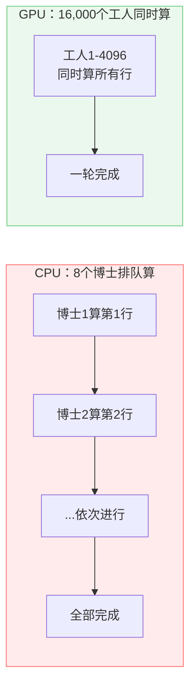
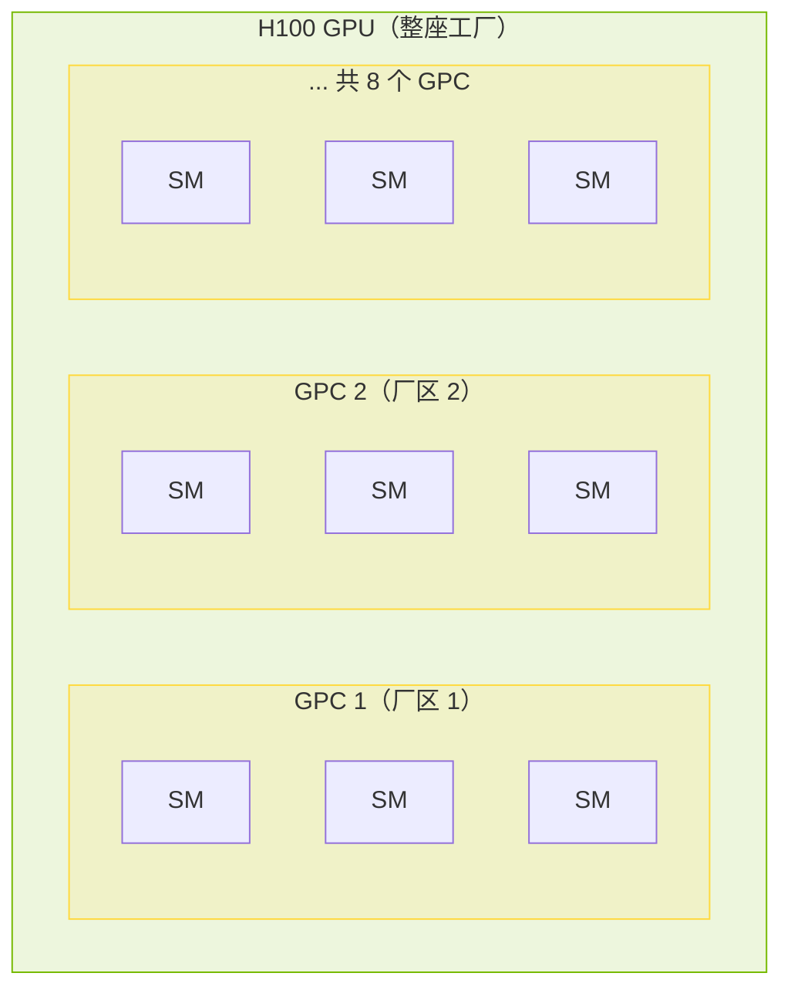
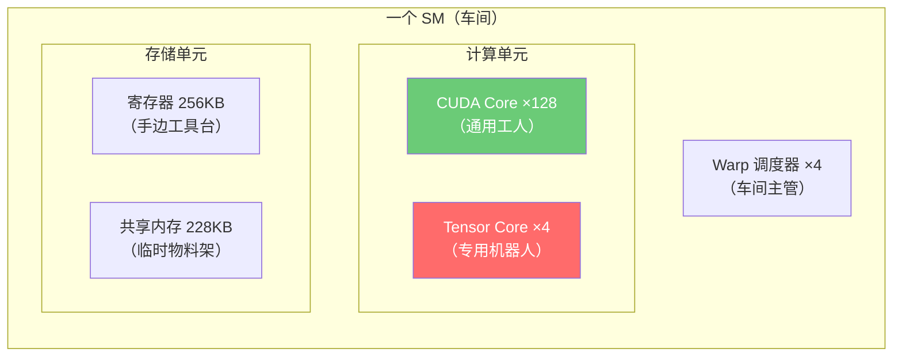
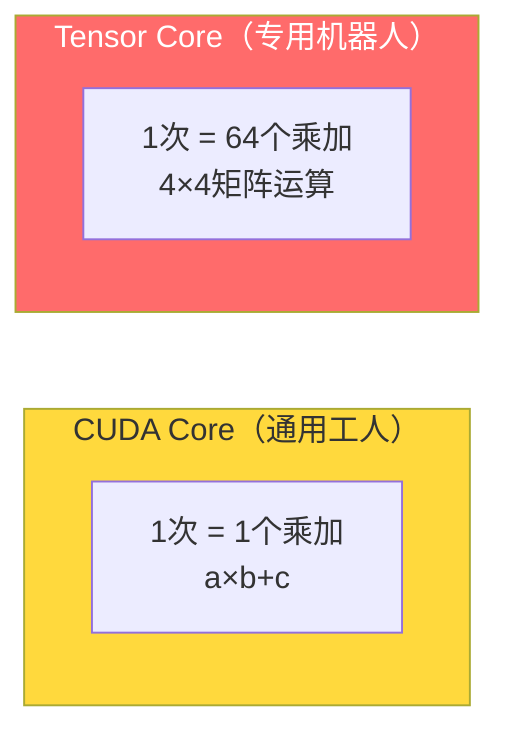
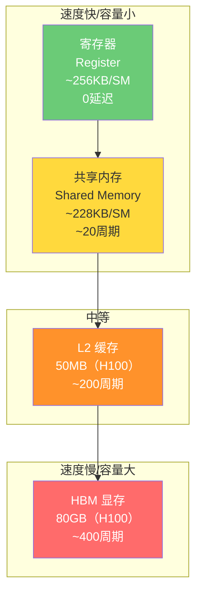
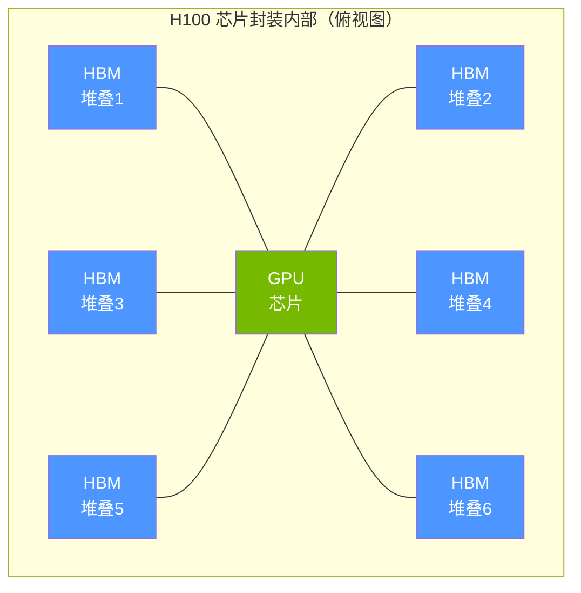
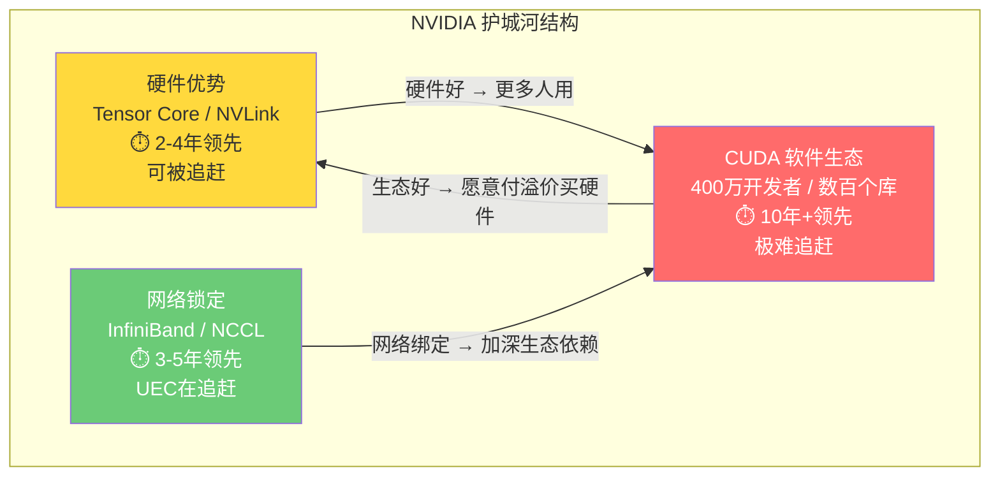

---
prev:
  text: 'Week 3 · 认知存盘'
  link: '/week-03/takeaways'
next:
  text: '💬 互动记录'
  link: '/week-04/interaction'
---

# Week 4：GPU 架构深度拆解——AI 算力的心脏

::: tip 本周核心命题
前三周讲清楚了 GPU 运行的物理环境——电力、散热、网络。这一周终于进入 GPU 本身：它内部到底长什么样？为什么 GPU 能做 AI 训练而 CPU 不行？NVIDIA 每一代架构升级到底在升级什么？"1 petaFLOPS"这样的算力数字到底意味着什么？
:::

## 先建立核心类比：GPU = 超级工厂

在展开技术细节之前，先用一个贯穿本周的类比把 GPU 的架构实体化。

**把一块 GPU 想象成一座超级工厂**：

| GPU 概念 | 工厂类比 | 作用 |
|----------|---------|------|
| **整块 GPU** | 一座**拥有 100+ 车间的超级工厂** | 整体算力单元 |
| **SM（Streaming Multiprocessor，流式多处理器）** | 工厂里的**一个车间** | GPU 的基本工作单元，内部包含一批工人和机器人 |
| **CUDA Core（CUDA 核心）** | 车间里的**通用工人**——什么活都能干，但速度一般 | 执行通用浮点运算 |
| **Tensor Core（张量核心）** | 车间里的**专用机器人**——只会做一件事（矩阵乘法），但速度极快 | 执行 AI 训练/推理的核心运算，速度是 CUDA Core 的 4-16 倍 |
| **HBM（High Bandwidth Memory，高带宽内存）** | 工厂旁边的**仓库** | 存储模型参数和训练数据 |
| **内存带宽（Memory Bandwidth）** | 仓库到车间的**传送带速度** | 决定数据多快能送到计算单元 |
| **CUDA（软件框架）** | 工厂的**生产管理系统（MES）**——调度工单、分配任务、协调车间 | 告诉 GPU 的每个核心该算什么 |
| **寄存器 / 共享内存** | 工人**手边的工具台**和车间内部的**临时物料架** | 最快但最小的存储，数据不需要跑回仓库 |

**一句话总结**：GPU 的算力取决于**车间数量 × 每个车间的工人/机器人数量 × 仓库到车间的传送带速度**。三者缺一不可——车间再多，传送带运不过来原料，工人也只能干等。

---

## 一、从图形到 AI：GPU 是怎么变成算力核心的？

### 1.1 GPU 的前世：画画的

GPU 最初是为**3D 图形渲染**设计的。一帧游戏画面有数百万个像素，每个像素的颜色需要独立计算（光照、阴影、纹理）。关键特点：**每个像素的计算逻辑几乎相同，像素之间互不依赖。**

这就是 GPU 的设计哲学——**用大量简单的计算单元，同时处理大量相同的任务**。

用工厂类比：
- **CPU** = 一个**精密实验室**，里面有 8-64 个博士级研究员。每个研究员能独立处理极其复杂的任务（编译代码、运行操作系统、处理中断），但人少
- **GPU** = 一个**流水线工厂**，里面有上万个操作工。每个操作工只能做简单重复动作，但人多力量大

| | CPU | GPU |
|--|-----|-----|
| 核心数 | 8-128 个"大核" | 10,000-20,000+ 个"小核" |
| 单核能力 | 极强——能处理复杂逻辑、分支判断、中断响应 | 弱——只能做简单的算术运算 |
| 擅长场景 | 运行操作系统、处理复杂业务逻辑、串行任务 | 大规模并行计算——图形渲染、矩阵运算、AI 训练 |
| 类比 | 8 个全能博士 | 16,000 个流水线工人 |

### 1.2 为什么 AI 训练需要 GPU？

Week 1 互动中你了解过：AI 训练的核心操作是**矩阵乘法（Matrix Multiplication）**——大量数字的相乘再相加。

一个简单的例子：两个 4096×4096 的矩阵相乘，需要约 **1370 亿次**乘法和加法运算。GPT-4 级别的模型一次前向传播就包含数千次这样的矩阵运算。

矩阵乘法的特点跟像素渲染一模一样：**每个元素的计算逻辑相同，元素之间可以并行。**



**关键数据**：同一个矩阵乘法任务：
- Intel Xeon CPU（64 核）：约 **50 毫秒**
- NVIDIA H100 GPU：约 **0.3 毫秒**
- 差距：**~160 倍**

这就是为什么 AI 训练用 GPU 而不是 CPU——不是 GPU "更聪明"，而是矩阵乘法这种"大量重复简单运算"恰好是 GPU 架构的甜区。

### 1.3 GPGPU 的诞生：从画画到通用计算

GPU 最初只能画图，不能跑通用程序。**2006 年 NVIDIA 发布 CUDA**，第一次允许程序员用类似 C 语言的方式给 GPU 写通用计算程序——这就是 **GPGPU（General-Purpose Computing on GPU，通用 GPU 计算）** 的起点。

用工厂类比：CUDA 相当于给这座流水线工厂装了一套**通用生产管理系统**。之前工厂只能做一种产品（渲染画面），有了管理系统后，可以接各种订单（科学计算、AI 训练、密码学）。

**这就是 CUDA 的战略意义**：它不是一个"软件产品"，而是让 GPU 从"画图专用"变成"通用计算"的**操作系统级平台**。所有后来的 AI 框架（PyTorch、TensorFlow）都是建立在 CUDA 之上的——就像所有 App 都建立在 iOS/Android 之上。

---

## 二、GPU 内部架构：SM、CUDA Core 与 Tensor Core

### 2.1 SM（Streaming Multiprocessor）：GPU 的基本"车间"

一块 GPU 不是一堆核心的平铺，而是**分层组织**的。基本单元叫 **SM（Streaming Multiprocessor，流式多处理器）**——每个 SM 就是工厂里的一个车间。

以 H100 为例：



**层级结构**：
- **GPU** = 整座工厂
- **GPC（Graphics Processing Cluster，图形处理集群）** = 工厂里的一个厂区（包含多个车间）
- **SM** = 一个车间（GPU 的基本调度和执行单元）

**H100 有 132 个 SM**（可用 114 个）——就像一座拥有 132 个车间的超级工厂。

### 2.2 一个 SM 里面有什么？

每个 SM 就是一个完整的"车间"，内部有：

| 组件 | H100 每个 SM 的数量 | 工厂类比 |
|------|-------------------|---------|
| **CUDA Core（FP32）** | 128 个 | 128 个通用工人——什么运算都能做 |
| **Tensor Core** | 4 个 | 4 个专用矩阵乘法机器人——速度是工人的 4-16 倍 |
| **寄存器文件（Register File）** | 256 KB | 每个工人手边的工具台——拿取最快（0 延迟） |
| **共享内存（Shared Memory）** | 228 KB | 车间公用的临时物料架——所有工人共享 |
| **L1 缓存** | 与共享内存共享 | 车间入口的物料暂存区 |
| **Warp 调度器** | 4 个 | 车间主管——负责给工人分配任务 |



### 2.3 Warp：GPU 的最小执行单位

在 CPU 的世界里，每个核心独立执行自己的任务。但 GPU 不一样——**GPU 的工人是"集体行动"的**。

每 **32 个 CUDA Core 组成一个 Warp**——类比为车间里的一个"班组"。班组里的 32 个工人**必须同时执行完全相同的指令**，只是处理不同的数据。

```
Warp 0: 32 个工人同时算第 0-31 个矩阵元素
Warp 1: 32 个工人同时算第 32-63 个矩阵元素
Warp 2: 32 个工人同时算第 64-95 个矩阵元素
...
```

这种模式叫 **SIMT（Single Instruction, Multiple Threads，单指令多线程）**——一个指令，32 个线程同步执行。这就是 GPU 并行效率的核心机制：不需要为每个工人单独下达指令，一个命令 32 个人一起动。

**代价**：如果 32 个工人中有一部分需要做 A 操作，另一部分需要做 B 操作（分支divergence，分支分歧），那整个班组必须**先做 A、再做 B**——效率减半。这就是为什么 GPU 不擅长复杂的 if-else 逻辑，而 CPU 擅长。

### 2.4 Tensor Core：为什么 NVIDIA 要造"专用机器人"？

**CUDA Core 的问题**：虽然数量多，但做矩阵乘法时效率不够高。每个 CUDA Core 一次只能做 1 次乘法+1 次加法（FMA，Fused Multiply-Add）。

**Tensor Core 的突破**：一个 Tensor Core 一次可以完成一个 **4×4 矩阵**的乘加运算——相当于一次做 64 次 FMA。



**从 Volta 到 Blackwell，Tensor Core 的演进**：

| 代际 | GPU | Tensor Core 代 | 支持精度 | 关键变化 |
|------|-----|---------------|---------|---------|
| Volta（2017） | V100 | 第一代 | FP16 | 首次引入 Tensor Core |
| Ampere（2020） | A100 | 第三代 | FP16/BF16/TF32/INT8 | 支持结构化稀疏（Structured Sparsity），理论性能翻倍 |
| Hopper（2022） | H100 | 第四代 | +FP8 | FP8 精度，性能再翻倍 |
| **Blackwell（2024）** | **B200** | **第五代** | +FP4 | **FP4 精度，推理性能翻倍；双芯封装** |

**一个关键趋势**：每一代架构，NVIDIA 增加 Tensor Core 的速度远快于 CUDA Core。为什么？

> 因为 AI 训练的计算瓶颈就是矩阵乘法，而矩阵乘法最适合 Tensor Core。**NVIDIA 在硬件层面越来越"偏科"——把越来越多的晶体管预算分配给 AI 专用的 Tensor Core，而不是通用的 CUDA Core。**

用工厂类比：工厂发现 90% 的订单都是同一种产品（矩阵运算），于是逐年把通用工人替换成专用机器人——机器人做这种产品的速度是工人的 16 倍。

---

## 三、内存层次：GPU 的"仓库物流系统"

### 3.1 为什么内存比计算更重要？

**反直觉的事实**：在很多 AI 工作负载中，GPU 的瓶颈不是"算得不够快"，而是"数据运不过来"。

用工厂类比：你的工厂有 16,000 个工人，但仓库到车间只有一条窄传送带。工人在 90% 的时间里**都在等传送带送原料过来**，真正动手干活的时间只有 10%。

这个现象叫 **Memory Wall（内存墙）**——计算速度的增长远快于内存带宽的增长，导致内存成为系统瓶颈。

### 3.2 GPU 的内存层次

GPU 的内存系统是多层的，越靠近计算单元速度越快、容量越小：



用工厂类比（这是理解 GPU 性能的关键图景）：

| 层级 | 工厂类比 | 容量 | 速度 | 关键认知 |
|------|---------|------|------|---------|
| **寄存器** | 工人**手里正在拿着的东西** | 极小 | 最快（0 延迟） | 只够放当前正在算的几个数字 |
| **共享内存** | 车间内部的**临时物料架** | 小 | 很快 | 同一车间的工人共享，不需要出车间 |
| **L2 缓存** | 工厂大厅的**公用储物柜** | 中等（50MB） | 中等 | 所有车间共享，但需要跑到大厅去拿 |
| **HBM 显存** | 工厂旁边的**大仓库** | 大（80GB） | 最慢 | 容量够大，但来回搬运需要时间 |

### 3.3 HBM（High Bandwidth Memory，高带宽内存）：GPU 的命门

**为什么 HBM 如此关键？**

普通内存（DDR5）的带宽约 50-60 GB/s。而 AI 训练需要不断在内存和计算单元之间搬运海量数据。如果用普通内存，GPU 的计算单元 99% 的时间都在等数据——相当于给工厂配了一条自行车道当传送带。

**HBM 的解决方案**：把内存芯片**垂直堆叠**（3D Stacking，三维堆叠），然后用**硅中介层（Silicon Interposer）** 与 GPU 芯片并排放置，通过数千条微型通道连接。



| GPU | HBM 代际 | 显存容量 | 显存带宽 | 显存带宽类比 |
|-----|---------|---------|---------|------------|
| A100 | HBM2e | 80 GB | 2.0 TB/s | 8 车道高速公路 |
| H100 | HBM3 | 80 GB | 3.35 TB/s | 13 车道高速公路 |
| **B200** | **HBM3e** | **192 GB** | **8.0 TB/s** | **32 车道高速公路** |

**容量 × 带宽 = 两个不同的约束**：
- **容量**决定能放多大的模型——GPT-4 级别模型参数约 1.8 万亿，FP16 精度下需要约 3.6 TB 显存，一块 H100（80GB）只能放 1/45
- **带宽**决定数据搬运速度——带宽不够，计算单元就在"等数据"

**HBM 的产业意义**：全球只有 **SK Hynix（SK 海力士）** 和 **Samsung（三星）** 两家能量产 HBM3/HBM3e。Micron（美光）正在追赶。这是一个**双寡头垄断**市场——供应商极少，定价权极强，且扩产需要 18-24 个月。Week 6 会深入拆解存储与内存墙问题。

---

## 四、NVIDIA 架构演进：从 V100 到 Blackwell

### 4.1 每一代到底在升级什么？

NVIDIA 每 2 年发布一代新 GPU 架构。外界经常只看"算力提升了多少倍"，但真正的设计决策比数字更有意思。

| 代际 | GPU | 年份 | SM 数 | CUDA Core | Tensor Core | HBM | 关键设计决策 |
|------|-----|------|-------|-----------|-------------|-----|------------|
| Volta | V100 | 2017 | 80 | 5,120 | 640（首次引入） | HBM2, 16/32GB | **发明 Tensor Core**——从通用计算转向 AI 专用 |
| Ampere | A100 | 2020 | 108 | 6,912 | 432 | HBM2e, 80GB | **结构化稀疏**（Sparsity）+ 多实例 GPU（MIG） |
| Hopper | H100 | 2022 | 132 | 16,896 | 528 | HBM3, 80GB | **Transformer Engine** + FP8 精度 + NVLink 4.0 |
| **Blackwell** | **B200** | **2024** | **160** | **20,480** | **640** | **HBM3e, 192GB** | **双芯封装 + FP4 + NVLink 5.0** |

### 4.2 Blackwell 的三大关键设计决策

**决策 1：双芯封装（Multi-Die / Chiplet Design）**

B200 不是一块芯片，而是**两块芯片通过 10 TB/s 的片间互联（NVLink-C2C）封装在一起**，对软件表现为一块 GPU。

为什么要这样做？因为单块芯片的尺寸已经逼近**光罩极限（Reticle Limit）**——芯片制造的光刻机能曝光的最大面积约 **858 mm²**（约 26mm × 33mm）。H100 的芯片面积已经达到 **814 mm²**，几乎顶满。

要继续增加晶体管数量，只有两条路：
1. **制程微缩**（从 4nm 到 3nm）——每个晶体管更小，同面积放更多。但制程进步越来越慢
2. **多芯封装**（Chiplet）——不做一块大芯片，做两块小芯片拼在一起

NVIDIA 选了双管齐下。B200 用两块芯片实现了 **2080 亿晶体管**——比 H100（800 亿）多了 2.6 倍。

用工厂类比：原来是一个超大厂房（H100），现在把两个厂房用一条**超高速连廊**连起来（B200），对管理系统来说看起来还是一个工厂。好处是每个厂房更容易建设（光刻机能曝光），坏处是两个厂房之间的通信需要走连廊（NVLink-C2C），有额外延迟。

**决策 2：FP4 精度——精度换性能的极致**

| 精度 | 位宽 | 数值范围 | 每 Tensor Core 吞吐量（相对） | 典型用途 |
|------|------|---------|---------------------------|---------|
| FP32 | 32 bit | 高 | 1× | 科学计算 |
| FP16 / BF16 | 16 bit | 中 | 8× | AI 训练（主流） |
| FP8 | 8 bit | 较低 | 16× | AI 训练/推理 |
| **FP4** | **4 bit** | **很低** | **32×** | **AI 推理（Blackwell 新增）** |

精度降低意味着每个数字占的空间更小——**同样的显存能装更多数据，同样的带宽能传更多数据，同样的计算单元能算更多数据**。

用工厂类比：以前每个产品要用一个大箱子装（FP32），现在发现很多产品用小袋子装就够了（FP4）。传送带一次能运 8 倍的产品，仓库能存 8 倍的产品。

**代价**：精度降低意味着数值误差增大。FP4 只有 4 bit，能表示的数值非常少，训练精度可能受影响。所以 FP4 目前主要用于**推理（Inference）**——推理对精度的容忍度比训练高。

**决策 3：NVLink 5.0——从机内到跨机**

Week 3 已经详细讲过：NVLink 5.0 将带宽提升到 1,800 GB/s，支持 72 GPU（9 台服务器）的 NVLink Domain。这不是一个"网络升级"，而是一个**架构范式转变**——GPU 的边界从"一台服务器"扩展到"一个 Domain"。

---

## 五、算力的真相：为什么 "FLOPS" 数字会骗人？

### 5.1 理论算力 vs 实际算力

NVIDIA 在发布 B200 时宣称：**FP4 推理算力 20 petaFLOPS（每秒 2 亿亿次浮点运算）**。这个数字意味着什么？

**它意味着——在一个完美世界里，所有计算单元 100% 满载、数据永远不需要等待、没有任何通信开销的情况下，B200 能达到的理论峰值。**

现实中，你能达到理论峰值的 **30-60%** 就已经非常好了。

| GPU | 理论峰值（BF16 Tensor Core） | 实际训练性能（典型） | 利用率 |
|-----|---------------------------|-------------------|--------|
| A100 | 312 TFLOPS | ~150 TFLOPS | ~48% |
| H100 | 990 TFLOPS | ~400-500 TFLOPS | ~40-50% |
| B200 | 2,250 TFLOPS | 预计 ~900-1,200 TFLOPS | ~40-53% |

**为什么差这么多？** 三个主要原因：

### 5.2 三大性能损耗

**损耗 1：内存带宽瓶颈（Memory-Bound，内存受限）**

计算速度增长比内存带宽快得多。H100 的 Tensor Core 理论上每秒能消耗 990 万亿次运算的数据，但内存带宽只有 3.35 TB/s——**数据供给跟不上计算消耗**。

用工厂类比：工厂升级了机器人（Tensor Core 变强），但仓库的传送带没有同比升级。机器人只能等传送带。

**量化指标——算术强度（Arithmetic Intensity）**：

> 算术强度 = 计算量（FLOPS）/ 数据搬运量（Bytes）

如果一个操作的算术强度低（每搬运 1 字节数据只做很少计算），GPU 就会被内存带宽卡住。矩阵乘法的算术强度高（一次搬运可以复用很多次），所以 Tensor Core 能发挥优势；但模型中的归一化（Normalization）、激活函数（Activation）等操作算术强度低，是典型的 memory-bound 操作。

**损耗 2：通信开销（Communication Overhead）**

Week 3 讲过的 AllReduce 梯度同步、张量并行的 All-to-All 通信——这些通信时间里 GPU 基本在空闲。

**损耗 3：GPU 空闲气泡（Bubble）**

在流水线并行（Pipeline Parallelism）中，不同 GPU 负责模型的不同层。当 GPU 0 在做第 2 批数据的前向传播时，GPU 1 可能在等 GPU 0 的输出——这段等待时间就是"气泡"。

```mermaid
gantt
    title 流水线并行中的"气泡"示意
    dateFormat X
    axisFormat %s

    section GPU 0（第1-10层）
    批次1前向  :a1, 0, 2
    批次2前向  :a2, 4, 6
    批次1反向  :a3, 8, 10

    section GPU 1（第11-20层）
    等待（气泡） :crit, b0, 0, 2
    批次1前向  :b1, 2, 4
    等待（气泡） :crit, b2, 6, 8
    批次1反向  :b3, 10, 12
```



### 5.3 MFU：衡量 GPU 真实利用率的核心指标

业界用 **MFU（Model FLOPS Utilization，模型算力利用率）** 来衡量实际训练效率：

> MFU = 实际训练速度（每秒处理的 tokens）所需的理论 FLOPS / GPU 理论峰值 FLOPS

| MFU 范围 | 评价 |
|----------|------|
| > 50% | 优秀——Google TPU 在部分工作负载上达到过 |
| 40-50% | 良好——大多数优化良好的训练任务 |
| 30-40% | 一般——有优化空间 |
| < 30% | 差——可能存在严重的瓶颈 |

**关键认知**：买 GPU 不只是买"算力"，更是买"算力 × 利用率"。一块理论 990 TFLOPS 的 H100，在优化差的系统中可能只输出 200 TFLOPS（MFU 20%）；在 Google 级别的优化下可以输出 500 TFLOPS（MFU 50%）。**差距 2.5 倍，但硬件完全一样——差别全在软件和系统工程。**

---

## 六、NVIDIA 的真正护城河：硬件还是 CUDA？

### 6.1 Week 3 结论的验证

Week 3 我们通过三层锁定分析得出结论：**CUDA（软件生态）是 NVIDIA 最难替代的护城河**。现在从硬件视角验证这个判断。

**硬件层面，NVIDIA 有护城河吗？**

| 硬件优势 | 能否被追赶？ | 时间窗口 |
|---------|------------|---------|
| Tensor Core 架构 | ⚠️ 可以——AMD MI300X 已有类似的矩阵引擎 | 1-2 代（2-4 年） |
| HBM 集成 | ⚠️ 可以——AMD MI300X 的 HBM 容量反而更大（192GB vs 80GB） | 已被追上 |
| NVLink 互联 | ⚠️ 困难但可能——AMD Infinity Fabric、Google ICI 都是替代路径 | 2-3 代（4-6 年） |
| 制程工艺 | ❌ 不是 NVIDIA 的优势——NVIDIA 和 AMD 都用台积电代工 | N/A |

**结论：硬件层面 NVIDIA 的领先是 2-4 年的时间优势，不是不可追赶的结构性壁垒。**

**软件层面，CUDA 的护城河有多深？**

| CUDA 生态要素 | 规模 | 替代成本 |
|--------------|------|---------|
| 开发者数量 | 400 万+ | 需要 10+ 年才能培养对等规模 |
| AI 框架绑定 | PyTorch、TensorFlow 底层深度依赖 CUDA | 虽然支持 ROCm，但 90%+ 的测试和优化针对 CUDA |
| 库生态（cuDNN, cuBLAS, NCCL） | 数百个优化库，覆盖所有 AI 工作负载 | AMD 的对等库（MIOpen, rocBLAS）功能覆盖和性能都有差距 |
| 调试工具（Nsight, cuda-gdb） | 成熟的开发者工具链 | ROCm 工具链仍在追赶 |
| 企业惯性 | "没有人因为选 NVIDIA 被开除" | 组织决策惯性极强 |



**飞轮效应（Flywheel Effect）**：
1. NVIDIA GPU 硬件性能领先 → 更多开发者选择 CUDA
2. 更多开发者用 CUDA → 更多库和工具被开发出来
3. 生态更丰富 → 企业更倾向于选 NVIDIA（风险低）
4. 企业买更多 NVIDIA GPU → NVIDIA 有更多利润投入下一代硬件研发
5. 回到第 1 步

**这个飞轮已经转了 18 年（2006 年 CUDA 发布至今）。AMD 不只需要追赶硬件，更需要打破这个飞轮——而飞轮一旦转起来，每一圈都在加速。**

### 6.2 NVIDIA 的定价权从何而来？

理解了护城河结构，就能理解 NVIDIA 的定价策略：

| GPU | 官方定价 | BOM 成本（物料成本估计） | 毛利率估算 |
|-----|---------|----------------------|-----------|
| A100 (80GB) | ~$15,000 | ~$3,000-4,000 | ~70-80% |
| H100 (80GB) | ~$30,000-40,000 | ~$5,000-6,000 | ~80-85% |
| B200 (192GB) | ~$30,000-40,000 | ~$7,000-8,000 | ~75-80% |

**毛利率 75-85%** 在半导体行业几乎闻所未闻（Intel 毛利率约 40-55%，AMD 约 45-50%）。

为什么能这么高？因为客户的**真正成本不是 GPU 本身，而是整个系统的 TCO**：

```
真正成本 = GPU × 数量 + 服务器 + 网络设备 + 电力 + 冷却 + 场地 + 工程师团队

GPU 本身只占 TCO 的 30-40%
```

当 GPU 只占总成本的 30-40% 时，即使 GPU 溢价 50%，对 TCO 的影响只有 15-20%。而如果选了更便宜但生态不成熟的 AMD GPU，可能需要额外的工程师调试时间、更低的 MFU、更长的训练周期——这些隐性成本可能远超 GPU 本身的差价。

**用你熟悉的商业逻辑表达**：NVIDIA 的定价权不是来自"硬件独家"（AMD 有替代），而是来自**系统级的切换成本**——换 GPU 不只是换一块卡，而是要重新搭建整个软件栈、重新培训团队、承担不确定的兼容性风险。

---

## 七、商业分析：GPU 市场的竞争格局

### 7.1 主要玩家

| 玩家 | 产品 | AI 训练市场份额（2025 估计） | 核心优劣势 |
|------|------|--------------------------|-----------|
| **NVIDIA** | H100/B200 | **~80%** | 生态无敌，定价权极强。劣势：供应链依赖台积电 |
| **AMD** | MI300X/MI350 | ~10-12% | 硬件参数不输 NVIDIA（HBM 更大），ROCm 生态在追赶。劣势：软件生态远落后于 CUDA |
| **Google** | TPU v5p/v6 | ~5-8%（仅自用+云服务） | 自研芯片+自研网络+自研编译器，垂直整合度最高。劣势：不对外卖芯片 |
| **华为** | 昇腾 910B | ~3-5%（主要中国市场） | 中国市场唯一高端选择（出口管制下）。劣势：生态小、制程受限 |
| **Intel** | Gaudi 3 | < 2% | 性价比路线。劣势：生态和性能均不足以挑战前三 |
| **各类 AI ASIC 创业公司** | Cerebras / Groq / d-Matrix | < 1% | 架构创新但缺乏生态规模 |

### 7.2 AMD 的真正差距在哪？

AMD MI300X 的硬件规格在很多维度上**已经追上甚至超过** H100：

| 维度 | AMD MI300X | NVIDIA H100 | 谁赢？ |
|------|-----------|-------------|--------|
| HBM 容量 | 192 GB | 80 GB | **AMD** |
| HBM 带宽 | 5.3 TB/s | 3.35 TB/s | **AMD** |
| 理论算力（BF16） | 1,307 TFLOPS | 990 TFLOPS | **AMD** |
| CUDA Core 等价数 | 19,456（CU） | 16,896 | **AMD** |

**但在实际 AI 训练中，H100 的表现通常优于 MI300X。为什么？**

答案就是 **CUDA 生态的软件优化差距**：

1. **PyTorch 对 CUDA 的优化深度远超 ROCm**——同一个模型在 CUDA 上的 kernel 性能比 ROCm 高 10-30%
2. **cuDNN vs MIOpen**：NVIDIA 的卷积/注意力算子库经过 10+ 年优化，AMD 的库仍在追赶
3. **NCCL vs RCCL**：多 GPU 通信库的性能差距在大规模训练中放大
4. **调试和诊断工具**：CUDA 有成熟的 Nsight 性能分析套件，ROCm 工具链不够完善，遇到 bug 排查时间更长

**用类比理解**：AMD 造了一台硬件参数更好的赛车（发动机更大、油箱更大），但 NVIDIA 有一支经营了 18 年的 F1 车队——车手经验、调校数据、轮胎策略全面领先。赛道上的实际圈速，还是 NVIDIA 更快。

### 7.3 "定价权 × 产能弹性"矩阵分析

| 环节 | 代表公司 | 定价权 | 产能弹性 | 判断 |
|------|---------|--------|---------|------|
| GPU 设计（Fabless） | NVIDIA | 极强（CUDA 生态锁定 + 80% 市场份额） | 低（依赖台积电产能） | ⭐⭐⭐⭐ 持续超额利润，飞轮加速 |
| GPU 制造（Foundry） | 台积电 TSMC | 极强（先进制程双寡头） | 极低（建厂 3-5 年，$200-300 亿） | ⭐⭐⭐⭐ 持续超额利润 |
| HBM | SK Hynix / Samsung | 强（双寡头） | 低（扩产 18-24 月） | ⭐⭐⭐ 持续超额利润（Week 6 详解） |
| GPU 竞品设计 | AMD | 弱（缺乏生态锁定） | 中 | ⭐ 硬件追上但生态落后，定价被 NVIDIA 锚定 |
| AI ASIC | Cerebras / Groq | 极弱（无生态基础） | 中 | ⭐ 细分场景可行，主流市场难突破 |

---

## Week 4 思考题

### 思考题 1：NVIDIA 的飞轮能被打破吗？

> Week 3 你判断"CUDA 是三层锁定中最难替代的"。现在从硬件+软件的全景来看：**如果你是 AMD CEO Lisa Su，你会用什么策略来打破 NVIDIA 的飞轮？** 是硬件参数碾压？还是生态合纵连横？还是差异化定位（比如专攻推理市场）？给出你的战略选择和理由。

### 思考题 2：精度降低的商业逻辑

> 从 FP32 → FP16 → FP8 → FP4，NVIDIA 每一代都在**降低计算精度**来提升性能。这个趋势有终点吗？**FP4 对推理的意义是什么？对 AI 应用的商业模型（特别是推理成本）有什么影响？** 提示：回忆 Week 1 讲的"推理总能耗已超过训练"。

### 思考题 3：MFU 40% 意味着什么？

> 一个客户花 $3,000 万购买了 1,000 块 H100，但实际训练 MFU 只有 40%。这意味着他有效获得的算力等价于多少块 H100？**60% 的算力浪费去了哪里？** 用本周学到的三大性能损耗（内存带宽瓶颈、通信开销、流水线气泡）来分析。如果你是这个客户的顾问，你会建议他**先优化哪个环节**？
