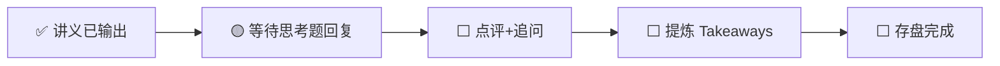

---
prev:
  text: '📖 讲义'
  link: '/week-05/lecture'
next:
  text: '✅ 认知存盘'
  link: '/week-05/takeaways'
---

# Week 5 · 互动记录

::: info 状态
🟡 等待思考题推演回复
:::

## 交互流程

## 思考题回顾

### 题目 1：中国 AI 公司的集群选择——H100 海外 vs 昇腾国内
> 用"双轨策略"框架分析训练集群的部署选择。

**你的回答**：（待填写）

**点评与补充**：（待填写）

---

### 题目 2：Google TPU 为什么不对外卖？
> "卖芯片"vs"卖算力服务"的商业逻辑分析。

**你的回答**：（待填写）

**点评与补充**：（待填写）

---

### 题目 3：AI ASIC 创业公司的"鸡生蛋"困境
> Cerebras/Groq 如何突破"没有生态就没有客户"的死循环？

**你的回答**：（待填写）

**点评与补充**：（待填写）

---

## 追问与延伸讨论

（互动过程中产生的追问将记录在此）
