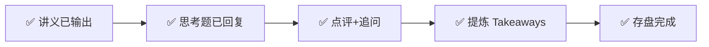
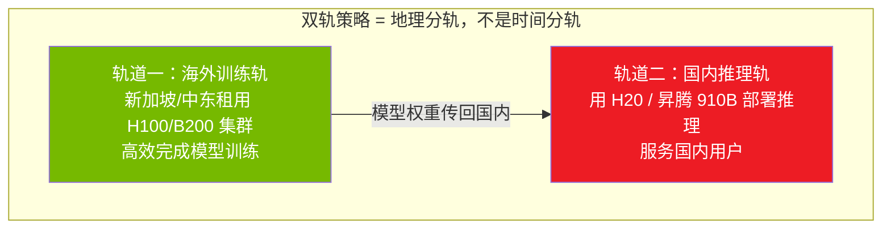
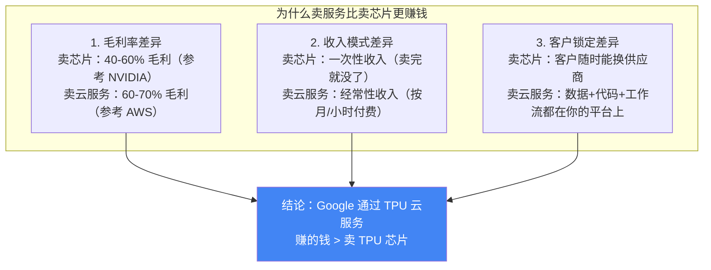
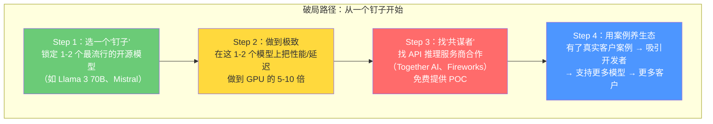

---
prev:
  text: '📖 讲义'
  link: '/week-05/lecture'
next:
  text: '✅ 认知存盘'
  link: '/week-05/takeaways'
---

# Week 5 · 互动记录

::: info 状态
✅ 思考题点评完成，已存盘
:::

## 交互流程



---

## 课间问答：Cerebras 晶圆与结晶体

> **老林的问题**：Cerebras 直接用整片晶圆做一块芯片，是不是跟直接用钻石原石来做饰品一样，没有进行切割的情况下杂质会更多，良率会有挑战。晶圆是个结晶类的东西么？

### 回答

你的钻石类比抓住了问题的核心，但有一个关键区别需要澄清。

**晶圆确实是结晶体。** 硅晶圆（Silicon Wafer）是由高纯度**单晶硅（Monocrystalline Silicon）** 制成的。制造过程类似"种水晶"——用**直拉法（Czochralski Process）** 将一颗籽晶缓慢拉出熔融硅液，形成直径 300mm 的圆柱形硅锭，再切成 0.775mm 厚的薄片。

硅晶圆本身的纯度极高——**11 个 9（99.999999999%）**，这是人类制造的最纯净材料之一。所以钻石类比的"杂质多"这部分不太准确。

**关键区别：缺陷来源不同**

| | 钻石原石 | 硅晶圆 |
|--|---------|--------|
| **缺陷来源** | 形成过程中自然产生的杂质和裂纹 | 芯片制造过程（光刻/蚀刻/沉积）引入的工艺缺陷 |
| **缺陷分布** | 天然随机分布在原石中 | 随机分布在晶圆表面的微米级粒子、线路偏差 |
| **切割的意义** | 避开杂质，展现最好的部分 | 切割后，有缺陷的小芯片丢弃，好的保留 |

更贴切的类比：

> 想象一张 **1000 格巧克力板**。正常做法是把巧克力板掰成 1000 小块卖——如果某一块有气泡（缺陷），扔掉那一块就行，其他 999 块不受影响。Cerebras 的做法是**整块巧克力板就是一块产品**——任何一格有气泡，整块都有问题。

**Cerebras 的解法：冗余设计（Redundancy）**

Cerebras WSE-3 有 90 万个 AI 核心，但实际使用的只有大约 85 万个。多出来的核心是**备用核心**——如果某个核心所在的区域有制造缺陷，软件会自动绕过那个坏核心，用附近的备用核心替代。

用酒店类比：建 1000 间客房，但只卖 950 间的房位。有 50 间是"备用房间"——如果某间客房的水管坏了，客人直接换到备用房间，不影响入住率。

**这个冗余策略有上限**：如果缺陷太多（超过备用核心数量），整片晶圆就真的报废了。这就是为什么 Cerebras 的良率管理比普通芯片厂商困难得多——它的容错空间更小。

---

## 思考题回顾

### 题目 1：中国 AI 公司的集群选择——H100 海外 vs 昇腾国内

> 用"双轨策略"框架分析训练集群的部署选择。

**你的回答**：

> 首先我是要用来训练数据，在这个场景下，短期 NVIDIA 的芯片和 CUDA 软件能在训练效率上获得最大产出。"双轨策略"是指长期和短期的策略么？

**评分：6/10 ⭐⭐⭐**

**点评**：

你选择 NVIDIA 做训练这个判断是正确的——CUDA 生态 + NVLink + NCCL 在训练场景的效率确实是碾压级的，这说明你对 Week 4 的核心认知（NVIDIA 三层锁定在训练场景最强）掌握得很好。

但有两个问题：

**❌ "双轨策略"理解有误。** "双轨"不是"长期 vs 短期"，而是**地理维度的双轨——海外训练 + 国内推理**。这个概念来自 Week 2 数据中心选址时讨论的中国企业出海策略：



**为什么是地理分轨？** 因为训练和推理的需求特征完全不同：

| 维度 | 训练 | 推理 |
|------|------|------|
| **对芯片性能要求** | 极高（需要最强 GPU） | 中等（性价比优先） |
| **数据主权风险** | 可控（训练数据可脱敏） | 高（用户数据必须在国内） |
| **CUDA 依赖度** | 极高（三层锁定全开） | 较低（推理框架渐趋标准化） |
| **最优芯片选择** | H100 / B200（海外） | H20 / 昇腾 910B（国内均可） |
| **合规约束** | 在海外使用不受出口管制 | 国内必须用合规芯片 |

**❌ 分析不完整。** 你只给了一半答案（选 NVIDIA），但没有展开**风险分析**和**完整的双轨部署方案**。一个 CTO 的完整思考应该包括：

1. **海外训练轨的风险**：地缘政治风险（美国可能进一步收紧出口管制、限制云服务访问）、数据出境合规、网络延迟
2. **国内推理轨的选择**：H20 vs 昇腾 910B 的具体对比（讲义表格已给出）
3. **模型权重回传**：训练好的模型权重（Model Weights）文件较小（几十到几百 GB），可以轻松从海外传回国内部署

**完整的"双轨策略"应答框架**：

> **训练轨（海外）**：选择 H100/B200 海外集群，获取最优训练效率。但必须做风险对冲——同时在国内用昇腾做小规模训练验证，确保一旦海外路径被切断，能在 3-6 个月内切换到国产方案。
> 
> **推理轨（国内）**：推理部署在国内，选择 H20 或昇腾（取决于具体工作负载和成本）。推理场景 CUDA 依赖低，昇腾的竞争力更强。
> 
> **保险策略**：始终保持"国产方案的最低可用能力"，即使当前效率低于 NVIDIA，也要确保断供时能平稳过渡。

这道题考的不是"选 A 还是选 B"，而是"如何同时用两条轨道并管理风险"——本质是**风险对冲（Hedging）** 思维。

---

### 题目 2：Google TPU 为什么不对外卖？

> "卖芯片"vs"卖算力服务"的商业逻辑分析。

**你的回答**：

> "卖芯片"只是卖一个产品，撼动不了被 NVIDIA 整个生态卡脖子的状态。只有通过卖整个生态才能逐渐改变 NVIDIA 目前垄断的现状。

**评分：5/10 ⭐⭐½**

**点评**：

你的回答有一个有趣的视角——"卖产品 vs 卖生态"，但**偏离了题目的核心问题**。题目问的不是"如何挑战 NVIDIA"，而是"Google 自己为什么选择不卖芯片"——这是一个**商业模式选择**的问题，不是竞争策略的问题。

**Google 不卖 TPU 的真正原因，可以用一个奶茶店的类比来理解**：

> 假设你开了一家奶茶店，你的秘密武器是自研的"黄金配方奶茶粉"。
> 
> - **方案 A：卖奶茶粉**——每包赚 5 块，卖完就没了。客户买回去自己冲，下次可以找别的供应商
> - **方案 B：卖奶茶**——每杯赚 15 块，客户每天都来买。而且喝习惯了你的口味，不想换
> 
> Google 选了方案 B。

**三层商业逻辑拆解**：



**更深一层**：TPU 不卖还有一个**战略级别**的原因——**差异化引流**。

如果 Google 把 TPU 卖了，它就变成了一个跟 NVIDIA 竞争的芯片公司（而且打不过 NVIDIA）。但 TPU 只在 Google Cloud 上可用，就变成了 Google Cloud 的**独家吸引力**——

> "想用 TPU 训练模型？只有来 Google Cloud。顺便用了我们的 BigQuery 数据仓库、Vertex AI 平台、GKE 容器集群……"

一旦客户的数据、代码、工作流全部建在 Google Cloud 上，迁移成本极高。TPU 是鱼饵，Google Cloud 生态才是鱼钩。

**你答案的修正方向**：你说的"卖整个生态"其实离正确答案很近，但需要把视角从"挑战 NVIDIA"转到"Google 自己的利润最大化"。Google 不是为了挑战 NVIDIA 而不卖 TPU——而是因为**不卖 TPU 比卖 TPU 赚得多**。

---

### 题目 3：AI ASIC 创业公司的"鸡生蛋"困境

> Cerebras/Groq 如何突破"没有生态就没有客户"的死循环？

**你的回答**：

> 他们可以在推理场景下，进行单点突破。因为训练场景需要软件和整个生态的配合，小公司是没有经济实力去开发整个模型的。但在推理场景下，他们可以利用芯片优势，开发想要性价比的客户。

**评分：7/10 ⭐⭐⭐½**

**点评**：

**✅ 框架应用准确。** 你正确使用了 Week 4 的"缝隙战略"（Framework 7）——识别飞轮的弱覆盖区域（推理市场），在缝隙中建立优势。而且你给出了清晰的理由：训练需要全生态配合，小公司负担不起；推理场景生态依赖低，有机会用硬件优势切入。这说明你对 Week 4 的框架内化得很好。

**✅ 客户定位准确。** "想要性价比的客户"——推理客户确实对成本极其敏感。

**需要补充的是：具体怎么破局？** 你给了方向（推理、单点突破），但没有给出**战术路径**。对一个 CTO 来说，"在推理场景单点突破"是战略，但还需要战术。

**ASIC 创业公司的突围四步战术**：



用生活类比：

> 一个新开的健身房想跟连锁巨头（GPU/NVIDIA）竞争。不要试图做"什么课都有的全能健身房"——而是做"拳击专项训练馆"。先在一个细分领域（拳击=低延迟推理）做到最好，吸引核心用户群，再用口碑辐射到其他运动项目。

**Groq 的实际案例**：Groq 已经在走这条路——它的 GroqCloud 平台免费提供 Llama 3、Mixtral 等开源模型的超低延迟推理 API。用户体验过"几乎瞬间出结果"后，很难再忍受 GPU 推理的延迟。这就是用**极致单点体验**来突破鸡生蛋困境。

**你答案的进化方向**：从"做什么"（推理场景突破）进化到"怎么做"（选模型、找合作伙伴、免费 POC、案例驱动增长）。**战略回答 80 分，加上战术细节才是 100 分。**

---

## 本周三道题的共性反馈

### 📊 能力雷达图

```mermaid
radar
    title Week 5 思考题能力评估
```

| 能力维度 | Week 4 评分 | Week 5 评分 | 变化 |
|---------|-----------|-----------|------|
| **框架应用** | ⭐⭐ | ⭐⭐⭐⭐ | 📈 显著提升——Q3 的缝隙战略用得很准 |
| **商业逻辑** | ⭐⭐⭐ | ⭐⭐½ | 📉 Q2 偏离了商业模式分析的焦点 |
| **概念精度** | ⭐⭐ | ⭐⭐⭐ | 📈 进步——没有再混淆技术概念 |
| **战术深度** | ⭐⭐ | ⭐⭐½ | ➡️ 方向对但缺乏具体路径 |
| **风险思维** | ⭐⭐⭐ | ⭐⭐ | 📉 Q1 没有展开风险分析 |

### 🎯 Week 5 的核心进步

**最大亮点**：你在 Q3 中自发使用了 Week 4 的"缝隙战略"框架来分析新问题——这是**知识迁移**的表现，说明你在内化分析框架，而不是死记硬背。从 Week 4 的"诊断不是处方"到 Week 5 的"给出方向+理由"，思考质量在提升。

### ⚠️ 需要加强的地方

1. **区分"题目在问什么"**：Q2 跑偏是因为你把"Google 的商业模式选择"理解成了"如何挑战 NVIDIA"。答题前先确认：题目问的是谁的决策？从谁的视角分析？
2. **从"战略"到"战术"的完整链路**：三道题你都给出了方向性判断，但缺少"具体怎么做"的执行路径。一个好的战略分析 = 判断（做什么）+ 路径（怎么做）+ 风险（可能出什么错）
3. **双轨策略需要回顾**：这个概念来自 Week 2，当时可能学得不够深。建议回看 Week 2 讲义中关于中国企业出海策略的部分

### 💡 本周新增思维模型

| 编号 | 模型名称 | 核心思想 |
|------|---------|---------|
| **10** | 垂直整合 vs 水平分工 | 自研全栈还是外购最佳组件？取决于规模、供应链风险和组织能力 |
| **11** | "卖产品" vs "卖服务"的商业模型 | 一次性收入 vs 经常性收入，关键变量是客户锁定和毛利率 |
| **12** | 管制驱动的市场结构 | 出口管制/政策法规可以人为创造市场边界，改变竞争参照系 |

---

## 追问与延伸讨论

### 晶圆制造与半导体基础

本次互动中通过 Cerebras 的讨论补充了半导体制造的基础知识：
- 硅晶圆是**单晶硅**，由直拉法生长，纯度达 11 个 9
- 芯片缺陷来源于**制造工艺**（光刻/蚀刻过程），而非硅材料本身
- Cerebras 用**冗余设计**解决良率问题——多造 5-10% 的核心作为备用
- 这些知识将在 Week 6（存储与内存墙）中进一步深化
