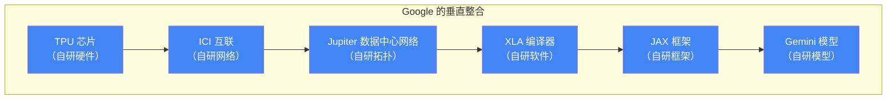
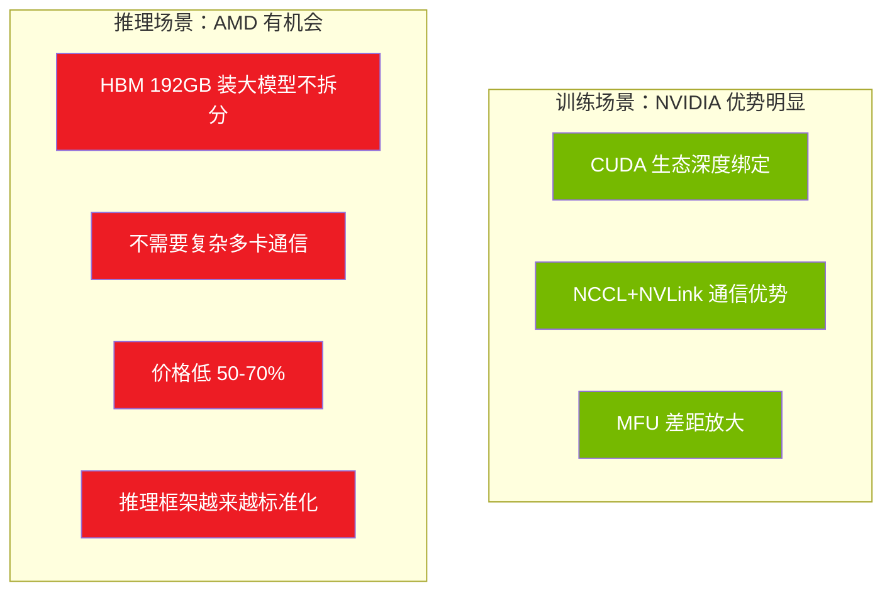
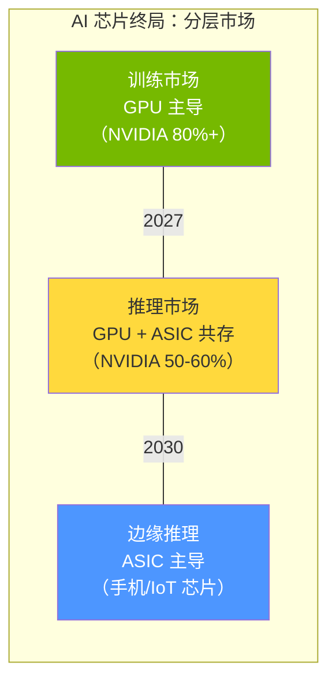
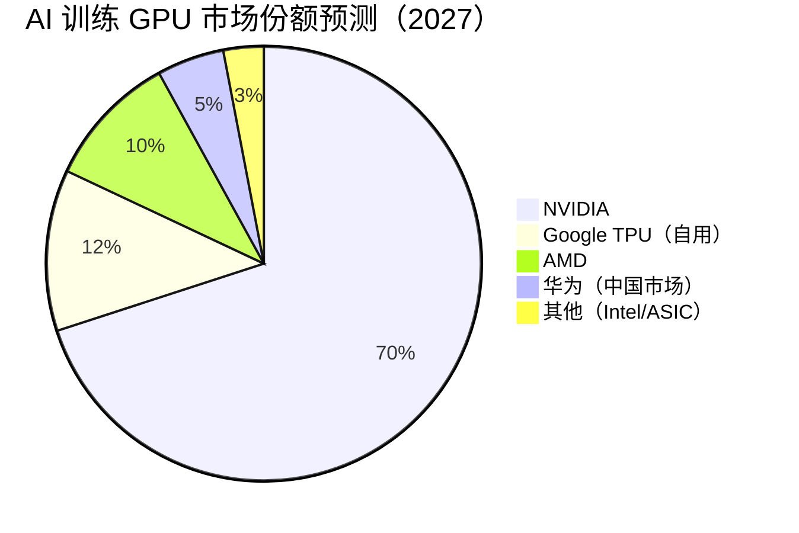
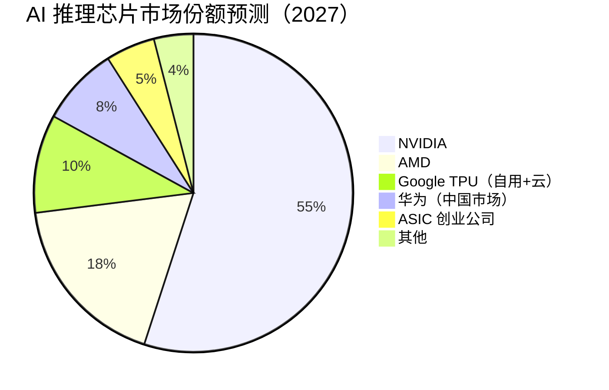

---
prev:
  text: 'Week 4 · 认知存盘'
  link: '/week-04/takeaways'
next:
  text: '💬 互动记录'
  link: '/week-05/interaction'
---

# Week 5：AI 芯片竞争格局——谁能挑战 NVIDIA？

::: tip 本周核心命题
Week 4 深入拆解了 NVIDIA GPU 的架构和护城河。这一周把镜头拉远：NVIDIA 之外的玩家——Google TPU、AMD MI、华为昇腾、以及各类 AI 专用芯片（ASIC）——它们的真实竞争力如何？"GPU vs ASIC"的终局是什么？AI 芯片市场是会保持 NVIDIA 一家独大，还是走向多元竞争？
:::

## 先建立核心类比：AI 芯片市场 = 汽车市场

在展开各家芯片之前，用一个全程类比帮你把竞争格局可视化。

| AI 芯片玩家 | 汽车市场类比 | 定位 |
|------------|------------|------|
| **NVIDIA GPU** | **奔驰 S 级**——豪华全能，贵但什么路都能开 | 通用 AI 芯片，训练+推理全覆盖，生态最强 |
| **Google TPU** | **特斯拉**——自产自销，不卖车只卖出行服务（云端租用） | 自研自用，仅通过 Google Cloud 对外提供 |
| **AMD MI** | **宝马 5 系**——参数不输奔驰，价格低 20-30%，但 4S 店和配件少 | 硬件对标 NVIDIA，生态（ROCm）追赶中 |
| **华为昇腾** | **比亚迪**——在国内市场有政策扶持和供应链优势，但海外受限 | 中国市场的国产替代，受芯片制程限制 |
| **Cerebras / Groq** | **赛道专用赛车**——在特定赛道极快，但不能上公路 | ASIC 专用芯片，特定场景极致性能 |
| **Intel Gaudi** | **大众帕萨特**——中规中矩，性价比路线 | 试图以低价切入，但存在感弱 |

**一句话总结**：NVIDIA 是"什么路都能开的豪华车"，竞争者要么在某条赛道更快（TPU/ASIC），要么更便宜（AMD），要么在特定地区有优势（华为）。问题是：**AI 需要的到底是"全能"还是"专精"？**

---

## 一、Google TPU：唯一真正验证过的替代路线

### 1.1 TPU 为什么存在？

Google 是最早发现 AI 训练需要专用硬件的公司。2013 年 Google 内部做了一个预测：如果所有 Google 用户每天对着手机说 3 分钟语音搜索，按当时的 CPU 推理能力，Google 需要把数据中心的服务器数量**翻一倍**——这在经济上不可行。

于是 Google 在 2015 年开始自研 **TPU（Tensor Processing Unit，张量处理单元）**。TPU 不是"更好的 GPU"，而是一个**从头设计的 AI 专用芯片**。

### 1.2 TPU vs GPU：架构差异

GPU 是从图形渲染演化来的通用并行处理器，里面保留了大量图形相关的硬件（光栅化单元、纹理单元等）。TPU 则**完全没有这些"历史包袱"**——它只做一件事：矩阵运算。

用汽车类比：
- **GPU** = 一台可以越野、赛道、公路的 SUV。什么都能做，但在赛道上跑不过纯跑车
- **TPU** = 一台专门为赛道设计的 F1 赛车。在赛道上极快，但不能上高速公路

| 维度 | NVIDIA GPU（H100） | Google TPU（v5p） |
|------|-------------------|------------------|
| **设计哲学** | 通用并行计算（GPGPU） | AI 专用计算 |
| **核心计算单元** | CUDA Core + Tensor Core | **MXU（Matrix Multiply Unit，矩阵乘法单元）** |
| **内存** | HBM3, 80GB | HBM2e, 95GB |
| **互联** | NVLink + InfiniBand | **ICI（Inter-Chip Interconnect，芯片间互联）**——Google 自研 |
| **软件生态** | CUDA（400 万开发者） | **JAX / XLA**（开发者数量远小于 CUDA） |
| **能否购买** | 可以，公开销售 | **不可以**——只能通过 Google Cloud 租用 |
| **定价模型** | 卖芯片（一次性） | 卖算力服务（按小时计费） |

### 1.3 TPU 的核心优势：垂直整合（Vertical Integration）

Google 做了一件其他公司做不到的事——**从芯片到软件到网络到数据中心全部自研**：

用汽车类比：NVIDIA 是**发动机供应商**（卖零件给各车厂），Google 是**自产自销的特斯拉**（从电池到软件到自动驾驶全部自研，但不卖车只卖出行服务）。

**垂直整合的优势**：
1. **软硬件联合优化**——XLA 编译器针对 TPU 硬件深度优化，MFU 可以达到 55-65%（vs GPU 的 30-50%）
2. **网络不受 NVIDIA 限制**——不需要 InfiniBand，自研 ICI 互联无供应链风险
3. **成本控制**——不需要给 NVIDIA 交 75-85% 毛利率的"过路费"

**垂直整合的劣势**：
1. **生态封闭**——PyTorch 在 TPU 上的支持不如 GPU 原生流畅（虽然有 PyTorch/XLA）
2. **不卖芯片**——其他公司无法购买 TPU，只能通过 Google Cloud 使用
3. **开发者迁移成本**——从 CUDA 转到 JAX/XLA 需要重新学习

### 1.4 TPU 的战略意义

**Google 做 TPU 的根本原因不是"做出更好的芯片"，而是"不被 NVIDIA 卡脖子"。**

Google 每年的 AI 算力需求是天文数字（搜索、Gmail、YouTube 推荐、Gemini 模型训练和推理）。如果全部用 NVIDIA GPU，Google 每年要付给 NVIDIA **数十亿到上百亿美元**的 GPU 采购费用，而且在供应链上完全依赖 NVIDIA。

TPU 的战略价值 = **供应链自主权 + 长期成本优势**

这跟 Week 4 的 Meta 选以太网替代 InfiniBand 是同一个逻辑——**超大规模玩家有动机和能力自研替代方案，中小玩家则不得不接受 NVIDIA 的定价。**

---

## 二、AMD MI 系列：最接近的挑战者

### 2.1 AMD 的真实竞争力

Week 4 讲过 AMD MI300X 的硬件参数在多个维度上已经超过 H100。但硬件好不等于实际好——关键是**软件生态（ROCm）能把硬件性能释放出来多少**。

| 维度 | NVIDIA H100 | AMD MI300X | 评价 |
|------|-------------|-----------|------|
| HBM 容量 | 80 GB | 192 GB | **AMD 大胜**——大模型推理不需要拆分 |
| HBM 带宽 | 3.35 TB/s | 5.3 TB/s | **AMD 胜**——推理场景的 memory-bound 操作受益 |
| 理论算力（BF16） | 990 TFLOPS | 1,307 TFLOPS | AMD 胜 |
| 实际训练 MFU | 40-50% | **25-40%** | **NVIDIA 胜**——ROCm 优化差距导致实际性能反转 |
| 软件生态 | CUDA（400 万开发者） | ROCm（约 10-30 万开发者） | **NVIDIA 大胜** |
| 多 GPU 通信 | NCCL + NVLink | RCCL + Infinity Fabric | **NVIDIA 胜** |
| 价格（公开市场） | $30,000-40,000 | $10,000-15,000 | **AMD 大胜** |

**关键数据**：MI300X 的理论算力比 H100 高 32%，但实际训练性能经常**打平甚至更低**。原因就是 Week 4 讲的 MFU 差距——ROCm 的 kernel 优化、通信库、调试工具都不如 CUDA 成熟。

用类比：AMD 造了一台发动机更大的赛车（1,307 TFLOPS vs 990 TFLOPS），但赛车的调校数据和车队经验不如 NVIDIA。实际跑圈时，发动机只能发挥 70% 的马力，而 NVIDIA 发挥了 85%——结果圈速差不多。

### 2.2 AMD 的真正机会：推理市场

Week 4 思考题 1 已经分析过：AMD 的最优策略是**差异化定位——专攻推理市场**。

为什么 MI300X 在推理场景优势更大？

1. **HBM 192GB** 的容量优势在推理中发挥极大——可以在单卡上装下 70B 参数模型（FP16），不需要跨卡拆分，避免通信开销
2. 推理不需要 AllReduce/张量并行的复杂通信——NVIDIA 在 NCCL+NVLink 上的优势用不上
3. 推理的 CUDA 依赖度更低——推理引擎（vLLM、TensorRT-LLM）越来越标准化
4. **价格是训练的 1/2 到 1/3**——推理客户对性价比极其敏感

**AMD 在推理市场的竞争力总结**：

### 2.3 AMD 的 MI350 和未来路线

AMD 的下一代 **MI350**（预计 2025 年底）将进一步缩小与 NVIDIA 的差距：
- 采用 CDNA 4 架构 + 3nm 制程
- HBM3e，预计 256-288 GB
- ROCm 持续改进（但追平 CUDA 仍需数年）

**判断**：AMD 在推理市场的份额会从目前的 ~10% 增长到 2027 年的 **15-25%**，但在训练市场短期内难以突破 15%。

---

## 三、华为昇腾：出口管制下的国产替代

### 3.1 华为面临的根本约束

华为的 AI 芯片（**昇腾 910B / 910C**）面临一个所有其他竞争者都不存在的约束——**美国出口管制（Export Control）**。

| 约束维度 | 具体限制 | 影响 |
|---------|---------|------|
| **芯片制造** | 无法使用台积电先进制程（7nm 及以下） | 只能用中芯国际（SMIC）的 7nm DUV 工艺，良率和密度不如台积电 |
| **EDA 工具** | 无法使用 Synopsys/Cadence 最新版本 | 芯片设计效率受限 |
| **HBM 供应** | SK Hynix/Samsung 受限向华为供货 | HBM 供应不稳定，可能影响产能 |
| **生态工具链** | 无法使用 CUDA/cuDNN | 自研 CANN（Compute Architecture for Neural Networks）生态 |

用汽车类比：华为像一家被禁止使用进口发动机和变速箱的车厂。不得不自研发动机（CANN 替代 CUDA）、自造变速箱（HCCS 互联替代 NVLink），甚至自建零部件工厂（中芯国际替代台积电）。虽然造出来的车能开，但性能和成本都受制于供应链约束。

### 3.2 昇腾的真实竞争力

| 维度 | 华为昇腾 910B | NVIDIA H100 | 差距 |
|------|-------------|-------------|------|
| 制程 | 7nm（SMIC） | 4nm（TSMC） | 约 1.5-2 代 |
| 理论算力（BF16） | ~256 TFLOPS | 990 TFLOPS | H100 约 4x |
| HBM | 64GB HBM2e | 80GB HBM3 | 容量和带宽均落后 |
| 互联 | HCCS（华为自研） | NVLink 4.0 | 带宽差距约 3x |
| 软件生态 | CANN + MindSpore | CUDA + PyTorch | 生态规模差距 10-50x |

**昇腾 910B 的单卡性能约为 H100 的 1/3 到 1/4**。但这不是华为的全部故事。

### 3.3 华为的战略定位：国内市场的"唯一选项"

在出口管制下，中国企业能合法购买的最高端 NVIDIA GPU 是 **H20**——一个专门为合规要求"阉割"的版本，性能仅为 H100 的 **1/4 到 1/5**。

**关键认知**：在中国市场，华为昇腾的竞争对手不是 H100，而是 **H20**。

| | NVIDIA H20 | 华为昇腾 910B | 对比 |
|--|-----------|-------------|------|
| 理论算力（BF16） | ~148 TFLOPS | ~256 TFLOPS | **华为胜** |
| HBM | 96GB HBM3 | 64GB HBM2e | H20 容量胜，但华为带宽竞争力尚可 |
| 互联 | NVLink（受限版） | HCCS | 各有优劣 |
| 价格 | ~$12,000-13,000 | 不公开，估计 ~$8,000-10,000 | **华为更便宜** |
| 政策支持 | 无 | 国产替代政策扶持、政府采购优先 | **华为大胜** |

**在中国市场的特殊环境下，华为昇腾的竞争力比全球视角看到的要强得多。**

### 3.4 华为的长期挑战

尽管在国内市场有竞争力，华为面临两个长期结构性挑战：

1. **制程天花板**：中芯国际的 7nm 工艺在良率和功耗上不如台积电 4nm。如果没有制程突破，华为的单芯片性能将被 NVIDIA/AMD 越甩越远
2. **生态规模**：CANN 的开发者数量远少于 CUDA，MindSpore 框架的用户基数也远小于 PyTorch。在中国以外的市场几乎没有存在感

**判断**：华为昇腾会在中国市场占据 **30-40% 的 AI 芯片份额**（2027 年预测），但在全球市场的份额可能不超过 5%。

---

## 四、AI ASIC：专用芯片能否颠覆 GPU？

### 4.1 什么是 ASIC？

**ASIC（Application-Specific Integrated Circuit，专用集成电路）** 是为特定任务从头设计的芯片。与 GPU 的"通用并行"不同，ASIC 只做一件事，但做到极致。

用汽车类比回顾：
- **GPU** = SUV——什么路都能开（训练/推理/科学计算/图形渲染）
- **ASIC** = F1 赛车——在赛道上无敌，但不能上高速公路

Google TPU 其实就是一种 ASIC。除了 TPU，还有一些创业公司在做更激进的 AI ASIC：

### 4.2 主要 ASIC 玩家

| 公司 | 芯片 | 核心创新 | 目标场景 | 评价 |
|------|------|---------|---------|------|
| **Cerebras** | WSE-3（Wafer-Scale Engine） | **整片晶圆做一块芯片**——面积是 GPU 的 56 倍，4 万亿晶体管 | 大模型训练 | 概念惊人但量产和良率挑战大 |
| **Groq** | LPU（Language Processing Unit） | **确定性推理**——没有传统 GPU 的调度开销，推理延迟极低 | 推理（低延迟） | 推理延迟行业最低，但生态极小 |
| **d-Matrix** | Corsair | **存内计算（In-Memory Compute）**——在内存中直接做计算，避免数据搬运 | 推理 | 直接解决内存墙问题，但产品仍早期 |
| **Graphcore** | IPU（Intelligence Processing Unit） | 不同于 GPU 的并行架构，专注稀疏计算 | 训练+推理 | 2024 年已几乎退出市场 |

### 4.3 Cerebras：把整片晶圆做成一块芯片

Cerebras 的方法最为激进——别人在一片 300mm 晶圆上切出几百块 GPU 芯片，Cerebras 直接**用整片晶圆做一块芯片**。

| | NVIDIA H100 | Cerebras WSE-3 | 差距 |
|--|-------------|---------------|------|
| 芯片面积 | 814 mm² | **46,225 mm²**（整片晶圆） | 56 倍 |
| 晶体管数 | 800 亿 | **4 万亿** | 50 倍 |
| 片上内存 | 50 MB L2 | **44 GB SRAM** | ~880 倍 |
| 核心数 | 16,896 CUDA Core | **900,000 AI 核心** | ~53 倍 |

Cerebras 的片上 SRAM 达到 44 GB——这意味着**整个模型可以放在芯片上**，不需要 HBM，彻底消灭内存墙（Memory Wall）问题。

**为什么 Cerebras 没有取代 NVIDIA？**

1. **良率问题**：一片晶圆上只要有一个缺陷，正常芯片只废一颗；Cerebras 废的是整片。需要极复杂的冗余设计和缺陷回避技术
2. **成本极高**：单片 WSE-3 的成本远超一块 H100
3. **生态几乎为零**：只有 Cerebras 自己的软件栈，不兼容 CUDA，不兼容 PyTorch 原生
4. **只适合特定工作负载**：整片晶圆的通信模式和 GPU 集群完全不同

### 4.4 Groq：推理延迟的极致

Groq 的 **LPU（Language Processing Unit，语言处理单元）** 走了另一条路——不追求算力峰值，追求**推理延迟最低**。

传统 GPU 推理时，GPU 的调度器需要动态分配计算资源——这个调度本身就有开销。Groq 的 LPU 把**所有调度决策在编译时完成**，运行时完全确定性执行，没有动态调度开销。

结果：**Groq 的 LLM 推理延迟约为 GPU 的 1/5 到 1/10**。用户体验上，ChatGPT 需要几秒才输出完的回答，Groq 上几乎瞬间完成。

**为什么 Groq 也没有取代 NVIDIA？**

1. **不能训练**——LPU 架构只适合推理，不能做训练
2. **模型适配成本高**——每个新模型都需要重新编译和适配
3. **芯片生产依赖三星 14nm**——制程落后，密度和功耗不如先进制程
4. **生态规模极小**——只有 Groq 自己的工具链

### 4.5 GPU vs ASIC 的终局判断

| 维度 | GPU（NVIDIA） | AI ASIC（TPU/Cerebras/Groq） |
|------|--------------|---------------------------|
| **通用性** | 极强——训练、推理、微调、科学计算都行 | 弱——通常只擅长某一个场景 |
| **生态** | CUDA 生态 400 万开发者 | 各自为政，生态分裂 |
| **成本效率（特定场景）** | 中等 | **可能更高**——专用硬件在特定场景可以更省电更快 |
| **迭代速度** | 2 年一代，节奏稳定 | 不确定——创业公司资金和产能受限 |
| **供应链** | 台积电代工，成熟供应链 | 部分用三星/台积电，部分有良率挑战 |

**我的终局判断**：

1. **训练市场**：GPU 继续主导，NVIDIA 份额 70%+。训练需要通用性（不同模型架构、不断变化的算法），ASIC 的专用性反而是劣势。Google TPU 是唯一成功的替代，但只自用
2. **推理市场**：GPU 和 ASIC 共存。推理工作负载相对固定（模型训练好了就不变），ASIC 的专用优化有空间。AMD 和 ASIC 创业公司在这里有机会
3. **边缘推理**（手机、IoT、自动驾驶）：ASIC 主导。功耗和体积约束下，通用 GPU 太浪费

**用一句话总结**：**GPU 的通用性是训练场景的核心优势，但在推理场景反而是"为不需要的功能多付钱"。** 推理市场会走向多元化竞争，训练市场会保持 NVIDIA 主导。

---

## 五、全景竞争力矩阵

### 5.1 按维度评分

| 维度 | NVIDIA（H100/B200） | Google（TPU v5p） | AMD（MI300X） | 华为（昇腾 910B） |
|------|-------|---------|------|--------|
| **硬件性能** | ⭐⭐⭐⭐⭐ | ⭐⭐⭐⭐ | ⭐⭐⭐⭐ | ⭐⭐ |
| **软件生态** | ⭐⭐⭐⭐⭐ | ⭐⭐⭐ | ⭐⭐ | ⭐ |
| **训练竞争力** | ⭐⭐⭐⭐⭐ | ⭐⭐⭐⭐ | ⭐⭐⭐ | ⭐⭐ |
| **推理竞争力** | ⭐⭐⭐⭐ | ⭐⭐⭐⭐ | ⭐⭐⭐⭐ | ⭐⭐⭐ |
| **性价比** | ⭐⭐ | ⭐⭐⭐ | ⭐⭐⭐⭐⭐ | ⭐⭐⭐⭐ |
| **供应链自主** | ⭐⭐（依赖台积电） | ⭐⭐⭐⭐ | ⭐⭐（依赖台积电） | ⭐⭐⭐（受制程限制但自主） |
| **可购买性** | ⭐⭐⭐⭐⭐ | ⭐（仅云服务） | ⭐⭐⭐⭐ | ⭐⭐（主要中国市场） |

### 5.2 谁在哪个场景有优势？

| 场景 | 最优选择 | 原因 |
|------|---------|------|
| 万卡级大模型训练（全球） | **NVIDIA** | CUDA + NCCL + NVLink 三层锁定，无替代 |
| 大模型训练（Google 内部） | **TPU** | 垂直整合 MFU 最高，不受 NVIDIA 供应链制约 |
| 大模型推理（性价比敏感） | **AMD MI300X** | HBM 192GB + 价格低 50-70% |
| 大模型推理（延迟敏感） | **Groq LPU** | 延迟是 GPU 的 1/5-1/10 |
| 中国市场 AI 训练 | **华为昇腾** | 出口管制下的最优国产选择（性能优于 H20） |
| 边缘推理（手机/IoT） | **各类 NPU** | 高通/联发科/苹果等移动芯片内置 AI 加速器 |

---

## 六、商业分析：AI 芯片市场的价值分配

### 6.1 "定价权 × 产能弹性"矩阵——AI 芯片层

| 环节 | 代表公司 | 定价权 | 产能弹性 | 判断 |
|------|---------|--------|---------|------|
| GPU 设计 | NVIDIA | 极强（CUDA 生态 + 80% 份额） | 低（台积电产能受限） | ⭐⭐⭐⭐ 飞轮加速中 |
| GPU 制造（代工） | 台积电 | 极强（先进制程双寡头） | 极低（建厂 3-5 年） | ⭐⭐⭐⭐ Week 4 已分析 |
| GPU 竞品设计 | AMD | 弱（缺乏生态锁定） | 中（同依赖台积电） | ⭐⭐ 推理市场份额有望增长 |
| 自研芯片 | Google TPU | N/A（不对外卖） | 低 | 不参与公开市场定价 |
| 国产 AI 芯片 | 华为 | 中（政策+市场保护） | 低（制程约束） | ⭐⭐⭐ 中国市场结构性需求 |
| AI ASIC 创业公司 | Cerebras/Groq | 极弱（无生态规模） | 中 | ⭐ 细分场景有价值 |

### 6.2 一个预测：2027 年 AI 芯片市场份额

**关键差异**：推理市场的竞争远比训练激烈。推理对 CUDA 依赖低 + 对性价比敏感 = NVIDIA 的飞轮在这里转得没那么快。

---

## Week 5 思考题

### 思考题 1：如果你是一家中国 AI 大模型公司的 CTO

> 你需要搭建一个训练集群来训练自己的基础模型。你面临两个选择：A）在新加坡租用 NVIDIA H100 集群（合规获取高端 GPU），B）在国内用华为昇腾 910B 搭建集群。你会怎么选？这只是一个"性能 vs 爱国"的简单选择吗？用 Week 2 学过的"双轨策略"框架来分析。

### 思考题 2：Google TPU 为什么不对外卖？

> Google 完全有能力把 TPU 像 NVIDIA 一样对外销售——但它选择只通过 Google Cloud 提供算力服务。这个决策背后的商业逻辑是什么？提示：想想"卖芯片"和"卖算力服务"两种模式的毛利率和客户锁定效果有什么区别。

### 思考题 3：AI ASIC 创业公司的"鸡生蛋"困境

> Cerebras 和 Groq 都做出了技术上令人印象深刻的芯片，但市场份额极小。它们面临一个经典的"鸡生蛋"困境：没有生态就没有客户，没有客户就没有营收来建设生态。你认为这个困境有解吗？它们应该如何突破？提示：回忆 Week 4 学过的"缝隙战略"。
