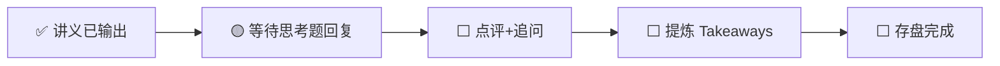

---
prev:
  text: '📖 讲义'
  link: '/week-06/lecture'
next:
  text: '✅ 认知存盘'
  link: '/week-06/takeaways'
---

# Week 6 · 互动记录

::: info 状态
🟡 等待思考题推演回复
:::

## 交互流程

## 思考题回顾

### 题目 1：NVIDIA 的 HBM 供应链风险管理
> 如何管理 50%+ 物料成本依赖单一供应商（SK Hynix）的风险？

**你的回答**：（待填写）

**点评与补充**：（待填写）

---

### 题目 2：CXL 内存池化的采用时机
> 云计算公司应该现在部署 CXL 还是等 CXL 3.0 成熟？

**你的回答**：（待填写）

**点评与补充**：（待填写）

---

### 题目 3：内存墙如何影响 AI 模型设计方向
> 内存墙会催生哪些模型架构创新？

**你的回答**：（待填写）

**点评与补充**：（待填写）

---

## 追问与延伸讨论

（互动过程中产生的追问将记录在此）
