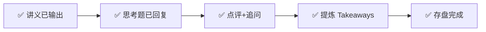
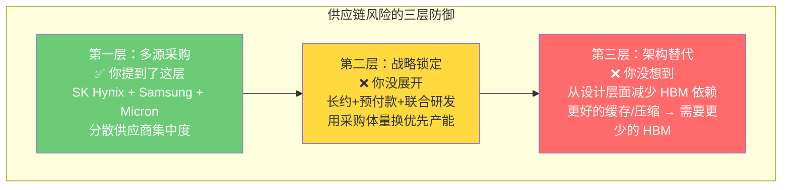
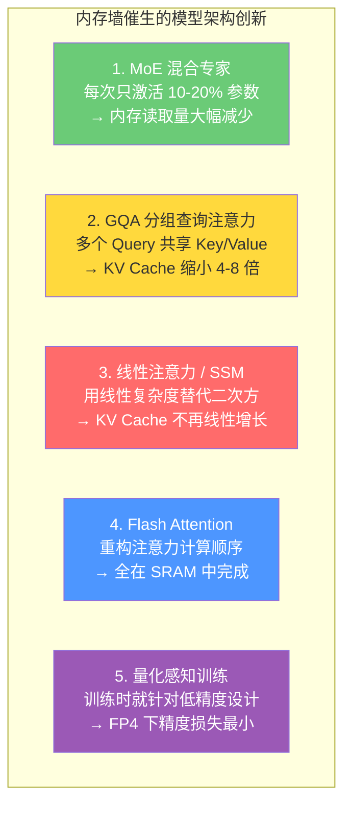

---
prev:
  text: '📖 讲义'
  link: '/week-06/lecture'
next:
  text: '✅ 认知存盘'
  link: '/week-06/takeaways'
---

# Week 6 · 互动记录

::: info 状态
✅ 思考题点评完成，已存盘
:::

## 交互流程

```mermaid
graph LR
    A["✅ 讲义已输出"] --> B["✅ 思考题已回复"]
    B --> C["✅ 点评+追问"]
    C --> D["✅ 提炼 Takeaways"]
    D --> E["✅ 存盘完成"]
```

---

## 课间问答：Claude 的"深度思考"是推理还是训练？

> **老林的问题**：我在用 Claude Opus 的时候发现它会有"深度思考"和"执行"，这个是不是就是对应的推理和训练？

### 回答

**"深度思考"和"执行"都是推理（Inference），跟训练（Training）没有任何关系。**

你每次跟 Claude 对话时，模型的参数一个都没变——它不是在"学习"，而是在**用已经学好的知识回答问题**。训练在几个月前就结束了。

| | 训练（Training） | 推理（Inference） |
|--|----------------|-----------------|
| **类比** | **备考阶段**——读课本、做练习题、被老师批改、调整理解 | **考试阶段**——拿到考题，用学过的知识答题 |
| **谁在做** | Anthropic 的工程师（用几千块 GPU 跑几个月） | 你的每一次对话请求 |
| **模型参数** | 在变（每一步都在调整权重） | **完全不变**（冻结的） |
| **发生时间** | 训练完就结束了 | 你每次点发送的时候 |

Claude 的两个阶段准确地说是：

- **"深度思考"** = 推理中的 Chain-of-Thought（思维链）——模型在内部展开推理步骤，自问自答，拆解问题。相当于考生**在草稿纸上列提纲**
- **"执行/输出"** = 推理中的 Token 生成——基于思考结果，逐字生成回答。相当于**在答题卡上写最终答案**

**整个过程都在考场里（推理），跟备考阶段（训练）无关。**

**关键认知**：Claude 不会因为你的对话变得"更聪明"——它对每个用户都是同一个冻结的模型。对话中的上下文信息是临时存在 **KV Cache** 里的——这正是 Week 6 讲的推理场景内存墙核心。模型不是在"学"你说的话，而是把你的每句话都当作"考试题目的一部分"来处理。

---

## 思考题回顾

### 题目 1：NVIDIA 的 HBM 供应链风险管理

> 如何管理 50%+ 物料成本依赖单一供应商（SK Hynix）的风险？

**你的回答**：

> 目前 HBM 有两家公司基本垄断（SK 和三星），目前两家公司的定价权都是很强的，且产能低，所以如果目前 NVIDIA 把 SK 作为唯一的供应商的话，那风险很高。可以尝试再引入三星作为替代。

**评分：6/10 ⭐⭐⭐**

**点评**：

**✅ 方向正确。** 多源采购（Multi-sourcing）是供应链风险管理的第一课。你正确识别了双寡头结构，准确应用了模型 2（产能弹性 × 定价权），判断出 HBM 供应商处于"定价权强 + 产能弹性低"的最佳位置。

**❌ 但这只是第一层。** NVIDIA **已经在用三星和 Micron 的 HBM 了**。问题是三星的 HBM3e 良率不如 SK Hynix，最先进代际仍高度依赖 SK Hynix。

一个供应链 VP 的完整思考应该是**三层防御**：

```mermaid
graph TB
    subgraph "供应链风险的三层防御"
        L1["第一层：多源采购<br/>✅ 你提到了这层<br/>SK Hynix + Samsung + Micron<br/>分散供应商集中度"]
        L2["第二层：战略锁定<br/>❌ 你没展开<br/>长约+预付款+联合研发<br/>用采购体量换优先产能"]
        L3["第三层：架构替代<br/>❌ 你没想到<br/>从设计层面减少 HBM 依赖<br/>更好的缓存/压缩 → 需要更少的 HBM"]
    end

    L1 --> L2 --> L3

    style L1 fill:#6bcb77,color:#fff
    style L2 fill:#ffd93d,color:#333
    style L3 fill:#ff6b6b,color:#fff
```

**第二层（战略锁定）** 的具体手段：

- **长期供应协议**：签 3-5 年的 Take-or-Pay 合同（保量保价），换取产能优先权
- **预付款 / 合资建厂**：用 NVIDIA 的现金流帮 SK Hynix 扩产，换取优先供货权。类似苹果对台积电的做法
- **联合研发**：NVIDIA 和 SK Hynix 共同定义 HBM4 规格，确保下一代从设计阶段就为 NVIDIA GPU 优化

**第三层（架构替代）** 是最高级的思路：

如果 HBM 是瓶颈，能不能设计 GPU 使其**需要更少的 HBM**？更大的片上 SRAM、更好的缓存策略、硬件级别的压缩/量化——都是从架构层面减少对 HBM 的依赖。

**模型 10 的应用**：NVIDIA 应不应该自己做内存？答案是**不应该**——内存制造需要完全不同的工艺能力。NVIDIA 的核心能力在 GPU 设计和软件生态，不在内存制造。正确的策略不是垂直整合，而是**采购杠杆 + 架构创新**。

---

### 题目 2：CXL 内存池化的采用时机

> 云计算公司应该现在部署 CXL 还是等 CXL 3.0 成熟？

**你的回答**：

> 等 CXL 3.0 成熟后再部署。因为现在部署虽然有先发优势，但 CXL 目前的版本对于内存的提高有限。可以优先准备 CXL 3.0 所需要的准备工作，因为内存占到 Total cost 几乎 50% 的成本，且目前设备成本较高的情况下，内存利用率仅提高 40%，不太划算。

**评分：6/10 ⭐⭐⭐**

**点评**：

**✅ 结论合理。** 等待 CXL 3.0 是稳健选择。"先做准备工作"——不是纯粹等待而是"等待中准备"，这是好的战略思维。

**❌ 但 40% 利用率提升的算账结论错了。** 你说"不太划算"——我们来真正算一下：

> 假设内存成本 10 万元/台，需要 100 台服务器。
>
> **不用 CXL**：100 × 10 万 = **1,000 万元**
>
> **用 CXL**：利用率 +40% → 只需 100/1.4 ≈ **72 台**，每台贵 30%：72 × 13 万 = **936 万元**
>
> **结果：省了 64 万 + 28 台服务器的其他成本（GPU、电力、机柜）**

**40% 利用率提升 + 30% 成本增加 → 单看内存成本就已经划算了！** 你直觉说"不划算"，是因为没有做具体计算。

**关键教训：数字会说话，直觉会骗人。战略判断需要定量验证。**

**等待的真正理由应该是这些**：

| 等待的真正理由 | 说明 |
|-------------|------|
| **GPU 不支持** | NVIDIA GPU 目前不支持 CXL，只有 CPU 侧支持。AI 推理的核心瓶颈在 GPU HBM，CXL 解决的是 CPU 侧问题——不是最痛的点 |
| **生态不成熟** | CXL 2.0 的内存池化软件栈不完善，运维复杂度高 |
| **CXL 3.0 带宽翻倍** | 128 GB/s vs 64 GB/s，等一代性价比显著提升 |
| **先发优势有限** | CXL 是标准协议，不是私有技术——不存在"先部署就锁定客户"的壁垒 |

**"先做准备工作"的完整路径**：

1. 在小规模测试环境中部署 CXL 2.0，积累运维经验
2. 新采购的服务器要求 CXL-ready 的主板和 CPU
3. 跟 CXL 控制器厂商保持技术合作
4. 等 NVIDIA GPU 宣布支持 CXL 后，快速切换到大规模部署

---

### 题目 3：内存墙如何影响 AI 模型设计方向

> 内存墙会催生哪些模型架构创新？

**你的回答**：

> 三个方向：1）3D 堆叠（硬件，搬近）；2）存内计算 PIM（硬件，搬到）；3）减少搬运量（推理中的量化/模糊字段）。

**评分：4/10 ⭐⭐**

**点评**：

**❌ 审题偏差——你回答的是硬件解决方案，但题目问的是"模型架构"层面。**

题目明确说"改变**模型架构**来适应内存墙"。你列的三条是讲义第六章的硬件方案总结——等于把讲义搬了一遍，但没有跳到题目要求的"模型设计"视角。

**五大"为绕过内存墙而生"的模型架构创新**：

```mermaid
graph TB
    subgraph "内存墙催生的模型架构创新"
        A["1. MoE 混合专家<br/>每次只激活 10-20% 参数<br/>→ 内存读取量大幅减少"]
        B["2. GQA 分组查询注意力<br/>多个 Query 共享 Key/Value<br/>→ KV Cache 缩小 4-8 倍"]
        C["3. 线性注意力 / SSM<br/>用线性复杂度替代二次方<br/>→ KV Cache 不再线性增长"]
        D["4. Flash Attention<br/>重构注意力计算顺序<br/>→ 全在 SRAM 中完成"]
        E["5. 量化感知训练<br/>训练时就针对低精度设计<br/>→ FP4 下精度损失最小"]
    end

    style A fill:#6bcb77,color:#fff
    style B fill:#ffd93d,color:#333
    style C fill:#ff6b6b,color:#fff
    style D fill:#4d96ff,color:#fff
    style E fill:#9b59b6,color:#fff
```

**逐个类比解释**：

**1. MoE（Mixture of Experts，混合专家模型）**

一家有 100 个厨师的餐厅，但每道菜只需要 10 个厨师上手做。其他 90 个人的食材（参数）不需要从仓库搬出来。**模型很大但每次"动"的部分很少 → 内存搬运量大幅减少。** GPT-4 推测就是 MoE 架构——总参数 1.8 万亿，但每次推理只激活约 2000 亿。

**2. GQA（Grouped Query Attention，分组查询注意力）**

正常 Attention 中，每个 Query head 都有独立的 Key 和 Value——就像每个学生都有自己的课本复印件。GQA 让 4-8 个学生**共享一套课本**——KV Cache 缩小 4-8 倍。Llama 3 已经使用 GQA。

**3. 线性注意力 / SSM（State Space Model，状态空间模型）**

标准 Attention 需要每个新 token 跟**所有**历史 token 交互——128K 上下文就要翻 128K 页笔记本。SSM（如 Mamba 模型）用一个**固定大小的"状态向量"**压缩所有历史信息——不管上下文多长，"笔记本"都是同样厚度。**从根本上消灭 KV Cache 的线性增长问题。**

**4. Flash Attention（闪存注意力）**

标准 Attention 需要在 HBM 中反复读写中间结果。Flash Attention 重新设计计算顺序——把数据切成小块，每块都在**片上 SRAM 中完成全部计算再写回 HBM**，中间结果不落地。数据搬运量减少 5-20 倍。这是纯算法优化，不需要任何硬件改动。

**5. 量化感知训练（Quantization-Aware Training, QAT）**

你提到的"减少搬运量"方向是对的，但你描述的是推理阶段的后量化。更深一步是：在**训练阶段就针对低精度设计模型**——让模型从出生就适应"窄路"（低精度），而不是训练完再硬压缩。

**关于"模糊字段"**——你想表达的应该是"低精度浮点数"（FP8/FP4），用"模糊"来描述精度降低的方向是对的，但术语不准确。精确的说法是**量化（Quantization）——用更少的比特位表示每个数字**。

---

## 本周三道题的共性反馈

### 📊 能力变化

| 能力维度 | Week 5 评分 | Week 6 评分 | 变化 |
|---------|-----------|-----------|------|
| **框架应用** | ⭐⭐⭐⭐ | ⭐⭐⭐ | 📉 Q1 用了模型 2 但没用模型 10 |
| **商业逻辑** | ⭐⭐½ | ⭐⭐⭐ | 📈 Q2 的成本分析意识在提升 |
| **概念精度** | ⭐⭐⭐ | ⭐⭐ | 📉 Q3 的"模糊字段"和审题偏差 |
| **定量思维** | — | ⭐⭐ | 🆕 有成本意识但没做具体计算 |
| **审题准确性** | ⭐⭐½ | ⭐⭐ | 📉 Q3 答了硬件方案而非模型架构 |

### 🎯 Week 6 的核心教训

1. **审题是第一步**：Q3 把"模型架构创新"理解成了"硬件解决方案"。答题前问自己：题目在问**哪个层面**的事？（硬件层？模型层？商业层？）
2. **定量验证直觉**：Q2 直觉说"40% 不划算"，算一下发现其实是划算的。**数字会说话，直觉会骗人**
3. **多层思考**：Q1 只给了第一层（多源采购），缺少战略锁定和架构替代两层。好的分析要像剥洋葱——不能只剥一层就停

### 💡 本周新增思维模型

| 编号 | 模型名称 | 核心思想 |
|------|---------|---------|
| **13** | 供应链风险的三层防御 | 多源采购（分散）→ 战略锁定（绑定）→ 架构替代（减少依赖） |
| **14** | 定量验证直觉 | 战略判断前先算一笔经济账——40% 利用率提升 vs 30% 成本增加 = 实际省钱 |

---

## 追问与延伸讨论

### Claude 的"深度思考"与推理/训练的区分

本次互动中补充了一个重要概念澄清：Claude 用户界面的"深度思考"和"执行"都是**推理（Inference）** 的不同阶段，而非训练。模型参数在整个对话过程中完全不变。对话上下文信息存储在 **KV Cache** 中——这正是 Week 6 讲的推理内存墙核心。

### Week 7 预告中的关键衔接

Week 6 思考题 3 提到的五大模型架构创新（MoE、GQA、SSM、Flash Attention、QAT）将在 Week 7-9 的模型与算法层中深入展开：
- Week 7：Transformer 架构本体 + Attention 机制 + Scaling Law
- Week 8：训练工程（3D 并行、合成数据、RLHF/DPO）
- Week 9：推理优化（量化/蒸馏/Flash Attention 的工程实现）
