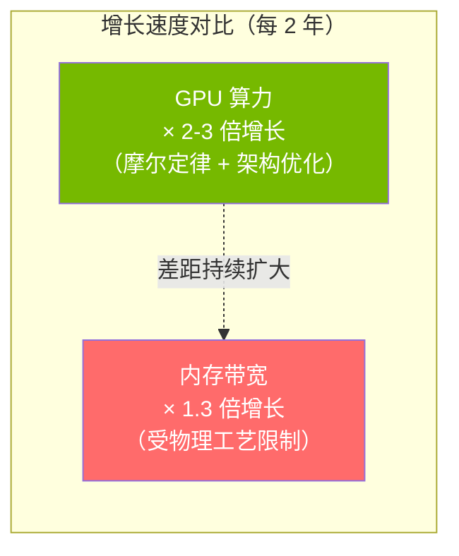
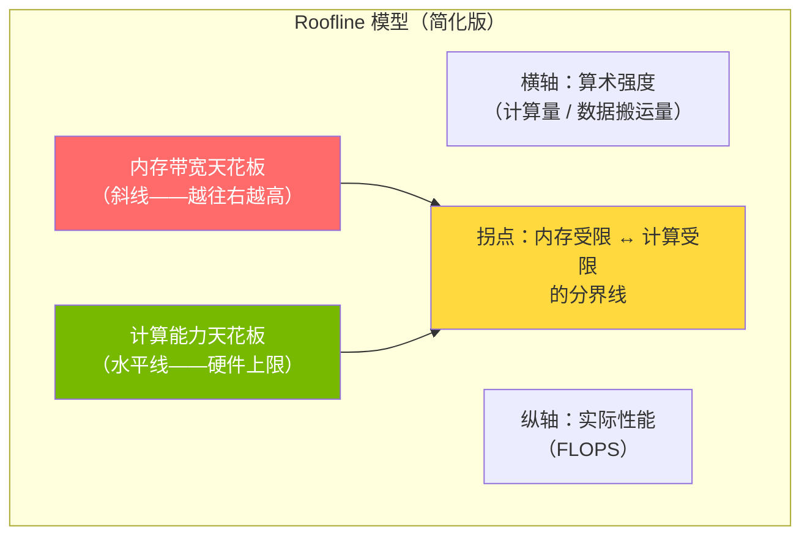
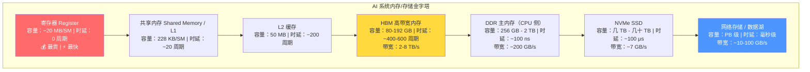
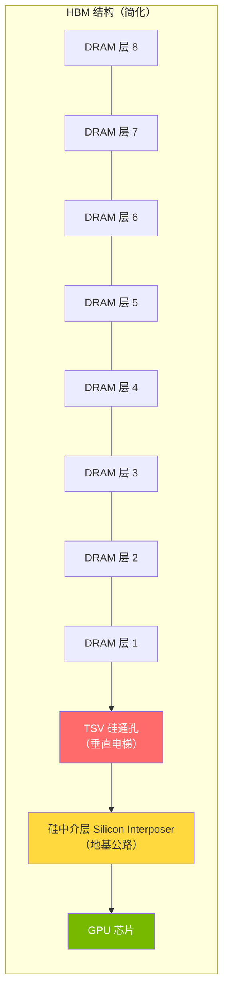
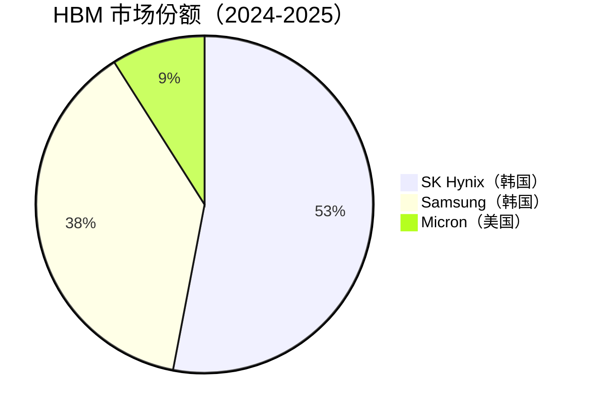
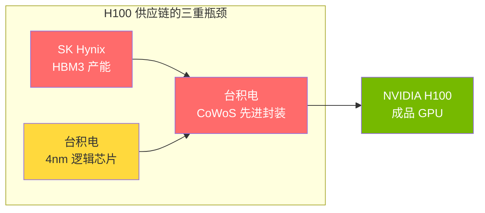
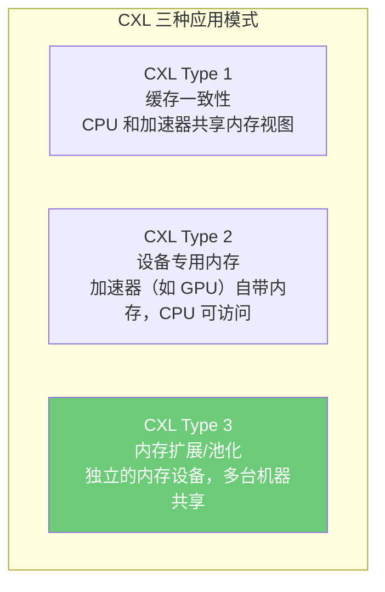
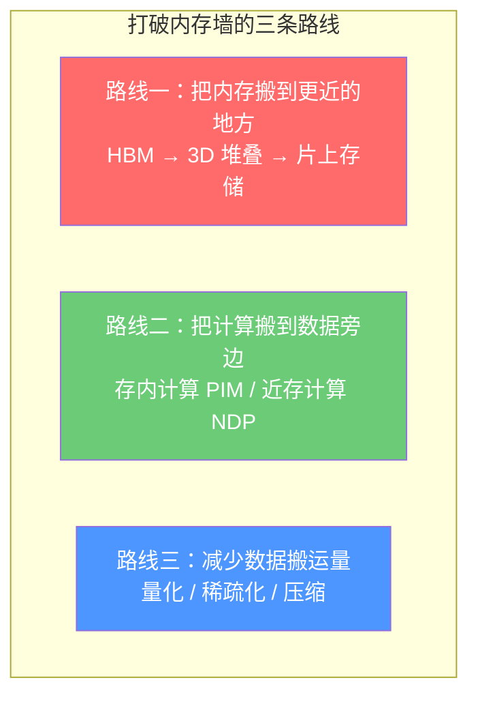
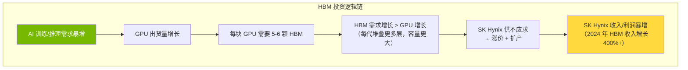
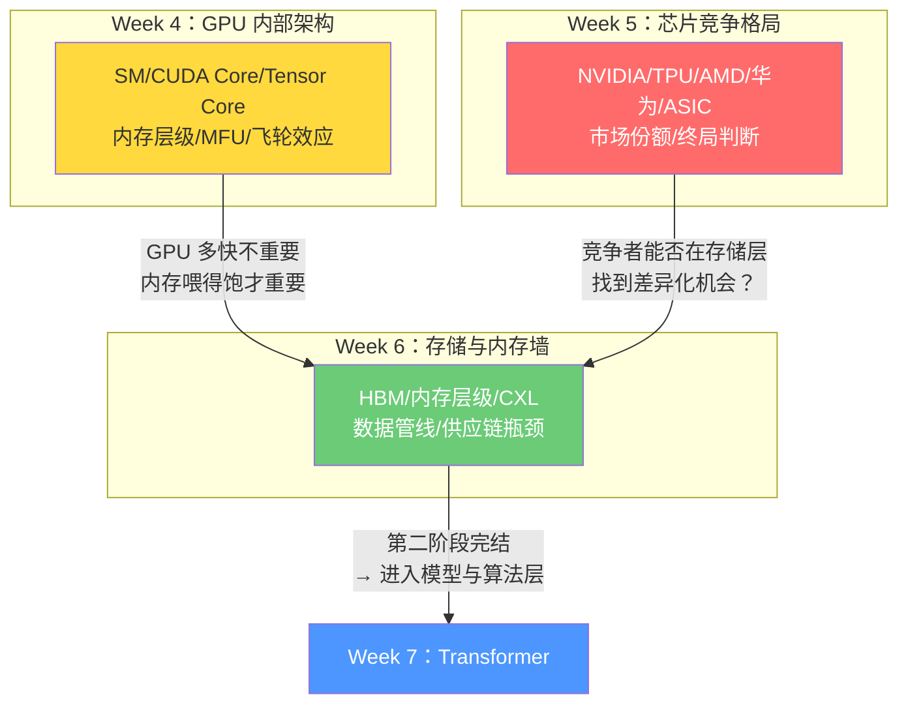

---
prev:
  text: 'Week 5 · 认知存盘'
  link: '/week-05/takeaways'
next:
  text: '💬 互动记录'
  link: '/week-06/interaction'
---

# Week 6：存储与内存墙——AI 芯片的隐形天花板

::: tip 本周核心命题
Week 4-5 拆解了 GPU 架构和芯片竞争格局，但有一个反复出现的瓶颈始终没有深入：**内存墙（Memory Wall）**。本周把这堵"墙"彻底拆解——HBM 为什么是 AI 芯片的"命门"？数据从硬盘到 GPU 的全链路瓶颈在哪？CXL 能否打破内存墙？存储技术的演进将如何重塑 AI 产业链的利润分配？
:::

## 先建立核心类比：AI 训练 = 超级工厂的供应链管理

Week 4 把 GPU 比喻成一座超级工厂。这一周我们聚焦工厂的**物流系统**——原材料（数据）如何从仓库运到生产线（计算单元），以及为什么物流跟不上生产速度。

| 现实世界 | AI 系统 | 关键矛盾 |
|---------|---------|---------|
| 生产线（工人） | 计算单元（CUDA Core / Tensor Core） | 生产速度每 2 年翻一倍 |
| 工厂车间的工具架 | **寄存器（Register）** / 共享内存（Shared Memory） | 容量极小（KB 级），但拿取瞬间完成 |
| 车间旁边的零件柜 | **L2 缓存**（50 MB） | 走几步就到，但放不了太多东西 |
| 工厂隔壁的仓库 | **HBM**（80-192 GB） | 需要叫物流车送，有等待时间 |
| 城市郊区的大仓库 | **DDR 主内存**（几百 GB - 几 TB） | 需要公路运输，更慢但容量大 |
| 外省的物流中心 | **SSD / NVMe 硬盘**（TB-PB 级） | 跨城快递，慢但便宜 |
| 全国各地的供应商 | **网络存储 / 数据湖** | 全国物流网络，最慢但无限量 |

**内存墙的本质**：工厂的生产线速度每 2 年翻一倍，但仓库到车间的物流通道宽度只增长 30%。结果就是——**生产线越来越多时间在等原材料，而不是在生产。**

---

## 一、内存墙：AI 算力的第一性瓶颈

### 1.1 什么是内存墙？

**内存墙（Memory Wall）** 这个概念在 Week 4 已经引入。现在深入它的物理根源。

1995 年，计算机科学家 Wulf 和 McKee 发表了一篇论文，预测处理器速度增长将远超内存速度增长——两者之间的差距会形成一堵越来越高的"墙"。30 年过去了，这个预测完全应验。

**具体数字感受**：

| GPU 代际 | 理论算力（BF16） | HBM 带宽 | 算力/带宽比 |
|---------|----------------|---------|-----------|
| A100（2020） | 312 TFLOPS | 2.0 TB/s | 156 |
| H100（2022） | 990 TFLOPS | 3.35 TB/s | 296 |
| B200（2024） | 2,250 TFLOPS | 8.0 TB/s | 281 |
| 趋势 | 每代 ×2-3 | 每代 ×1.5-2.4 | **持续增大** |

算力增长 **7 倍**（A100 → B200），但内存带宽只增长 **4 倍**。差距在每一代都在拉大。

### 1.2 为什么内存墙对 AI 特别致命？

不是所有计算都受内存墙影响。内存墙杀伤力取决于工作负载的**算术强度（Arithmetic Intensity，算术密度）**。

Week 4 介绍过算术强度 = 计算量（FLOPS）/ 数据搬运量（Bytes）。用工厂类比：

> **算术强度高** = 每搬一箱零件，可以在生产线上加工很多道工序。搬运一次，干活很久。**物流压力小。**
>
> **算术强度低** = 每搬一箱零件，只在生产线上过一道工序就扔了。不停地搬，但每次只干一点活。**物流压力极大。**

AI 工作负载中，不同操作的算术强度差异巨大：

| 操作类型 | 算术强度 | 瓶颈 | 典型场景 |
|---------|---------|------|---------|
| 大矩阵乘法（训练） | **高**（100-1000） | 计算受限 | 训练时的前向/反向传播主体 |
| Attention 计算 | **中**（10-100） | 两者都有 | Transformer 注意力层 |
| LayerNorm / 激活函数 | **低**（1-10） | 内存受限 | 每个 Transformer 层的归一化 |
| Softmax | **低**（< 5） | 内存受限 | 注意力分数归一化 |
| Embedding 查表 | **极低**（< 1） | 内存受限 | 推理时的词表查找 |
| KV Cache 读写 | **极低**（< 1） | 内存受限 | LLM 推理时的缓存管理 |

**关键发现**：虽然矩阵乘法（大量计算）是 AI 的核心操作，但一个完整的 Transformer 模型中，大量的辅助操作（LayerNorm、Softmax、KV Cache）都是**内存受限**的。这些"小操作"就像工厂里的搬运工——虽然每个人干的活不多，但它们加起来占了大量时间。

用餐厅类比：

> 一家高级餐厅的厨师（Tensor Core）手速极快，30 秒能炒一盘菜。但服务员（内存带宽）从后厨到餐桌来回要 2 分钟。结果？**厨师 75% 的时间在等服务员把上一盘菜端走、把新食材送来。** 这就是为什么 MFU 只有 30-50%——不是厨师不够快，是服务员跟不上。

### 1.3 Roofline 模型：一张图看清瓶颈在哪

**Roofline 模型（屋顶线模型）** 是分析算力利用率的经典工具。它把操作分成两类：

想象一个三角形的房子屋顶：
- **左边的斜坡** = 内存带宽限制区域。算术强度低的操作落在这里——它们的性能被内存带宽"压住"，算力再强也没用
- **右边的平顶** = 计算能力限制区域。算术强度高的操作落在这里——它们充分利用了计算资源
- **拐点** = 这台 GPU 的"平衡点"。H100 的拐点约在算术强度 = 296 处

**实际影响**：LLM 推理时大量操作（KV Cache 读写、LayerNorm）的算术强度只有 1-10，远低于拐点 296。这意味着**推理场景下，GPU 的大部分算力被浪费了**——你花了大价钱买的 Tensor Core 在空转，因为内存带宽喂不饱它。

---

## 二、内存层级：从寄存器到数据湖的六级台阶

### 2.1 完整的内存/存储层级

AI 系统的数据存储是一个**金字塔结构**——越往上越快越贵越小，越往下越慢越便宜越大。

用工厂物流的完整类比：

| 层级 | 类比 | 特征 |
|------|------|------|
| **寄存器** | 工人手中正在使用的工具 | 瞬间可用，但只能拿几件 |
| **共享内存 / L1** | 工位旁边的工具架 | 伸手就到，放得下一个班组的工具 |
| **L2 缓存** | 车间公共工具柜 | 走几步就到，全车间共享 |
| **HBM** | 工厂隔壁的高速仓库 | 用传送带连接，速度快但有等待 |
| **DDR（CPU 侧）** | 工业园区的公共仓库 | 要开叉车去取，更慢但容量大 |
| **NVMe SSD** | 城市另一边的物流中心 | 需要货车运输，按小时计 |
| **网络存储** | 外省的原材料供应商 | 全国物流网络配送，按天计 |

### 2.2 为什么要这么多层？

一个字：**成本**。

如果所有数据都放在最快的存储（SRAM/寄存器）上，一块 80 GB 的 SRAM 成本大约需要 **50,000-100,000 美元**——这比一整块 H100 GPU 还贵。所以必须分层：把"最热的数据"（马上要用的）放在最快的存储上，把"温数据"放在中间层，把"冷数据"存在最便宜的地方。

| 存储类型 | 每 GB 成本（约） | 容量 | 速度 |
|---------|----------------|------|------|
| SRAM（片上缓存） | $500-1,000 | MB 级 | 最快 |
| HBM3 | $10-25 | 80-192 GB | 很快 |
| DDR5 | $3-5 | 几百 GB | 中等 |
| NVMe SSD | $0.05-0.10 | TB 级 | 较慢 |
| HDD / 对象存储 | $0.01-0.02 | PB 级 | 最慢 |

**SRAM 和 HBM 的成本差距是 50-100 倍**。这就是为什么 Cerebras（44 GB 全 SRAM）的芯片成本远高于 NVIDIA GPU——它用最贵的存储类型解决了内存墙，但付出了极高的成本代价。

### 2.3 数据搬运的"税"

数据在不同层级之间搬运不是免费的——它消耗**能量和时间**。

一个令人震惊的数字：在当前的 AI 系统中，**数据搬运消耗的能量是计算本身的 10-100 倍**。

| 操作 | 能耗（pJ/操作） | 相对倍数 |
|------|----------------|---------|
| INT8 乘法 | 0.03 | 1× |
| FP16 乘法加 | 0.4 | 13× |
| 读 SRAM（片上） | 5 | 167× |
| 读 HBM | 20 | 667× |
| 读 DDR | 100 | 3,333× |

用类比：

> 做一道数学题（乘法计算）消耗的能量，相当于翻一页课本。但把课本从书架上拿过来（从 HBM 读数据），消耗的能量相当于**跑到隔壁图书馆借书再跑回来**。AI 芯片的大部分电费，其实花在"搬数据"而不是"算数据"上。

---

## 三、HBM：AI 芯片的"命门"

### 3.1 HBM 是什么？为什么 AI 离不开它？

**HBM（High Bandwidth Memory，高带宽内存）** 是一种特殊的内存封装技术。传统的 DDR 内存芯片是平铺在主板上的，而 HBM 是把多层 DRAM 芯片**垂直堆叠**在一起，再通过**硅中介层（Silicon Interposer）** 与 GPU 芯片直接连接。

用类比：

> **DDR 内存** = 一栋平房仓库。每个房间存一点东西，要取东西得一间一间跑。通道（总线）只有一条路。
>
> **HBM** = 一栋 8-12 层的立体仓库。每层都有货物，中间有电梯（TSV，硅通孔）直接连通。同时 8 层一起出货，带宽是平房的 **5-10 倍**。而且仓库紧贴工厂（通过硅中介层直连 GPU），搬运距离更短。

### 3.2 HBM 的代际演进

| 代际 | 堆叠层数 | 容量（每颗） | 带宽（每颗） | 用于 GPU | 年份 |
|------|---------|-------------|-------------|---------|------|
| HBM2 | 8 层 | 16 GB | 460 GB/s | V100 | 2018 |
| HBM2e | 8 层 | 16-24 GB | 460 GB/s | A100 | 2020 |
| **HBM3** | 8-12 层 | 16-24 GB | **819 GB/s** | **H100** | 2022 |
| **HBM3e** | 8-12 层 | 24-36 GB | **1,200 GB/s** | **B200** | 2024 |
| HBM4（预计） | 12-16 层 | 36-48 GB | ~2,000 GB/s | 下一代 | 2026 |

**关键趋势**：每代 HBM 的带宽增长约 50-80%，但 GPU 算力增长 100-200%。**HBM 的进步速度追不上 GPU——内存墙仍在变高。**

### 3.3 HBM 供应链：SK Hynix 的垄断地位

全球 HBM 的供应链极度集中——只有两家半导体公司能量产：

**SK Hynix** 占据超过一半的市场份额，而且在最先进的 HBM3e 代际中份额更高（约 60%+），因为 Samsung 的 HBM3e 良率不及预期。

**为什么 HBM 如此难做？**

HBM 的制造难度远超普通 DRAM：

| 工艺挑战 | 说明 |
|---------|------|
| **TSV（硅通孔）** | 在 DRAM 芯片上打穿数千个垂直微孔，直径仅 5-10 微米 |
| **晶圆减薄** | 每层 DRAM 必须磨薄到 30-40 微米（一根头发丝约 70 微米） |
| **堆叠键合** | 8-12 层芯片要精确对齐堆叠，误差不能超过 1 微米 |
| **散热挑战** | 层数越多，中间层的热量越难散出 |
| **良率管理** | 12 层堆叠中任何一层有缺陷，整颗 HBM 报废 |

用类比：

> 做 HBM 就像建一栋 12 层的积木塔，每块积木薄如纸片（30 微米），每层之间要用几千根针精确对齐（TSV），整栋塔还不能歪超过一根头发的百分之一。**这种精度要求，全世界只有两三家公司能做到。**

### 3.4 HBM 为什么是 AI 芯片的"命门"？

**命门（Critical Dependency）** 的意思是：没有它，整个系统无法运转。HBM 对 AI 芯片的关系就像发动机对汽车——不是"有它更好"，而是"没有就开不了"。

三个维度的命门效应：

**1. 性能命门**：GPU 算力再高，没有足够的 HBM 带宽，算力就浪费了。H100 的 990 TFLOPS 中，实际能利用的只有 30-50%（MFU），主要瓶颈就是 HBM 带宽。

**2. 成本命门**：一块 H100 GPU 中，**HBM 占物料成本的 40-60%**。GPU 芯片本身（逻辑芯片）的成本可能只占 20-30%。

| 成本组成 | 占比（估） | 说明 |
|---------|-----------|------|
| HBM 内存 | 40-60% | 5-6 颗 HBM3 堆叠封装 |
| GPU 芯片（逻辑） | 20-30% | 台积电 4nm 代工 |
| 硅中介层 + 封装 | 10-15% | CoWoS 先进封装 |
| 基板 + 其他 | 5-10% | PCB 基板、被动元件 |

**一块 H100 的出厂成本中，接近一半给了 SK Hynix 的 HBM。**

**3. 供应链命门**：NVIDIA 的 GPU 产能瓶颈不只是台积电的逻辑芯片产能，还有 SK Hynix/Samsung 的 HBM 产能，以及台积电的 **CoWoS（Chip on Wafer on Substrate，基板上晶圆上芯片）** 先进封装产能——因为 HBM 必须通过 CoWoS 工艺与 GPU 芯片封装在一起。

**CoWoS 封装是三重瓶颈中最紧的**——2023-2024 年 NVIDIA GPU 的交货延迟，主要原因不是 GPU 芯片不够，而是 CoWoS 封装产能不够。台积电正在紧急扩建 CoWoS 产线，预计 2025 年产能翻倍。

---

## 四、AI 训练/推理的数据全链路

### 4.1 训练数据管线：从数据湖到 GPU 的长征

一个大模型训练过程中，数据要经过漫长的旅途才能到达 GPU 的 Tensor Core：

**每一段都可能成为瓶颈**：

| 链路 | 带宽 | 常见瓶颈原因 |
|------|------|------------|
| 数据湖 → SSD | 10-100 GB/s | 网络带宽、存储系统 IOPS |
| SSD → CPU 内存 | ~7 GB/s（单盘） | SSD 读取速度 |
| CPU 内存 → GPU HBM | ~64 GB/s（PCIe 5.0 x16） | **PCIe 总线成为新瓶颈** |
| HBM → Tensor Core | 2-8 TB/s | **内存墙——最核心的瓶颈** |

用物流类比：

> 训练数据的旅途就像一条公路，从高速公路（网络存储，宽但远）→ 国道（SSD，较快）→ 城市主干道（PCIe，有限）→ 工厂专用道（HBM 带宽，快但不够宽）→ 车间内部传送带（片上总线，最快）。**整条路的通行能力取决于最窄的那段。**

### 4.2 推理时的特殊挑战：KV Cache

推理场景有一个训练没有的独特内存挑战——**KV Cache（键值缓存）**。

当 LLM 生成文本时，它需要记住之前所有 token 的信息。这些信息存储在一个叫 KV Cache 的数据结构中。随着对话越来越长，KV Cache 越来越大。

**KV Cache 有多大？**

| 模型 | 参数量 | 上下文长度 | KV Cache 大小（BF16） |
|------|--------|-----------|---------------------|
| Llama 3 8B | 8B | 8K tokens | ~2 GB |
| Llama 3 70B | 70B | 8K tokens | ~10 GB |
| GPT-4 级别 | ~1.8T（推测 MoE） | 128K tokens | ~50-100 GB |

用类比：

> KV Cache 就像一个服务员的记忆笔记本。客人每说一句话，服务员就要记一页笔记（存一层 KV）。对话越长，笔记本越厚。问题是：每次客人说新的一句话，服务员不仅要记新内容，还要**翻阅之前所有的笔记**来理解上下文——这就是 Attention 机制的本质。
>
> 128K 上下文的 GPT-4，相当于服务员要同时记住一本 **200 页的笔记本**，而且每接待一位新客人（新 token），都要翻完全部 200 页。

**KV Cache 是推理场景的内存墙核心**：它的算术强度极低（大量读、极少计算），完全是内存带宽受限的操作。这就是为什么推理场景下 HBM 容量（能装多大的 KV Cache）和 HBM 带宽（能多快地读 KV Cache）比算力本身更重要。

### 4.3 并行文件系统：喂饱万卡集群的数据管道

训练万卡集群时，数万块 GPU 同时需要读取训练数据。普通的文件系统（NFS、HDFS）在这种规模下会成为严重瓶颈。

AI 训练集群通常使用**并行文件系统（Parallel File System）**：

| 系统 | 类型 | 特点 | 典型用户 |
|------|------|------|---------|
| **Lustre** | 开源并行文件系统 | 大规模 HPC 标配，可扩展到 PB 级 | 国家实验室、超算中心 |
| **GPFS / Spectrum Scale** | IBM 商业产品 | 企业级可靠性 | 金融、制造 |
| **WekaFS** | 全闪存并行文件系统 | AI 训练优化，NVMe 原生 | AI 训练公司 |
| **对象存储 + 缓存层** | S3/OSS + Alluxio | 冷热分层，成本最优 | 云上训练 |

用类比：

> 普通文件系统像一个**单一收银台的超市**——10,000 个顾客（GPU）同时来买东西，全排一条队，等到天荒地老。并行文件系统像一个**开了 100 个收银台的仓储式超市**——数据分散存储在多台服务器上，多路并行读取，总带宽可以线性扩展。

---

## 五、CXL：打破内存墙的新希望？

### 5.1 CXL 是什么？

**CXL（Compute Express Link，计算快速链路）** 是一种新的互联协议，基于 PCIe 物理层，但增加了**内存语义**——让 CPU 和加速器可以像访问本地内存一样访问远端设备上的内存。

CXL 要解决的核心问题：**内存不够用**。

当前的 AI 服务器架构中，每块 GPU 的 HBM 是"私有的"——GPU A 的 80 GB HBM 不能给 GPU B 用。如果 GPU A 的模型只用了 60 GB，剩下 20 GB 就浪费了。

用类比：

> 当前架构 = 每个工人有自己的私人工具柜，别人不能借用。有的工具柜满得塞不下，有的工具柜还有空位——但不能共享。
>
> CXL = 在车间里建一个**公共工具库**，所有工人都可以按需取用。虽然从公共库取工具比从自己柜子里拿慢一点，但胜在**容量灵活，不浪费**。

### 5.2 CXL 的三种用法

AI 领域最关注的是 **Type 3——内存池化（Memory Pooling）**：

> 想象一个图书馆系统。以前每个教室（服务器）有自己的小书架（DDR 内存），书不够了就只能买新书架。CXL 内存池化相当于在学校中心建了一个**大图书馆**（共享内存池），所有教室都可以借阅。需要更多书（内存）的教室多借一些，不需要的少借一些。

### 5.3 CXL 代际演进

| 版本 | 基于 | 带宽 | 关键能力 | 状态 |
|------|------|------|---------|------|
| **CXL 1.0/1.1** | PCIe 5.0 | 64 GB/s | 基础内存扩展 | 已量产 |
| **CXL 2.0** | PCIe 5.0 | 64 GB/s | 内存池化（多设备共享） | 产品上市中 |
| **CXL 3.0** | PCIe 6.0 | 128 GB/s | 多层交换、动态共享 | 规范已发布，产品 2026+ |

### 5.4 CXL 能解决 AI 的内存墙吗？

**短期（2024-2026）：不能。** 原因：

1. **带宽差距太大**——CXL 3.0 的内存带宽是 128 GB/s，而 HBM3e 的带宽是 1,200 GB/s。**CXL 比 HBM 慢 10 倍**。对于需要极高带宽的 AI 训练/推理核心计算，CXL 根本喂不饱
2. **延迟增加**——通过 CXL 访问远端内存的延迟比访问本地 HBM 高 3-5 倍
3. **GPU 还不原生支持**——NVIDIA 目前的 GPU 不支持 CXL。GPU 的内存只认 HBM

**中长期（2027+）：有价值，但解决的是不同问题。** CXL 不是替代 HBM，而是**补充 HBM**：

| 维度 | HBM | CXL 内存池 |
|------|-----|-----------|
| **定位** | GPU 的"心脏血管"——必须极快 | 系统的"血库"——容量大、按需分配 |
| **带宽** | 2-8 TB/s | 64-128 GB/s |
| **容量** | 80-192 GB / GPU | 几 TB 到几十 TB / 服务器 |
| **最佳用途** | 训练/推理的核心计算 | KV Cache 溢出、模型权重存储、数据预处理 |

用类比：

> HBM 是赛车发动机里的**涡轮增压器**——极快，但容量有限。CXL 是赛车后面的**额外油箱**——跑得不快，但续航更久。你不能用额外油箱替代涡轮增压器，但它能让你在长途比赛（大上下文推理）中不至于半路没油。

### 5.5 CXL 的真正价值场景

CXL 内存池化对 AI 推理的价值远大于训练：

1. **KV Cache 溢出**：当上下文窗口很长（128K+ tokens）时，KV Cache 可能超过 HBM 容量。CXL 提供了一个"溢出缓冲区"——把不常访问的老 KV 数据放到 CXL 内存中
2. **推理服务的内存利用率**：多个推理请求可以共享 CXL 内存池中的模型权重，减少每个 GPU 独立加载模型的冗余
3. **成本优化**：CXL 内存的成本远低于 HBM（基于标准 DDR），用它替代一部分不需要极高带宽的数据存储，可以降低整体 TCO

---

## 六、打破内存墙的未来技术

### 6.1 三条技术路线

内存墙问题不是一个技术方向能解决的，而是需要多条路线并进：

### 6.2 路线一：把内存搬到更近的地方

**核心逻辑**：搬运距离越短，带宽越高、延迟越低、能耗越小。

| 技术 | 原理 | 状态 | 代表 |
|------|------|------|------|
| **HBM 堆叠层数增加** | 从 8 层 → 12 层 → 16 层，每层带宽叠加 | HBM3e 12层已量产 | SK Hynix |
| **3D 堆叠（Logic-on-Memory）** | 把计算逻辑芯片直接堆叠在内存芯片上方 | 研发中 | AMD（3D V-Cache 已验证） |
| **片上大容量 SRAM** | 增加芯片上的 SRAM 缓存容量 | Cerebras WSE-3（44 GB SRAM） | Cerebras |

AMD 的 **3D V-Cache** 技术已经在 CPU 产品线上验证——把额外的 L3 缓存芯片堆叠到 CPU 上方，缓存容量翻了 3 倍。这项技术未来可能应用到 GPU 上，在 GPU 芯片上方堆叠大容量 SRAM。

### 6.3 路线二：把计算搬到数据旁边

**核心逻辑**：既然数据搬不快，那就不搬——直接在数据存储的地方做计算。

这就是 **存内计算（Processing-in-Memory，PIM）** 和 **近存计算（Near-Data Processing，NDP）** 的思路。

用类比：

> 传统方式 = 把所有食材从仓库运到中央厨房做饭。PIM = 在每个仓库里直接装一个小厨房——食材在哪，就在哪做，不需要搬运。

| 技术 | 原理 | 优势 | 挑战 |
|------|------|------|------|
| **PIM（存内计算）** | 在内存芯片内部嵌入简单计算逻辑 | 彻底消除数据搬运开销 | 计算单元简单，只能做特定操作 |
| **NDP（近存计算）** | 在内存芯片旁边放置计算单元 | 大幅减少搬运距离 | 需要新的编程模型 |

Samsung 已经在 HBM 中试验 PIM 技术——**HBM-PIM（Aquabolt-XL）**，在 HBM 的每个 Bank（存储单元组）内嵌入简单的向量计算单元。特定操作（如 BatchNorm、Activation）可以直接在内存中完成，不需要搬到 GPU 上。

**但 PIM 有天花板**：它只能做简单的逐元素操作，不能做复杂的矩阵乘法。所以 PIM 不会替代 GPU，而是作为**卸载"小操作"的加速器**——把那些算术强度低的操作（LayerNorm、Softmax）留在内存里做，让 GPU 专心做矩阵乘法。

### 6.4 路线三：减少数据搬运量

**核心逻辑**：搬不快就少搬——压缩数据、跳过零值、降低精度。

这条路线 Week 4 已经接触过（FP8/FP4 量化、结构化稀疏），现在从内存墙角度重新理解：

| 技术 | 减少搬运量的原理 | 对内存墙的影响 |
|------|----------------|-------------|
| **量化（FP16 → FP8 → FP4）** | 每个数字占的字节数减半/再减半 | 同等带宽下，能搬运 2-4 倍的数据 |
| **结构化稀疏（Sparsity）** | 跳过零值，只搬运/计算非零元素 | 减少 50% 的数据搬运量 |
| **KV Cache 压缩** | 压缩推理时的 KV Cache 占用 | 减少推理内存需求 30-50% |
| **模型蒸馏** | 用小模型模仿大模型的行为 | 从根本上减少参数量（即数据量） |

**量化是当前最实用的"反内存墙"武器**。Week 4 讲过 FP4 精度让推理性能翻倍——本质上是因为**每个数字只占 4 bit，带宽等效翻倍**，相当于把高速公路的车道数加倍了。

---

## 七、商业分析：存储/内存层的投资价值

### 7.1 "定价权 × 产能弹性"矩阵——存储与内存层

| 环节 | 代表公司 | 定价权 | 产能弹性 | 判断 |
|------|---------|--------|---------|------|
| **HBM（AI 内存）** | SK Hynix、Samsung | **极强**（双寡头 + AI 刚需） | **极低**（扩产 1.5-2 年） | ⭐⭐⭐⭐ AI 时代最稀缺的元器件 |
| **CoWoS 先进封装** | 台积电 | **极强**（独家技术） | **极低**（扩产 1-2 年） | ⭐⭐⭐⭐ GPU 出货的最紧瓶颈 |
| **NAND SSD（训练存储）** | Samsung / WD / 铠侠 | 弱（周期性商品） | 高 | ⭐ 价格随周期波动 |
| **并行文件系统** | WekaFS / DDN / 浪潮 | 中 | 中 | ⭐⭐ 软件差异化，但替代品多 |
| **CXL 控制器** | Montage / Astera Labs | 弱（市场早期） | 中 | ⭐⭐ 长期看好，短期收入极小 |
| **内存接口芯片** | Montage（澜起科技） | 中强 | 中 | ⭐⭐ DDR5/CXL 升级周期受益 |

### 7.2 关键投资逻辑

**一个惊人的数字**：SK Hynix 2024 年的 HBM 业务收入同比增长超过 **400%**，从约 30 亿美元增长到约 150 亿美元。HBM 已经从 SK Hynix 的小众业务变成利润支柱。

**投资关注点**：

1. **SK Hynix（韩国上市）**：全球 HBM 龙头，AI 需求直接受益。风险：三星追赶、HBM4 代际切换的良率挑战
2. **台积电 CoWoS**：GPU 出货的隐形瓶颈，利润率极高。风险：集中于少数大客户
3. **Astera Labs（美股）**：CXL 控制器芯片领先者。风险：CXL 大规模商用仍需 2-3 年
4. **澜起科技（A 股）**：DDR5/CXL 内存接口芯片龙头。风险：依赖 DDR5 升级周期

---

## 八、Week 4-6 总结：芯片与硬件层全景

三周内容构成了 AI 硬件层的完整画面：

**第二阶段核心结论**：AI 硬件的瓶颈正在从计算转向存储和互联。NVIDIA 的护城河不只是 CUDA（软件）+ NVLink（互联），还包括对 HBM 和 CoWoS 供应链的锁定。**未来谁能在内存/存储层取得突破（更大 HBM、PIM、更高效量化），谁就能重塑 AI 芯片的竞争格局。**

---

## Week 6 思考题

### 思考题 1：如果你是 NVIDIA 的供应链负责人

> NVIDIA 当前有超过 50% 的 GPU 物料成本来自 SK Hynix 的 HBM。SK Hynix 是唯一能大规模量产最先进 HBM 的供应商。作为 NVIDIA 的供应链负责人，你会如何管理这个依赖风险？
>
> 提示：回忆 Week 5 学过的"垂直整合 vs 水平分工"框架（模型 10），以及 Week 1 的"产能弹性 × 定价权"矩阵（模型 2）。

### 思考题 2：CXL 的采用时机判断

> 一家云计算公司（类似阿里云）正在评估是否在下一代 AI 推理服务器中引入 CXL 内存池化。CXL 设备成本比传统 DDR 高 30%，但理论上可以提高内存利用率 40%。你会建议他们**现在就部署**还是**等 CXL 3.0 成熟后再部署**？
>
> 提示：思考"技术代际窗口期"（模型 6）——先发优势 vs 等待标准成熟的风险。

### 思考题 3：内存墙如何影响 AI 模型的设计方向？

> 我们讨论了很多"如何用硬件技术打破内存墙"。但还有另一个方向——**改变模型架构来适应内存墙**。你认为内存墙问题会如何影响未来 AI 模型的设计方向？哪些模型架构创新可能是"为了绕过内存墙而生"的？
>
> 提示：想想 Week 4 讲过的算术强度、量化、稀疏化，再想想"减少数据搬运"这个目标如何反过来影响模型设计。
