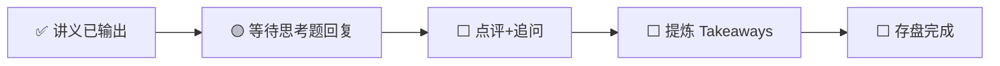

---
prev:
  text: '📖 讲义'
  link: '/week-07/lecture'
next:
  text: '✅ 认知存盘'
  link: '/week-07/takeaways'
---

# Week 7 · 互动记录

::: info 状态
🟡 等待思考题推演回复
:::

## 交互流程

## 思考题回顾

### 题目 1：Attention 的 O(n²) 与 API 定价策略
> 按 token 数收费 vs 按上下文长度收费的利弊分析。

**你的回答**：（待填写）

**点评与补充**：（待填写）

---

### 题目 2：Chinchilla 最优 vs 推理最优的商业选择
> 什么条件下选训练成本最优，什么条件下选推理成本最优？

**你的回答**：（待填写）

**点评与补充**：（待填写）

---

### 题目 3：Scaling Law 天花板的投资含义
> 如果"更大模型不再更聪明"，AI 产业链各层受什么影响？

**你的回答**：（待填写）

**点评与补充**：（待填写）

---

## 追问与延伸讨论

（互动过程中产生的追问将记录在此）
