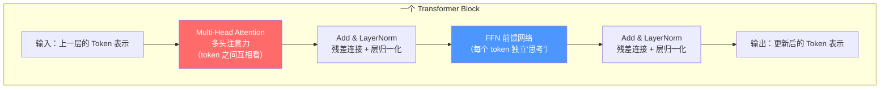
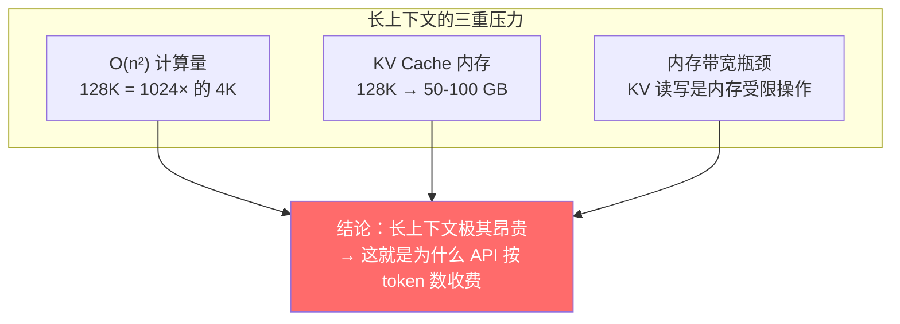
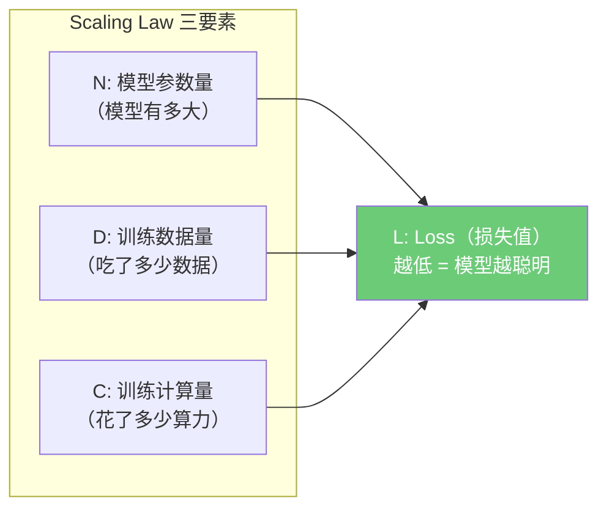
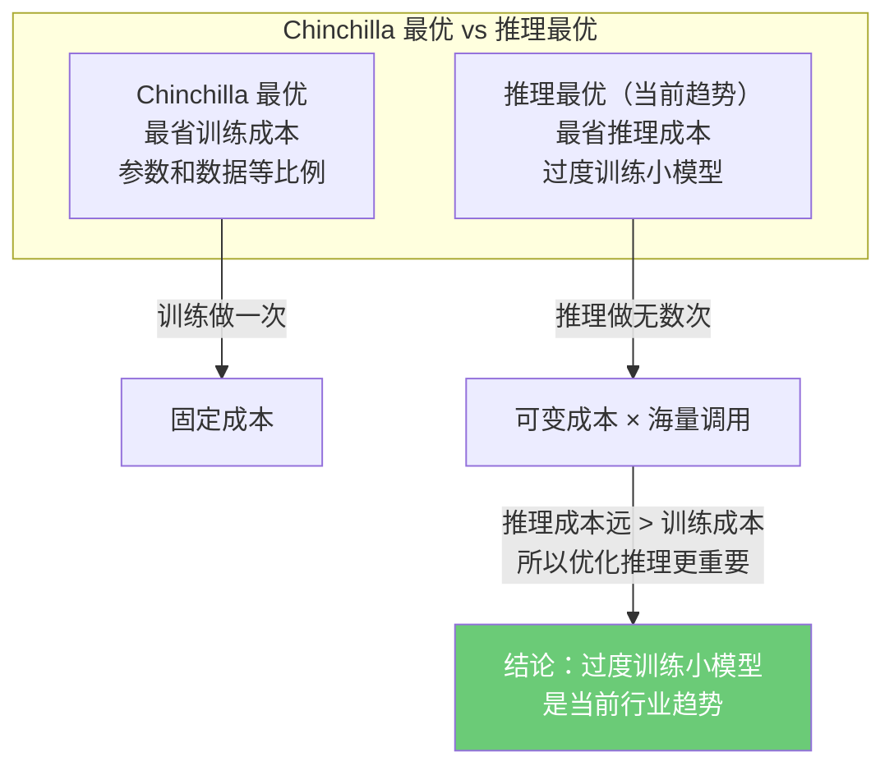
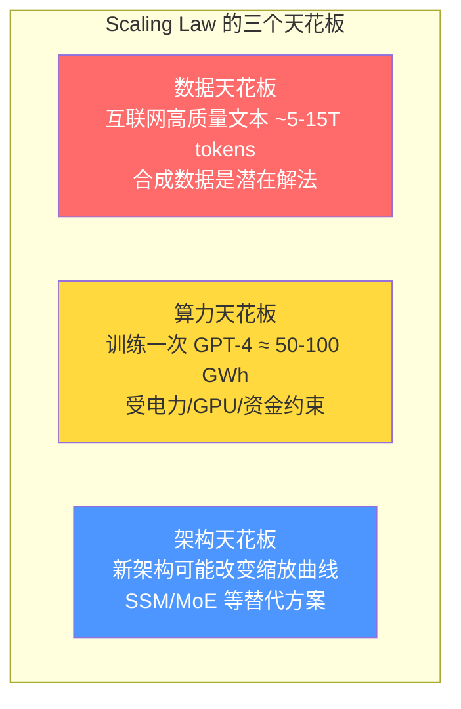
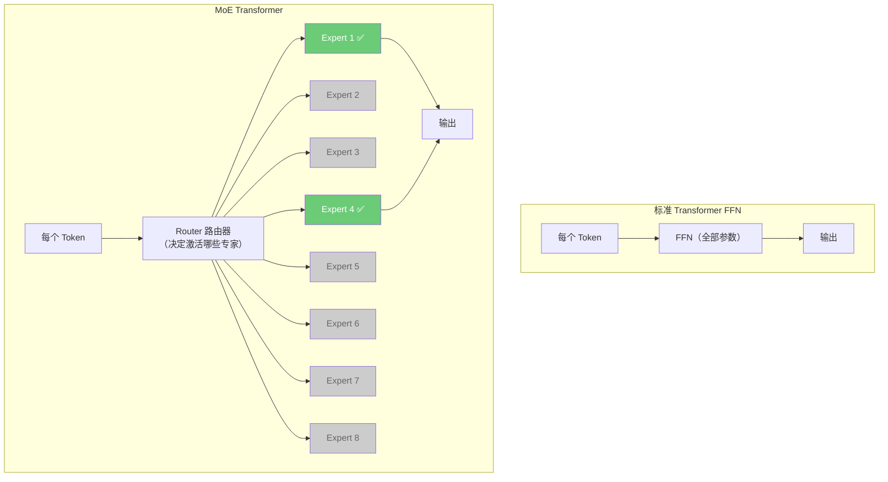
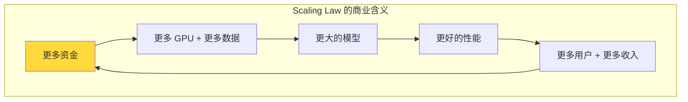
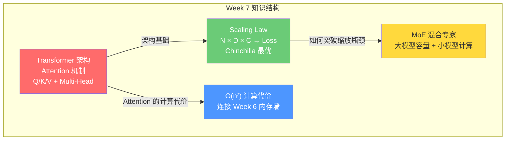

---
prev:
  text: 'Week 6 · 认知存盘'
  link: '/week-06/takeaways'
next:
  text: '💬 互动记录'
  link: '/week-07/interaction'
---

# Week 7：Transformer 与 Scaling Law——大模型的引擎和燃油经济学

::: tip 本周核心命题
前六周从电力到芯片到内存，拆解了 AI 的全部物理基础设施。从这一周开始，我们走进"引擎舱"——**模型本身是怎么工作的？** Transformer 架构为什么能统一 NLP、视觉、语音等几乎所有 AI 领域？Scaling Law（缩放定律）为什么让"大力出奇迹"成为 AI 行业的核心信仰？以及——这些对投资决策意味着什么？
:::

## 先建立核心类比：Transformer = 一场全员发言的圆桌会议

在理解 Transformer 之前，先建立一个全程类比：

> 想象一场公司的**圆桌会议**。会议室里坐着 10 个人（10 个 token），每个人手里有一张卡片写着自己的信息。
>
> **旧方案（RNN/LSTM）**：信息只能**依次传递**——第 1 个人把卡片给第 2 个人，第 2 个人综合后传给第 3 个人……传到第 10 个人时，第 1 个人说的话已经变形了。而且必须**一个一个传**，速度很慢。
>
> **新方案（Transformer）**：所有人**同时看到所有人的卡片**——每个人都可以自主判断"谁的卡片跟我最相关"，直接从最相关的人那里获取信息。不需要排队传递，**并行处理**。

这就是 Transformer 的核心创新：**用"注意力机制"（Attention）替代"依次传递"（Recurrence），让所有信息可以直接互相对话。**

| 维度 | 旧方案（RNN/LSTM） | 新方案（Transformer） |
|------|-------------------|---------------------|
| **信息传递方式** | 依次传递（串行） | 所有人直接对话（并行） |
| **长距离信息** | 传话链太长，信息衰减 | 直接访问，无衰减 |
| **计算并行度** | 低（必须按顺序） | 高（天然适合 GPU 并行） |
| **训练速度** | 慢 | **快很多**（可以利用 GPU 并行） |

---

## 一、Transformer 诞生：一篇改变世界的论文

### 1.1 历史背景

2017 年，Google Brain 团队发表了一篇论文：**"Attention Is All You Need"（注意力就是你所需要的全部）**。这篇论文提出了 **Transformer** 架构，它后来成为几乎所有现代 AI 大模型的基础。

| 模型 | 基于 Transformer | 年份 | 意义 |
|------|----------------|------|------|
| BERT | ✅（Encoder） | 2018 | 开启预训练时代 |
| GPT-2 | ✅（Decoder） | 2019 | 证明大模型能生成流畅文本 |
| GPT-3 | ✅（Decoder） | 2020 | 175B 参数，In-Context Learning |
| GPT-4 | ✅（Decoder） | 2023 | 多模态，推测 MoE 架构 |
| Claude | ✅（Decoder） | 2023- | Anthropic 的大语言模型系列 |
| Llama 3 | ✅（Decoder） | 2024 | Meta 开源，推动开放生态 |
| Gemini | ✅（Decoder） | 2024 | Google 多模态大模型 |

**一个架构统一了整个 AI 领域**——NLP（自然语言处理）、计算机视觉、语音识别、蛋白质结构预测（AlphaFold）、甚至天气预报，全部用 Transformer。这在 AI 历史上从未发生过。

### 1.2 为什么 Transformer 之前的方案不行？

在 Transformer 之前，处理序列数据（文本、语音等）的主流架构是 **RNN（Recurrent Neural Network，循环神经网络）** 和它的改进版 **LSTM（Long Short-Term Memory，长短期记忆网络）**。

用类比来理解它们的核心缺陷：

> **RNN 的问题 = 电话传话游戏。**
>
> 30 个人站成一排，第 1 个人说一句话，依次传给第 30 个人。第 30 个人听到的内容跟原话已经面目全非。这就是 RNN 的**长距离依赖问题（Long-range Dependency）**——序列越长，早期信息丢失越严重。
>
> LSTM 试图在每个人手里放一个"小笔记本"来记录重要信息，减轻传话失真。但根本问题没解决——**信息仍然必须依次传递**，不能并行，所以速度慢。

**Transformer 的解决方案**：不传话了！**让每个人直接看到所有人的卡片。** 这就是 Self-Attention（自注意力）机制。

---

## 二、注意力机制：Transformer 的核心引擎

### 2.1 什么是注意力（Attention）？

**注意力机制（Attention Mechanism）** 的核心思想是：在处理当前信息时，**自动判断其他信息中哪些与我相关，然后重点关注那些相关的部分。**

用一个具体例子：

> 句子："小明把球踢给了小红，**她**很开心。"
>
> 当模型处理到"她"这个字时，需要判断"她"指的是谁。注意力机制让"她"这个 token **对句子中每个其他 token 打一个相关性分数**：
>
> | Token | 与"她"的相关性 |
> |-------|-------------|
> | 小明 | 0.05（低——"她"不太可能指男性） |
> | 把 | 0.01（极低——功能词） |
> | 球 | 0.02（极低——物体） |
> | 踢给了 | 0.03（低——动词） |
> | **小红** | **0.82（极高——女性，且是接球者）** |
> | 很 | 0.03 |
> | 开心 | 0.04 |
>
> 注意力机制自动发现"她"和"小红"最相关，于是在处理"她"时，重点参考"小红"的信息。

### 2.2 Q / K / V：注意力的三个角色

注意力机制的实现用了三个向量：**Query（查询）、Key（键）、Value（值）**。

用圆桌会议类比来理解这三个角色：

> 圆桌会议上，**每个参会者同时扮演三个角色**：
>
> - **Query（问题）**：我想了解什么？（"谁有关于预算的信息？"）
> - **Key（标签）**：我能提供什么信息？（"我有供应链数据"）
> - **Value（内容）**：我的具体信息是什么？（供应链报告的详细内容）
>
> 当你（Query）环顾四周，你会把自己的问题（Query）和每个人的标签（Key）**对比打分**——发现财务总监的标签跟你的问题最匹配，于是你**重点读取**财务总监的具体内容（Value）。

数学上，Attention 的计算公式：

```
Attention(Q, K, V) = softmax(Q × K^T / √d) × V
```

用白话翻译这个公式：

| 步骤 | 数学 | 白话 |
|------|------|------|
| 1 | Q × K^T | 计算"我的问题"跟"每个人的标签"的匹配度 |
| 2 | / √d | 除以一个缩放因子，防止分数太大太极端 |
| 3 | softmax() | 把匹配度转成概率分布（加起来 = 1） |
| 4 | × V | 用概率作为权重，对每个人的"具体内容"加权求和 |

**最终结果**：每个 token 得到一个**融合了所有相关 token 信息的新表示**。"她"不再只是一个代词——它吸收了"小红"的全部语义信息。

### 2.3 多头注意力（Multi-Head Attention, MHA）

一个注意力头只能从**一个角度**看信息。但理解一句话需要同时考虑多个维度。

> 回到圆桌会议：如果你只关心"预算"这一个维度，你会错过时间线、风险、竞品等信息。解决办法：**派多个代表，每人关注不同维度。**
>
> - **Head 1** 关注：语法关系（主语-谓语-宾语）
> - **Head 2** 关注：时间顺序（先发生-后发生）
> - **Head 3** 关注：指代关系（"她"= "小红"）
> - **Head 4** 关注：情感色彩（正面-负面）
> - ……
>
> 最后把所有代表收集到的信息**合并**，得到一个多角度的综合理解。

GPT-4 级别的模型通常有 **96-128 个注意力头**——同时从 96 个不同角度理解每句话。

### 2.4 Week 6 互动中提到的 GQA：注意力头的共享优化

Week 6 互动中我们提过 **GQA（Grouped Query Attention，分组查询注意力）**，现在可以准确理解它了：

标准 MHA 中，每个 Query head 都有自己独立的 Key 和 Value head——96 个 Query 就需要 96 组 Key/Value。

GQA 让多个 Query head **共享**同一组 Key/Value——比如每 8 个 Query 共享 1 组 K/V，96 个 Query 只需要 12 组 K/V。

**效果**：KV Cache 缩小 8 倍，推理时内存占用大幅下降。回忆 Week 6 讲的 KV Cache 是推理内存墙的核心——GQA 直接从模型架构层面缓解了这个问题。

---

## 三、Transformer 完整架构

### 3.1 一个 Transformer Block（变换器块）的内部结构

一个 Transformer 模型由多个相同的 **Block（层/块）** 堆叠而成。每个 Block 内部做两件事：



用类比解释每个组件：

| 组件 | 功能 | 类比 |
|------|------|------|
| **Multi-Head Attention** | Token 之间互相交流信息 | 圆桌会议——所有人互相讨论 |
| **FFN（Feed-Forward Network，前馈网络）** | 每个 Token 独立处理自己吸收到的信息 | 会后回到各自工位**独立思考整理笔记** |
| **残差连接（Residual Connection）** | 保留原始信息，防止层数太多时信息丢失 | 每次会议后保留上次的会议纪要，不从零开始 |
| **LayerNorm（层归一化）** | 把数值范围稳定在合理区间 | 确保每个人的发言音量差不多，不会有人声音太大盖过别人 |

### 3.2 多层堆叠：深度 = 理解的层次

GPT-4 级别的模型通常有 **96-120 层** Transformer Block 堆叠。为什么需要这么多层？

> **每一层理解的"层次"不同**：
>
> - 第 1-10 层：识别基础模式（词义、语法结构）——相当于**认字**
> - 第 11-40 层：理解短语和句子关系——相当于**读懂句子**
> - 第 41-80 层：捕获段落级别的逻辑和推理——相当于**理解文章**
> - 第 81-120 层：抽象推理和知识整合——相当于**形成观点和判断**
>
> 更多层 = 更深的理解能力。这就是为什么模型越大（更多层 + 每层更宽）通常越聪明。

### 3.3 Decoder-Only：当前大模型的主流架构

原始 Transformer 论文提出了两种结构：

| 结构 | 特点 | 典型模型 |
|------|------|---------|
| **Encoder-Decoder（编码器-解码器）** | 先"理解"输入（Encoder），再"生成"输出（Decoder） | 原始 Transformer、T5、早期翻译模型 |
| **Decoder-Only（仅解码器）** | 只有 Decoder，统一理解和生成为"逐词预测下一个词" | **GPT 系列、Claude、Llama、Gemini** |

为什么当前几乎所有大模型都用 **Decoder-Only**？

> **Decoder-Only 的核心思想**：把所有任务都统一为一个任务——**预测下一个 Token（Next Token Prediction）**。
>
> 类比：Encoder-Decoder 像一个**翻译官**——先听完整段话（Encoder 理解），再翻译成另一种语言（Decoder 生成）。Decoder-Only 像一个**即兴演讲者**——每说一个字，都基于前面所有字来决定下一个字说什么。
>
> 即兴演讲者看似更"笨"（每次只想一个字），但它的优势是**极致简单 + 极致通用**——问答、翻译、写代码、数学推理，全部变成"预测下一个 token"。简单意味着可以无限扩展（Scale）。

### 3.4 Token 与 Tokenizer：文字如何变成数字

模型不直接处理文字——它处理的是 **Token（词元）**。一个 Tokenizer（分词器）把文字切分成 Token：

| 原始文本 | Token 切分（示意） | Token 数量 |
|---------|------------------|-----------|
| "人工智能" | ["人工", "智能"] | 2 |
| "Transformer" | ["Trans", "former"] | 2 |
| "GPT-4 很厉害" | ["G", "PT", "-", "4", " 很", "厉害"] | 6 |

每个 Token 被转成一个数字 ID，再通过 **Embedding（嵌入层）** 变成一个向量（一串数字）——这个向量就是 Token 在"意义空间"中的坐标。

**一个关键数字**：当前主流模型的词表大小约 **32,000-128,000 个 Token**。中文大约 1 个汉字 ≈ 1-2 个 Token，英文大约 1 个单词 ≈ 1-2 个 Token。

---

## 四、注意力的计算代价：O(n²) 的诅咒

### 4.1 Attention 的计算量与上下文长度

Attention 的核心操作是：**每个 token 都要和每个其他 token 计算相关性**。如果上下文有 n 个 token，相关性计算的次数 = n × n = **n²**。

用圆桌会议类比：

> - 10 个人的会议：每人要跟其他 9 人交流 → 10 × 10 = 100 次交流
> - 100 个人的会议：100 × 100 = **10,000 次**交流
> - 1,000 个人的会议：1,000 × 1,000 = **1,000,000 次**交流
>
> 人数增加 10 倍，交流次数增加 **100 倍**。这就是 O(n²) 的含义——**上下文长度翻倍，计算量翻四倍。**

**具体数字感受**：

| 上下文长度 | Attention 计算量（相对） | 对应场景 |
|-----------|----------------------|---------|
| 4K tokens | 1× | 一篇短文章 |
| 32K tokens | 64× | 一本短篇小说 |
| 128K tokens | 1,024× | 一本长篇小说 |
| 1M tokens | 62,500× | 一整套教科书 |

**128K 上下文 vs 4K 上下文，Attention 计算量增加了 1,024 倍！**

### 4.2 与 Week 6 的连接：内存墙在 Attention 中的体现

现在可以精确理解 Week 6 讲的推理内存墙：

1. **计算量**：Attention 的 O(n²) 计算对算力的需求随上下文长度平方增长
2. **KV Cache**：推理时需要存储所有历史 token 的 Key/Value 向量。128K 上下文的 KV Cache 可达 **50-100 GB**（Week 6 数据），直接吃掉大部分 HBM 容量
3. **算术强度**：KV Cache 的读写是低算术强度操作——被内存带宽限制，不是被算力限制



### 4.3 Flash Attention：算法层面的反内存墙武器

Week 6 互动中提到的 **Flash Attention（闪存注意力）** 现在可以准确理解了：

标准 Attention 的计算过程会在 HBM 中生成一个巨大的 n × n 中间矩阵（注意力分数矩阵）。对于 128K 上下文，这个矩阵有 128K × 128K ≈ **160 亿个元素**——必须写入 HBM 再读出来。

Flash Attention 的创新：**不在 HBM 中生成完整的 n × n 矩阵。** 而是把计算分成小块（tiles），每块在 GPU 的**片上 SRAM** 中完成全部计算再写回 HBM。中间结果不落地。

> 类比：标准方式 = 把一整面墙的瓷砖全铺在地上排好（n×n 矩阵存入 HBM），再一块块贴上墙。Flash Attention = 每次只拿几块瓷砖，在工位上测量好（SRAM 计算），直接贴上墙，不需要铺满整个地面。

**效果**：HBM 读写量减少 5-20 倍，训练和推理速度都显著提升。这是**纯算法优化**——不需要任何硬件改动，所有 GPU 都能受益。

---

## 五、Scaling Law：大力为什么能出奇迹

### 5.1 什么是 Scaling Law（缩放定律）？

2020 年，OpenAI 的 Kaplan 等人发表了一篇关键论文，发现了一个惊人的经验规律：

> **模型的性能（Loss）与三个变量之间存在简单的幂律（Power Law）关系：模型参数量（N）、训练数据量（D）、训练计算量（C）。**

用白话说：**模型越大、数据越多、算力投入越多 → 模型越聪明。而且这个关系是可预测的——给定预算，你可以预估能做出多聪明的模型。**



### 5.2 用"学生考试"类比理解 Scaling Law

> **模型参数量 N** = 学生的**大脑容量**。脑容量越大，能记住和理解的知识越多。
>
> **训练数据量 D** = 学生读的**教科书页数**。读的书越多，见过的知识点越全面。
>
> **训练计算量 C** = 学生的**学习时间**。学习时间越长，理解越深入。
>
> **Loss（损失值）** = 考试**错题率**。Loss 越低，考试分数越高，模型越聪明。

Scaling Law 告诉我们的是：

**错题率 ∝ 1/大脑容量^α + 1/教科书页数^β**

其中 α 和 β 是常数（约 0.07 和 0.05）。这意味着：

1. 大脑容量翻倍 → 错题率下降约 5%（不多！但持续有效）
2. 教科书翻倍 → 错题率下降约 3.5%
3. **两者需要同步增长**——光增大脑不增教科书（或反过来），效果会越来越差

### 5.3 Chinchilla 缩放：计算最优的训练配方

2022 年，DeepMind 发表了 **Chinchilla（龙猫）** 论文，修正了 OpenAI 的 Scaling Law：

**OpenAI 的方法**（GPT-3 时代）：尽量把模型做大，数据量相对不够。GPT-3 有 1750 亿参数，但只用了 3000 亿 token 训练。

**Chinchilla 的发现**：在固定计算预算下，**模型参数和训练数据应该等比例扩大**。具体来说：

> **Chinchilla 最优配方：训练 Token 数 ≈ 模型参数量 × 20**

| 模型 | 参数量 | 实际训练 Token 数 | Chinchilla 最优 Token 数 | 是否"喂饱了" |
|------|--------|-----------------|------------------------|-----------|
| GPT-3 | 175B | 300B | 3,500B | ❌ 严重不足（数据只有最优值的 1/12） |
| Chinchilla | 70B | 1,400B | 1,400B | ✅ 刚好 |
| Llama 3 70B | 70B | 15,000B | 1,400B | 📈 过度训练（推理优化策略） |

**Chinchilla 的核心洞察**：**GPT-3 的参数量太大、数据量太少。** 一个更小的模型（70B），配上更多数据（1.4T tokens），可以达到 GPT-3（175B）一样的性能——而且训练和推理成本都低得多。

用"学生考试"类比：

> GPT-3 = 一个**天才脑容量（175B）但只读了几页书（300B tokens）的学生**。大脑很大但知识面窄。
>
> Chinchilla = 一个**普通脑容量（70B）但精读了整套教科书（1.4T tokens）的学生**。考试分数一样好，而且学费（训练成本）更低。

### 5.4 后 Chinchilla 时代：过度训练的新逻辑

Chinchilla 论文说"参数 × 20 是最优"，但最新趋势是**有意超过这个比例**——Llama 3 70B 用了 15T tokens 训练（比最优值多 10 倍）。

为什么要"过度训练"？因为 Chinchilla 优化的是**训练成本**，但实际应用中更重要的是**推理成本**：

> 一个模型训练只做一次（固定成本），但推理是持续发生的（可变成本）。用更多数据训练一个**更小但同样聪明的模型**，推理成本大幅降低——因为更小的模型需要更少的 GPU、更少的 HBM、更少的电力。
>
> 类比：花更多钱培训一个**精干的 3 人小队**（小模型 + 更多训练），比维持一个**冗余的 10 人大团队**（大模型 + 少量训练）的长期运营成本低得多。



### 5.5 Scaling Law 的天花板在哪？

Scaling Law 告诉我们"越大越好"，但有三个天花板：

**1. 数据天花板**

互联网上高质量的文本数据是有限的。估计全球互联网的文本总量约 **5-15 万亿 token**（各家估计不同）。当训练数据接近这个上限时，继续扩大模型带来的收益递减。

目前的应对方案：**合成数据（Synthetic Data）**——用模型生成训练数据给自己或更小的模型训练。但"模型训练模型"存在质量衰减风险。

**2. 算力天花板**

训练一次 GPT-4 级别模型估计需要约 **2×10²⁵ FLOPS**，消耗约 **50-100 GWh 电力**（相当于一个小城市一个月用电）。继续扩大意味着更多 GPU、更多数据中心、更多电力——这些都是 Week 1-6 拆解过的物理约束。

**3. 架构天花板**

Scaling Law 假设"同一架构下，越大越好"。但如果出现**更高效的新架构**（如 SSM/Mamba），可能用更少的参数达到同样效果——这意味着 Scaling Law 的曲线不是唯一的。



---

## 六、MoE：Scaling Law 的"作弊码"

Week 6 互动中我们提到 **MoE（Mixture of Experts，混合专家模型）** 是"为绕过内存墙而生"的架构创新。现在从 Scaling Law 角度重新理解它。

### 6.1 MoE 的核心思想

标准 Transformer 中，每个 token 都要经过**所有的参数**计算。MoE 把 FFN（前馈网络）层替换成多个**"专家"（Expert）**，每个 token 只激活其中少数几个：



用餐厅类比：

> 标准模型 = 一家餐厅只有一个全能厨师，每道菜他都亲自做。MoE = 餐厅有 8 个专业厨师（川菜师傅、粤菜师傅、甜点师傅……），每道菜只叫 2 个最相关的师傅来做，其他人休息。
>
> **总参数量（所有厨师的技能加起来）很大，但每次实际干活的参数（工作中的厨师）很少。**

### 6.2 MoE 对 Scaling Law 的意义

MoE 本质上是一种**"用更少的计算量获取更大模型容量"** 的方法：

| 维度 | 标准模型（Dense） | MoE 模型 |
|------|-----------------|---------|
| 总参数量 | 70B | 1.8T（如 GPT-4 推测） |
| 每次激活参数 | 70B（100%） | ~200B（约 11%） |
| 单次推理算力需求 | 高 | 中（接近 200B Dense 模型） |
| 模型"知识容量" | 70B 上限 | 1.8T 上限（大得多） |

**MoE 让 Scaling Law 的"大脑容量"可以继续扩大（1.8T 参数），而计算成本只相当于一个小模型（200B 参数）。**

但 MoE 有代价：
1. **内存需求大**——虽然每次只激活 11%，但 1.8T 参数都需要存在 HBM 里。这对 HBM 容量的需求极大（回忆 Week 6 的内存墙）
2. **路由不均衡**——如果所有 token 都涌向同一个 Expert，其他 Expert 闲置，性能退化
3. **训练复杂度高**——需要额外的负载均衡（Load Balancing）机制

---

## 七、商业分析：Scaling Law 的投资含义

### 7.1 Scaling Law 如何影响 AI 行业格局

Scaling Law 的存在决定了 AI 行业的一个核心特征：**规模经济极强——大玩家越大越强。**



这个正反馈循环意味着：
- **头部集中**：只有少数有足够资金和基础设施的公司能训练前沿大模型（OpenAI、Google、Anthropic、Meta、字节跳动等）
- **壁垒升高**：随着模型规模增大，后来者追赶的成本越来越高
- **开源搅局**：Meta 的 Llama 系列开源模型让中小公司可以基于开源模型微调，降低了"从零训练"的必要性

### 7.2 "定价权 × 产能弹性"矩阵——模型与算法层

| 环节 | 代表公司 | 定价权 | 竞争格局 | 判断 |
|------|---------|--------|---------|------|
| **基础模型训练** | OpenAI / Google / Anthropic | 强（性能领先 + 品牌） | 3-5 家头部垄断 | ⭐⭐⭐⭐ 赢者通吃倾向 |
| **开源模型** | Meta (Llama) / Mistral | 弱（免费） | 生态竞争 | ⭐⭐ 不直接赚钱，但战略价值大 |
| **训练数据** | 互联网 / 出版商 | 中（版权争议中） | 供给有限 | ⭐⭐⭐ 高质量数据越来越稀缺 |
| **训练框架** | PyTorch (Meta) | 弱（开源） | 事实标准 | ⭐ 免费但有生态锁定 |
| **推理 API 服务** | OpenAI / AWS / Google | 中（竞争激烈） | 价格战进行中 | ⭐⭐ 标准化趋势，毛利承压 |

### 7.3 Scaling Law 对 Week 1-6 基础设施的回溯影响

Scaling Law 意味着"模型越做越大"是行业趋势，这对整条基础设施链的需求都是**正向拉动**：

| 基础设施层 | Scaling Law 的影响 |
|-----------|-------------------|
| **电力（Week 1）** | 更大模型 = 更多 GPU = 更多电力需求 |
| **数据中心（Week 2）** | 更大集群 = 更多机柜 + 更强散热需求 |
| **互联（Week 3）** | 更大模型需要更多 GPU 并行 = 更高通信带宽需求 |
| **GPU（Week 4）** | 更大模型直接拉动 GPU 采购量 |
| **芯片竞争（Week 5）** | Scaling Law 加固 NVIDIA 飞轮——更大模型 = 更依赖 CUDA 生态 |
| **HBM/存储（Week 6）** | 更大模型 = 更大参数 = 更多 HBM 需求。MoE 对 HBM 容量需求尤其大 |

**Scaling Law 是 AI 产业链价值传导的源头驱动力。** 只要 Scaling Law 持续有效，整条基础设施链的需求就有支撑。如果 Scaling Law 遇到天花板（数据耗尽、新架构颠覆），基础设施链的增长逻辑也会改变。

---

## 八、Week 7 总结



**本周核心认知**：
1. Transformer 的核心创新是用 Attention（并行的"所有人看所有人"）替代 RNN（串行的"传话"）
2. Attention 的代价是 O(n²)——上下文翻倍，计算量翻四倍
3. Scaling Law 证明"越大越好"是可预测的——但受数据、算力、架构三个天花板约束
4. Chinchilla 证明"训练最优"不等于"推理最优"——当前趋势是过度训练小模型
5. MoE 是 Scaling Law 的"作弊码"——用少量计算获取大模型容量

---

## Week 7 思考题

### 思考题 1：Attention 的 O(n²) 与商业定价

> 讲义中说明了 Attention 的计算量与上下文长度的平方成正比。问题：如果你是一家 AI API 公司（类似 OpenAI）的产品经理，你会如何设计 API 定价策略？
>
> 已知条件（从讲义可推导）：
> - 128K 上下文的 Attention 计算量是 4K 上下文的 1,024 倍
> - KV Cache 的内存占用随上下文长度线性增长
> - 用户通常不需要每次都用满最大上下文
>
> 提示：想想"按 token 数收费"和"按上下文长度收费"这两种模式各有什么利弊。

### 思考题 2：Chinchilla 最优 vs 推理最优的商业选择

> 讲义介绍了两种训练策略：Chinchilla 最优（训练成本最低）和推理最优（推理成本最低，过度训练小模型）。问题：如果你是一家 AI 公司的 CEO，**什么条件下应该选 Chinchilla 最优，什么条件下应该选推理最优？**
>
> 提示：思考训练成本（一次性）vs 推理成本（持续性）的比例，以及你的模型使用场景（调用量高 vs 低）。

### 思考题 3：Scaling Law 天花板的投资含义

> 讲义讨论了 Scaling Law 的三个天花板：数据天花板、算力天花板、架构天花板。问题：如果 Scaling Law 在 2027 年遇到明显的天花板（即"更大模型不再显著更聪明"），这对 AI 产业链 Week 1-6 各层的投资逻辑分别意味着什么？
>
> 提示：讲义最后一节给出了 Scaling Law 对各层基础设施的正向拉动逻辑。反过来想——如果这个拉动力减弱，哪些层受影响最大？哪些层有"保底需求"？
